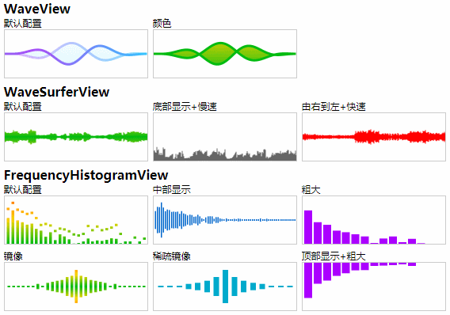

**【[源GitHub仓库](https://github.com/xiangyuecn/Recorder)】 | 【[Gitee镜像库](https://gitee.com/xiangyuecn/Recorder)】如果本文档图片没有显示，请手动切换到Gitee镜像库阅读文档。**


# :open_book:Recorder用于html5录音

[​](?Ref=Desc&Start)支持在大部分已实现`getUserMedia`的移动端、PC端浏览器麦克风录音、实时处理，主要包括：Chrome、Firefox、Safari、iOS 14.3+、Android WebView、腾讯Android X5内核(QQ、微信、小程序WebView)、uni-app(App、H5)、大部分2021年后更新的Android手机自带浏览器；不支持：~~UC系内核（典型的支付宝），大部分未更新的老旧国产手机自带浏览器，低版本iOS(11.0-14.2)上除Safari外的其他任何形式的浏览器（含PWA、WebClip、任何App内网页）~~。

支持对任意`MediaStream`进行音频录制、实时处理，包括：`getUserMedia返回的流`、`WebRTC中的remote流`、`audio、video标签的captureStream方法返回的流`、`自己创建的流` 等等。

提供多个插件功能支持：拥有丰富的音频可视化、变速变调处理、语音识别、音频流播放等；搭配上强大的实时处理支持，可用于各种网页应用：从简单的录音，到复杂的实时语音识别（ASR），甚至音频相关的游戏，都能从容应对。

音频文件的上传和播放：可直接使用常规的`Audio HTML标签`来播放完整的音频文件，参考文档下面的【快速使用】部分，有上传和播放例子；上传了的录音直接将音频链接赋值给`audio.src`即可播放；本地的`blob音频文件`可通过`URL.createObjectURL`来生成本地链接赋值给`audio.src`即可播放，或者将blob对象直接赋值给`audio.srcObject`（兼容性没有src高）。实时的音频片段文件播放，可以使用本库自带的`BufferStreamPlayer`插件来播放，简单高效，或者采用别的途径播放。

**如需录音功能定制开发，网站、App、小程序、前端后端开发等需求，请加本文档下面的QQ群，联系群主（即作者），谢谢~**


[​](?)

**Recorder H5** ：
[ [H5在线测试](https://xiangyuecn.gitee.io/recorder/) ]
[ [H5 QuickStart](https://xiangyuecn.gitee.io/recorder/QuickStart.html) ]
[ [H5 vue](https://xiangyuecn.gitee.io/recorder/assets/demo-vue/) ]
[ [H5 ts](https://xiangyuecn.gitee.io/recorder/assets/demo-ts/) ]
[ [旧版本测试](https://xiangyuecn.gitee.io/recorder/assets/工具-GitHub页面历史版本访问.html#url=xiangyuecn:Recorder@1.0.19120600,/) ]


**工具集** ：
[ [Recorder代码运行和静态分发](https://xiangyuecn.gitee.io/recorder/assets/%E5%B7%A5%E5%85%B7-%E4%BB%A3%E7%A0%81%E8%BF%90%E8%A1%8C%E5%92%8C%E9%9D%99%E6%80%81%E5%88%86%E5%8F%91Runtime.html) ]
[ [裸(RAW、WAV)PCM转WAV播放测试和转码](https://xiangyuecn.gitee.io/recorder/assets/%E5%B7%A5%E5%85%B7-%E8%A3%B8PCM%E8%BD%ACWAV%E6%92%AD%E6%94%BE%E6%B5%8B%E8%AF%95.html) ]
[ [无用户操作测试](https://xiangyuecn.gitee.io/recorder/assets/ztest_no_user_operation.html) ]
[ [Can I Use查看浏览器支持情况](https://caniuse.com/#search=getUserMedia) ]


**RecordApp**[即将废弃] ：
[ [RecordApp测试](https://jiebian.life/web/h5/github/recordapp.aspx) ]
[ [App QuickStart](https://jiebian.life/web/h5/github/recordapp.aspx?path=/app-support-sample/QuickStart.html) ]
[ [App vue](https://jiebian.life/web/h5/github/recordapp.aspx?path=/assets/demo-vue/recordapp.html) ]
[ [Android、iOS App源码](https://github.com/xiangyuecn/Recorder/tree/master/app-support-sample) ]


> [](https://xiangyuecn.gitee.io/recorder/) 扫一扫在线测试，`github.io`可访问性太不尽人意，所以使用`gitee.io`镜像库的速度快多了。


[​](?)

[​](?)

录音默认输出mp3格式，另外可选wav、pcm、g711a、g711u格式；有限支持ogg(beta)、webm(beta)、amr(beta)格式；支持任意格式扩展（前提有相应编码器）。

> mp3默认16kbps的比特率，2kb每秒的录音大小，音质还可以（如果使用8kbps可达到1kb每秒，不过音质太渣）。主要用于语音录制，双声道语音没有意义，特意仅对单声道进行支持。mp3、wav、pcm、g711a、g711u格式支持边录边转码，录音结束时转码速度极快，支持实时转码成小片段文件和实时传输，demo中已实现一个语音通话聊天，下面有介绍；其他格式录音结束时可能需要花费比较长的时间进行转码。
> 
> mp3使用lamejs编码(CBR)，压缩后的recorder.mp3.min.js文件160kb左右（开启gzip后60kb）。如果对录音文件大小没有特别要求，可以仅仅使用录音核心+wav编码器(raw pcm format录音文件超大)，压缩后的recorder.wav.min.js不足20kb。录音得到的mp3(CBR)、wav(PCM)，均可简单拼接小的二进制录音片段文件来生成长的音频文件，具体参考下面这两种编码器的详细介绍。


> 对于不支持录音的浏览器，引入js和调用相关方法都不会产生异常（IE8+），会进入相关的fail回调；一般在open的时候就能检测到不支持或被用户拒绝了权限，可在用户开始录音之前提示浏览器不支持录音或授权。


> 如需在Hybrid App WebView内使用（支持iOS、Android，包括uni-app），请参阅本文档下面的【快速使用】中附带的示例，参考示例代码给网页授予录音权限，或直接由App底层提供接口给H5调用（[app-support-sample](https://github.com/xiangyuecn/Recorder/tree/master/app-support-sample)目录内有源码）。


> *不同iOS版本下的稳定性、低版本iOS兼容、老旧国产手机自带浏览器上的使用限制等问题和兼容请参阅下面的知识库部分；打开录音后对音频播放的影响、录音中途来电话、手机锁屏对录音的影响等问题也参阅下面的知识库。*


[​](?)

### Demo片段列表
1. [【Demo库】【格式转换】-mp3等格式解码转成其他格式](https://xiangyuecn.gitee.io/recorder/assets/工具-代码运行和静态分发Runtime.html?jsname=lib.transform.mp32other)
2. [【Demo库】【格式转换】-wav格式转成其他格式](https://xiangyuecn.gitee.io/recorder/assets/工具-代码运行和静态分发Runtime.html?jsname=lib.transform.wav2other)
3. [【Demo库】【格式转换】-amr格式转成其他格式](https://xiangyuecn.gitee.io/recorder/assets/工具-代码运行和静态分发Runtime.html?jsname=lib.transform.amr2other)
4. [【教程】【音频流】【上传】实时转码并上传-通用版](https://xiangyuecn.gitee.io/recorder/assets/工具-代码运行和静态分发Runtime.html?jsname=teach.realtime.encode_transfer)
5. [【教程】【音频流】【上传】实时转码并上传-mp3专版](https://xiangyuecn.gitee.io/recorder/assets/工具-代码运行和静态分发Runtime.html?jsname=teach.realtime.encode_transfer_mp3)
6. [【教程】【音频流】【上传】实时转码并上传-pcm固定帧大小](https://xiangyuecn.gitee.io/recorder/assets/工具-代码运行和静态分发Runtime.html?jsname=teach.realtime.encode_transfer_frame_pcm)
7. [【教程】【音频流】【播放】实时解码播放音频片段](https://xiangyuecn.gitee.io/recorder/assets/工具-代码运行和静态分发Runtime.html?jsname=teach.realtime.decode_buffer_stream_player)
8. [【教程】【ASR】实时语音识别、音频文件转文字-阿里云版](https://xiangyuecn.gitee.io/recorder/assets/工具-代码运行和静态分发Runtime.html?jsname=teach.realtime.asr.aliyun.short)
9. [【教程】实时录制处理audio、video标签的captureStream流](https://xiangyuecn.gitee.io/recorder/assets/工具-代码运行和静态分发Runtime.html?jsname=teach.source_stream.capture_stream)
10. [【Demo库】【文件合并】-mp3多个片段文件合并](https://xiangyuecn.gitee.io/recorder/assets/工具-代码运行和静态分发Runtime.html?jsname=lib.merge.mp3_merge)
11. [【Demo库】【文件合并】-wav多个片段文件合并](https://xiangyuecn.gitee.io/recorder/assets/工具-代码运行和静态分发Runtime.html?jsname=lib.merge.wav_merge)
12. [【教程】实时多路音频混音](https://xiangyuecn.gitee.io/recorder/assets/工具-代码运行和静态分发Runtime.html?jsname=teach.realtime.mix_multiple)
13. [【教程】变速变调音频转换](https://xiangyuecn.gitee.io/recorder/assets/工具-代码运行和静态分发Runtime.html?jsname=teach.sonic.transform)
14. [【教程】新录音从老录音接续、或录制中途插入音频](https://xiangyuecn.gitee.io/recorder/assets/工具-代码运行和静态分发Runtime.html?jsname=teach.env_in.follow)
15. [【教程】DTMF（电话拨号按键信号）解码、编码](https://xiangyuecn.gitee.io/recorder/assets/工具-代码运行和静态分发Runtime.html?jsname=teach.dtmf.decode_and_encode)
16. [【Demo库】PCM采样率提升](https://xiangyuecn.gitee.io/recorder/assets/工具-代码运行和静态分发Runtime.html?jsname=lib.samplerate.raise)
17. [【Demo库】【信号处理】IIR低通、高通滤波](https://xiangyuecn.gitee.io/recorder/assets/工具-代码运行和静态分发Runtime.html?jsname=dsp.lib.filter.iir)
18. [【测试】【信号处理】FFT频域分析ECharts频谱曲线图](https://xiangyuecn.gitee.io/recorder/assets/工具-代码运行和静态分发Runtime.html?jsname=dsp.test.fft.analysis)
19. [【测试】WebM格式解析并提取音频](https://xiangyuecn.gitee.io/recorder/assets/工具-代码运行和静态分发Runtime.html?jsname=test.webm.extract_audio)
20. [【测试】G711、G72X编码和解码播放](https://xiangyuecn.gitee.io/recorder/assets/工具-代码运行和静态分发Runtime.html?jsname=test.g7xx.engine)
21. [【测试】音频可视化相关插件测试](https://xiangyuecn.gitee.io/recorder/assets/工具-代码运行和静态分发Runtime.html?jsname=test.extensions.visualization)


### App Demo
Android Demo App ：
[下载APK](https://gitee.com/xiangyuecn/Recorder/blob/master/app-support-sample/demo_android/app-debug.apk.zip)（40kb，删除.zip后缀，
[源码](https://github.com/xiangyuecn/Recorder/tree/master/app-support-sample/demo_android)）

iOS Demo App ：[下载源码](https://github.com/xiangyuecn/Recorder/tree/master/app-support-sample/demo_ios) 自行编译


[​](?)

## 【QQ群】交流与支持

欢迎加QQ群：①群 781036591、②群 748359095，纯小写口令：`recorder`


[​](?)

[​](?)

[​](?)

[​](?)

[​](?)

[​](?)


<p align="center"><a href="https://github.com/xiangyuecn/Recorder"></a></p>

<p align="center">
  Basic:
  <a title="Stars" href="https://github.com/xiangyuecn/Recorder"></a>
  <a title="Forks" href="https://github.com/xiangyuecn/Recorder"></a>
  <a title="npm Version" href="https://www.npmjs.com/package/recorder-core"></a>
  <a title="License" href="https://github.com/xiangyuecn/Recorder/blob/master/LICENSE"></a>
</p>
<p align="center">
  Traffic:
  <a title="npm Downloads" href="https://www.npmjs.com/package/recorder-core"></a>
  <a title="cnpm" href="https://npmmirror.com/package/recorder-core"></a><a title="cnpm" href="https://npmmirror.com/package/recorder-core"></a>
  <a title="JsDelivr CDN" href="https://www.jsdelivr.com/package/gh/xiangyuecn/Recorder"></a>
  <a title="unpkg CDN" href="https://unpkg.com/recorder-core/"></a>
  <a title="51LA" href="https://www.51.la/?20469973"></a>
</p>

[​](?RefEnd)


# :open_book:快速使用

你可以通过阅读和运行[QuickStart.html](https://xiangyuecn.gitee.io/recorder/QuickStart.html)文件来快速入门学习，直接将`QuickStart.html`copy到你的(https、localhost)网站中，无需其他文件，就能正常开始测试了；**注意：需要在https、localhost等[安全环境](https://developer.mozilla.org/en-US/docs/Web/API/MediaDevices/getUserMedia#Privacy_and_security)下才能进行录音。**

> https环境搭建最佳实践：建议给自己的域名申请一个泛域名通配符证书（*.xxx.com），然后线上、本地开发均可使用此证书；本地开发环境直接分配一个三级域名（dev.xxx.com、local.xxx.com、192-168-1-123.xxx.com）解析A记录到电脑局域网的IP地址（192.168.1.123、127.0.0.1），方便本地开发跨端调试（本地如何配置https请针对自己的开发环境自行搜索，很容易）。
> 
> 获取泛域名通配符证书推荐：[在线免费申请（ZeroSSL、Let’s Encrypt）](https://xiangyuecn.gitee.io/acme-html-web-browser-client/ACME-HTML-Web-Browser-Client.html)；不建议自己生成根证书来签发域名证书，一个是流程复杂，每个设备均要导入根证书，致命的是很多现代浏览器不再信任用户目录下导入的根证书（Android）。
> 
> 如果必须http访问，Chrome中可尝试打开`chrome://flags/#unsafely-treat-insecure-origin-as-secure`，启用`Insecure origins treated as secure`，把你的地址含端口配置进去。

## 【1】加载框架

**方式一**：使用script标签引入

在需要录音功能的页面引入压缩好的recorder.xxx.min.js文件即可（CDN：[JsDelivr](https://www.jsdelivr.com/package/gh/xiangyuecn/Recorder)、[unpkg](https://unpkg.com/recorder-core/)）
``` html
<script src="recorder.mp3.min.js"></script> <!--已包含recorder-core和mp3格式支持, CDN不稳定仅供测试: https://cdn.jsdelivr.net/gh/xiangyuecn/Recorder@latest/recorder.mp3.min.js-->
```
或者直接使用源码（src内的为源码、dist内的为压缩后的），可以引用src目录中的recorder-core.js+相应类型的实现文件，比如要mp3录音：
``` html
<script src="src/recorder-core.js"></script> <!--必须引入的录音核心，CDN不稳定仅供测试: https://cdn.jsdelivr.net/gh/xiangyuecn/Recorder@latest/src/recorder-core.js-->

<script src="src/engine/mp3.js"></script> <!--相应格式支持文件；如果需要多个格式支持，把这些格式的编码引擎js文件放到后面统统加载进来即可-->
<script src="src/engine/mp3-engine.js"></script> <!--如果此格式有额外的编码引擎（*-engine.js）的话，必须要加上-->

<script src="src/extensions/waveview.js"></script>  <!--可选的插件支持项-->
```

**方式二**：通过import/require引入

通过 npm 进行安装 `npm install recorder-core` ，如果直接clone的源码下面文件路径调整一下即可 [​](?Ref=ImportCode&Start)
``` javascript
//必须引入的核心，换成require也是一样的。注意：recorder-core会自动往window下挂载名称为Recorder对象，全局可调用window.Recorder，也许可自行调整相关源码清除全局污染
import Recorder from 'recorder-core'

//引入相应格式支持文件；如果需要多个格式支持，把这些格式的编码引擎js文件放到后面统统引入进来即可
import 'recorder-core/src/engine/mp3'
import 'recorder-core/src/engine/mp3-engine' //如果此格式有额外的编码引擎（*-engine.js）的话，必须要加上

//以上三个也可以合并使用压缩好的recorder.xxx.min.js
//比如 import Recorder from 'recorder-core/recorder.mp3.min' //已包含recorder-core和mp3格式支持

//可选的插件支持项
import 'recorder-core/src/extensions/waveview'

//ts import 提示：npm包内已自带了.d.ts声明文件（不过是any类型）
```
[​](?RefEnd)

## 【2】调用录音，播放结果
[​](?Ref=Codes&Start)这里假设只录3秒，录完后立即播放，[在线编辑运行此代码>>](https://xiangyuecn.gitee.io/recorder/assets/%E5%B7%A5%E5%85%B7-%E4%BB%A3%E7%A0%81%E8%BF%90%E8%A1%8C%E5%92%8C%E9%9D%99%E6%80%81%E5%88%86%E5%8F%91Runtime.html?idf=self_base_demo)。录音结束后得到的是Blob二进制文件对象，可以下载保存成文件、用`FileReader`读取成`ArrayBuffer`或者`Base64`给js处理，或者参考下一节上传示例直接上传。
``` javascript
//简单控制台直接测试方法：在任意(无CSP限制)页面内加载需要的js，加载成功后再执行一次本代码立即会有效果
//①加载Recorder+mp3：import("https://unpkg.com/recorder-core/recorder.mp3.min.js").then(()=>console.log("import ok"))
//②可视化插件和显示：import("https://unpkg.com/recorder-core/src/extensions/waveview.js").then(()=>console.log("import ok")); div=document.createElement("div");div.innerHTML='<div style="height:100px;width:300px;" class="recwave"></div>';document.body.prepend(div);

var rec,wave;
/**调用open打开录音请求好录音权限**/
var recOpen=function(success){//一般在显示出录音按钮或相关的录音界面时进行此方法调用，后面用户点击开始录音时就能畅通无阻了
    rec=Recorder({ //本配置参数请参考下面的文档，有详细介绍
        type:"mp3",sampleRate:16000,bitRate:16 //mp3格式，指定采样率hz、比特率kbps，其他参数使用默认配置；注意：是数字的参数必须提供数字，不要用字符串；需要使用的type类型，需提前把格式支持文件加载进来，比如使用wav格式需要提前加载wav.js编码引擎
        ,onProcess:function(buffers,powerLevel,bufferDuration,bufferSampleRate,newBufferIdx,asyncEnd){
            //录音实时回调，大约1秒调用12次本回调，buffers为开始到现在的所有录音pcm数据块(16位小端LE)
            //可利用extensions/sonic.js插件实时变速变调，此插件计算量巨大，onProcess需要返回true开启异步模式
            //可实时上传（发送）数据，配合Recorder.SampleData方法，将buffers中的新数据连续的转换成pcm上传，或使用mock方法将新数据连续的转码成其他格式上传，可以参考文档里面的：Demo片段列表 -> 实时转码并上传-通用版；基于本功能可以做到：实时转发数据、实时保存数据、实时语音识别（ASR）等

            //可实时绘制波形（extensions目录内的waveview.js、wavesurfer.view.js、frequency.histogram.view.js插件功能）
            wave&&wave.input(buffers[buffers.length-1],powerLevel,bufferSampleRate);
        }
    });

    //var dialog=createDelayDialog(); 我们可以选择性的弹一个对话框：为了防止移动端浏览器存在第三种情况：用户忽略，并且（或者国产系统UC系）浏览器没有任何回调，此处demo省略了弹窗的代码
    rec.open(function(){//打开麦克风授权获得相关资源
        //dialog&&dialog.Cancel(); 如果开启了弹框，此处需要取消
        //rec.start() 此处可以立即开始录音，但不建议这样编写，因为open是一个延迟漫长的操作，通过两次用户操作来分别调用open和start是推荐的最佳流程

        //创建可视化，指定一个要显示的div
        if(Recorder.WaveView)wave=Recorder.WaveView({elem:".recwave"});
        success&&success();
    },function(msg,isUserNotAllow){//用户拒绝未授权或不支持
        //dialog&&dialog.Cancel(); 如果开启了弹框，此处需要取消
        console.log((isUserNotAllow?"UserNotAllow，":"")+"无法录音:"+msg);
    });
};

/**开始录音**/
function recStart(){//打开了录音后才能进行start、stop调用
    rec.start();
};

/**结束录音**/
function recStop(){
    rec.stop(function(blob,duration){
        
        //简单利用URL生成本地文件地址，注意不用了时需要revokeObjectURL，否则霸占内存
        //此地址只能本地使用，比如赋值给audio.src进行播放，赋值给a.href然后a.click()进行下载（a需提供download="xxx.mp3"属性）
        var localUrl=(window.URL||webkitURL).createObjectURL(blob);
        console.log(blob,localUrl,"时长:"+duration+"ms");
        rec.close();//释放录音资源，当然可以不释放，后面可以连续调用start；但不释放时系统或浏览器会一直提示在录音，最佳操作是录完就close掉
        rec=null;
        
        //已经拿到blob文件对象想干嘛就干嘛：立即播放、上传、下载保存
        
        /*** 【立即播放例子】 ***/
        var audio=document.createElement("audio");
        document.body.prepend(audio);
        audio.controls=true;
        audio.src=localUrl;
        audio.play();
    },function(msg){
        console.log("录音失败:"+msg);
        rec.close();//可以通过stop方法的第3个参数来自动调用close
        rec=null;
    });
};


//我们可以选择性的弹一个对话框：为了防止移动端浏览器存在第三种情况：用户忽略，并且（或者国产系统UC系）浏览器没有任何回调
/*伪代码：
function createDelayDialog(){
    if(Is Mobile){//只针对移动端
        return new Alert Dialog Component
            .Message("录音功能需要麦克风权限，请允许；如果未看到任何请求，请点击忽略~")
            .Button("忽略")
            .OnClick(function(){//明确是用户点击的按钮，此时代表浏览器没有发起任何权限请求
                //此处执行fail逻辑
                console.log("无法录音：权限请求被忽略");
            })
            .OnCancel(NOOP)//自动取消的对话框不需要任何处理
            .Delay(8000); //延迟8秒显示，这么久还没有操作基本可以判定浏览器有毛病
    };
};
*/


//这里假设立即运行，只录3秒，录完后立即播放，本段代码copy到控制台内可直接运行
recOpen(function(){
    recStart();
    setTimeout(recStop,3000);
});
```


[​](?)

## 【附】录音上传示例
``` javascript
var TestApi="/test_request";//用来在控制台network中能看到请求数据，测试的请求结果无关紧要
var rec=Recorder();rec.open(function(){rec.start();setTimeout(function(){rec.stop(function(blob,duration){
//-----↓↓↓以下才是主要代码↓↓↓-------

//本例子假设使用jQuery封装的请求方式，实际使用中自行调整为自己的请求方式
//录音结束时拿到了blob文件对象，可以用FileReader读取出内容，或者用FormData上传
var api=TestApi;

/***方式一：将blob文件转成base64纯文本编码，使用普通application/x-www-form-urlencoded表单上传***/
var reader=new FileReader();
reader.onloadend=function(){
    $.ajax({
        url:api //上传接口地址
        ,type:"POST"
        ,data:{
            mime:blob.type //告诉后端，这个录音是什么格式的，可能前后端都固定的mp3可以不用写
            ,upfile_b64:(/.+;\s*base64\s*,\s*(.+)$/i.exec(reader.result)||[])[1] //录音文件内容，后端进行base64解码成二进制
            //...其他表单参数
        }
        ,success:function(v){
            console.log("上传成功",v);
        }
        ,error:function(s){
            console.error("上传失败",s);
        }
    });
};
reader.readAsDataURL(blob);

/***方式二：使用FormData用multipart/form-data表单上传文件***/
var form=new FormData();
form.append("upfile",blob,"recorder.mp3"); //和普通form表单并无二致，后端接收到upfile参数的文件，文件名为recorder.mp3
//...其他表单参数
$.ajax({
    url:api //上传接口地址
    ,type:"POST"
    ,contentType:false //让xhr自动处理Content-Type header，multipart/form-data需要生成随机的boundary
    ,processData:false //不要处理data，让xhr自动处理
    ,data:form
    ,success:function(v){
        console.log("上传成功",v);
    }
    ,error:function(s){
        console.error("上传失败",s);
    }
});

//-----↑↑↑以上才是主要代码↑↑↑-------
},function(msg){console.log("录音失败:"+msg);});},3000);},function(msg){console.log("无法录音:"+msg);});
```
[​](?RefEnd)


[​](?)

[​](?)

## 【附】Android Hybrid App - WebView中录音示例
在Android Hybrid App中使用本库来录音，需要在App源码中实现以下两步分：

1. 在`AndroidManifest.xml`声明需要用到的两个权限
``` xml
<uses-permission android:name="android.permission.RECORD_AUDIO"/>
<uses-permission android:name="android.permission.MODIFY_AUDIO_SETTINGS"/>
```

2. `WebChromeClient`中实现`onPermissionRequest`网页授权请求
``` java
@Override
public void onPermissionRequest(PermissionRequest request) {
    //需判断request.getResources()中包含了PermissionRequest.RESOURCE_AUDIO_CAPTURE才进行权限处理，否则不认识的请求直接deny()
    if (Build.VERSION.SDK_INT >= Build.VERSION_CODES.LOLLIPOP) {
        //录音是敏感权限，必须app先有录音权限后，网页才会有录音权限，伪代码：
        App的系统录音权限请求()
            .用户已授权(()->{
                //直接静默授权，或者再弹个确认对话框让用户确认是否允许此网页录音后grant|deny
                request.grant(request.getResources());
            })
            .用户拒绝授权(()->{
                request.deny();
            })
    }
}
```

> 注：如果应用的`腾讯X5内核`，除了上面两个权限外，还必须提供`android.permission.CAMERA`权限。另外无法重写此`onPermissionRequest`方法，默认他会自己弹框询问（如果点了拒绝就很惨了），可以通过调用`webView.setWebChromeClientExtension`来重写X5的`IX5WebChromeClientExtension.onPermissionRequest`方法来进行权限处理，参考此篇[X5集成文章](https://www.cnblogs.com/xiangyuecn/p/13450916.html)最后面的网页权限处理代码。

如果不出意外，App内显示的网页就能正常录音了。

[app-support-sample/demo_android](https://github.com/xiangyuecn/Recorder/tree/master/app-support-sample/demo_android)目录中提供了Android测试源码（如果不想自己打包可以用打包好的apk来测试，文件名为`app-debug.apk.zip`，自行去掉.zip后缀）。

### 备忘小插曲
排查 [#46](https://github.com/xiangyuecn/Recorder/issues/46) `Android WebView`内长按录音不能收到`touchend`问题时，发现touch事件会被打断，反复折腾，最终发现是每次检测权限都会调用`Activity.requestPermissions`，而`requestPermissions`会造成WebView打断touch事件，进而产生H5、AppNative原生录都会产生此问题；最后老实把精简掉的`checkSelfPermission`加上检测一下是否已授权，就没有此问题了，囧。


[​](?)

## 【附】iOS Hybrid App - WebView中录音示例
iOS 14.3+：新版本iOS WKWebView已支持H5录音，但作者还未测试，暂时不提供实现方法，请自行对接。已知：App有了录音权限后，H5请求录音权限时会弹出网页授权确认对话框，已知iOS 15+提供了静默授权支持，参考[WKUIDelegate](https://developer.apple.com/documentation/webkit/wkuidelegate)中的 `Requesting Permissions` -> `requestMediaCapturePermissionFor`，为什么15+才支持：应该是低版本iOS脑残。

iOS 11.0-14.2：纯粹的H5录音在iOS WebView中是不支持的，需要有Native层的支持，具体参考RecordApp中的[app-support-sample/demo_ios](https://github.com/xiangyuecn/Recorder/tree/master/app-support-sample/demo_ios)，含iOS App源码。


[​](?)

## 【附】UniApp - uni-app(App、H5)集成参考
只要是WebView环境，且能访问到window对象，就能直接使用Recorder录音。uni-app中的`renderjs`是直接运行在视图层WebView中的，因此可以通过在`renderjs`中加载Recorder来进行录音；支持App、H5，但不支持小程序（小程序可用web-view组件加载H5，或调用小程序自己的录音接口）。

注意在开发App平台的代码时，需在调用`rec.open`前，在原生层获取到录音权限；和上面的Android和iOS一样先配置好录音权限声明，再调用权限请求接口，在逻辑层中编写js权限处理代码（非renderjs层），参考：
- Android：直接调用`plus.android.requestPermissions(["android.permission.RECORD_AUDIO"],callback)`得到权限；
- iOS：通过反射`audioSession=plus.ios.importClass("AVAudioSession").sharedInstance()`，调用`status=audioSession.recordPermission()`来判断是否有权限：`status=1735552628 granted`为已获得权限；`status=1970168948 undetermined`为从未授权过，此时要调用`audioSession.requestRecordPermission(callback)`来请求权限（回调中从头再判断一遍权限）；`status=其他值 eg:1684369017 denied`代表无权限。

除了请求权限这个差异外，App和H5没有区别。但App需注意的是，uni-app的逻辑层和视图层数据交互性能实在太拉跨了，大点的录音二进制数据传回给逻辑层可能会异常缓慢，就算用plus接口在renderjs中保存到本地文件，会发现plus接口的坑更多（他们框架对于二进制操作几乎没有任何性能可言）。

App端建议使用原生插件来录音，没有这些框架缺陷带来的性能问题，修改`RecordApp`对接原生插件来录音。作者已编译好了Android原生录音`.aar module 25KB`、iOS原生录音`.a library 200KB`，集成到项目的`nativeplugins`目录中；逻辑层中通过`uni.requireNativePlugin`来获取接口给`RecordApp`调用，RecordApp会自动识别App和网页环境，App中走原生录音，网页中走H5录音；此原生插件暂未开源，如需请加上面的QQ群联系群主付费购买。


[​](?)

[​](?)

[​](?)

[​](?)

[​](?)

[​](?)

# :open_book:知识库

本库期待的使用场景是语音录制，因此音质只要不比高品质的感觉差太多就行；1分钟的语音进行编码是很快的，但如果录制超长的录音，比如10分钟以上，不同类型的编码可能会花费比较长的时间，因为只有边录边转码(Worker)支持的类型才能进行极速转码。另外未找到双声道语音录制存在的意义（翻倍录音数据大小，并且拉低音质），因此特意仅对单声道进行支持。


浏览器Audio Media[兼容性](https://developer.mozilla.org/en-US/docs/Web/HTML/Supported_media_formats#Browser_compatibility)mp3最好，wav还行，其他要么不支持播放，要么不支持编码；因此本库最佳推荐使用mp3、wav格式，代码也是优先照顾这两种格式。

`getUserMedia`的浏览器支持情况和兼容性，可到[Can I use](https://caniuse.com/?search=getUserMedia)查看。


**留意中途来电话**：在移动端录音时，如果录音中途来电话，或者通话过程中打开录音，是不一定能进行录音的；经过简单测试发现，iOS上Safari将暂停返回音频数据，直到通话结束才开始继续有音频数据返回；小米上Chrome不管是来电还是通话中开始录音都能对麦克风输入的声音进行录音；只是简单测试，更多机器和浏览器并未做测试，不过整体上来看来电话或通话中进行录音的可行性并不理想，也不赞成在这种过程中进行录音；但只要通话结束后录音还是会正常进行，影响基本不大。

**录音时对播放音频的影响**：仅在移动端，如果录音配置中未禁用降噪+回声消除（浏览器默认开启降噪+回声），打开录音后，如果同时播放音频，此时系统播放音量可能会变得很小；PC上 和 禁用降噪+回声消除后 似乎无此影响，但iOS上如果禁用又可能会导致无法正常录音，详细请阅读配置文档中的`audioTrackSet`参数说明。

**移动端锁屏录音**：手机锁屏后浏览器的运行状态是一个玄学，是否能录音不可控；不同手机、甚至同一手机在不同状态下，有可能能录又有可能不能录，且无法检测；可以调用 `navigator.wakeLock` 来阻止手机自动锁屏，不支持的直接简单粗暴的 循环+静音 播放一段视频，来阻止锁屏，就是有点费电，具体实现可参考H5在线测试页面内的`wakeLockClick`方法。

**特别注**：如果在`iframe`里面调用的录音功能，并且和上层的网页是不同的域（跨域了），如果未设置相应策略，权限永远是被拒绝的，[参考此处](https://developer.mozilla.org/en-US/docs/Web/API/MediaDevices/getUserMedia#Privacy_and_security)。另外如果要在`非跨域的iframe`里面使用，最佳实践应该是让window.top去加载Recorder（异步加载js），iframe里面使用top.Recorder，免得各种莫名其妙（比如微信里面的各种渣渣功能，搞多了就习惯了）。

> 低版本`iOS(11.X、12.X、13.X)`上只有`Safari`支持`getUserMedia`，其他任何形式的浏览器均不支持；如果需要最大限度的兼容低版本IOS（仅增加微信支持），可以使用`RecordApp`，它已包含`Recorder`，源码在`src/app-support`、`app-support-sample`中，但此兼容库需要服务器端提供微信JsSDK的签名、下载素材接口，涉及微信公众（订阅）号的开发。

支持|Recorder|~[RecordApp](https://github.com/xiangyuecn/Recorder/tree/master/app-support-sample)~
-:|:-:|:-:
PC浏览器|√|√
Android Chrome Firefox|√|√
Android微信(含小程序)|√|√
Android Hybrid App|√|√
Android其他浏览器|未知|未知
iOS Safari|√|√
iOS微信(含小程序)|iOS 14.3+|√
iOS Hybrid App|iOS 14.3+|√
iOS其他浏览器|iOS 14.3+|iOS 14.3+
开发难度|简单|~复杂~
第三方依赖|无|~依赖微信公众号~


## 已知问题

> 此处已清除7个已知问题，大部分无法解决的问题会随着时间消失；问题主要集中在iOS上，好在这玩意能更新

*2023-02-22* iPhone 14：~~有部分开发者反馈iPhone14上关闭录音后再次打开录音，会出现无法录音的情况，目前并不清楚是只有iPhone14上有问题，还是iOS16均有问题；估计是新的WebKit改了相关源码印度阿三没有测试，js没办法解决此问题，静候iOS更新，也许下一个系统更新就自动修复了；建议针对iOS环境，全局只open一次，不要close，挂在那里录音，可减少iOS系统问题带来的影响（负优化+耗电）。~~ 2023-7-1，此问题已修复，原因出在AudioContext上，iOS新版本上似乎不能共用一个AudioContext（新版本每次open均会创建新的AudioContext），并且iOS上AudioContext的resume行为和其他浏览器不相同，如果不是通过用户操作（触摸、点击等）进行调用，将无法resume，参考 [ztest_AudioContext_resume.html](https://xiangyuecn.gitee.io/recorder/assets/ztest_AudioContext_resume.html) 测试用例。

*2020-04-26* Safari Bug：据QQ群内`1048506792`、`190451148`开发者反馈研究发现，IOS ?-13.X Safari内打开录音后，如果切换到了其他标签、或其他App并且播放了任何声音，此时将会中断已打开的录音（系统级的？），切换回正在录音的页面，这个页面的录音功能将会彻底失效，并且刷新也无法恢复录音；表现为关闭录音后再次打开录音，能够正常获得权限，但浏览器返回的采集到的音频为静默的PCM，此时地址栏也并未显示出麦克风图标，刷新这个标签也也是一样不能正常获得录音，只有关掉此标签新打开页面才可正常录音。如果打开录音后关闭了录音，然后切换到其他标签或App播放声音，然后返回录音页面，不会出现此问题。此为Safari的底层Bug。使用长按录音类似的用户交互可大幅度避免踩到这坨翔。


[​](?)

[​](?)

[​](?)

[​](?)

[​](?)

[​](?)

# :open_book:方法文档


### 【构造】rec=Recorder(set)

构造函数，拿到`Recorder`的实例，然后可以进行请求获取麦克风权限和录音。

`set`参数为配置对象，默认配置值如下：
``` javascript
set={
    type:"mp3" //输出类型：mp3,wav等，使用一个类型前需要先引入对应的编码引擎
    ,bitRate:16 //比特率，必须是数字 wav(位):16、8，MP3(单位kbps)：8kbps时文件大小1k/s，16kbps 2k/s，录音文件很小
    
    ,sampleRate:16000 //采样率，必须是数字，wav格式（8位）文件大小=sampleRate*时间；mp3此项对低比特率文件大小有影响，高比特率几乎无影响。
                //wav任意值，mp3取值范围：48000, 44100, 32000, 24000, 22050, 16000, 12000, 11025, 8000
    
    ,onProcess:NOOP //接收到录音数据时的回调函数：fn(buffers,powerLevel,bufferDuration,bufferSampleRate,newBufferIdx,asyncEnd)
                //返回值：onProcess如果返回true代表开启异步模式，在某些大量运算的场合异步是必须的，必须在异步处理完成时调用asyncEnd(不能真异步时需用setTimeout包裹)；返回其他值或者不返回为同步模式（需避免在回调内执行耗时逻辑）；如果开启异步模式，在onProcess执行后新增的buffer会全部替换成空数组，因此本回调开头应立即将newBufferIdx到本次回调结尾位置的buffer全部保存到另外一个数组内，处理完成后写回buffers中本次回调的结尾位置。
                //buffers=[[Int16,...],...]：缓冲的PCM数据块(16位小端LE)，为从开始录音到现在的所有pcm片段，每次回调可能增加0-n个不定量的pcm片段。
                    //注意：buffers数据的采样率为bufferSampleRate，它和set.sampleRate不一定相同，可能为浏览器提供的原始采样率rec.srcSampleRate，也可能为已转换好的采样率set.sampleRate；如需浏览器原始采样率的数据，请使用rec.buffers原始数据，而不是本回调的参数；如需明确和set.sampleRate完全相同采样率的数据，请在onProcess中自行连续调用采样率转换函数Recorder.SampleData()，配合mock方法可实现实时转码和压缩语音传输；修改或替换buffers内的数据将会改变最终生成的音频内容（注意不能改变第一维数组长度），比如简单有限的实现实时静音、降噪、混音等处理，详细参考下面的rec.buffers
                //powerLevel：当前缓冲的音量级别0-100。
                //bufferDuration：已缓冲时长。
                //bufferSampleRate：buffers缓存数据的采样率（当type支持边录边转码(Worker)时，此采样率和设置的采样率相同，否则不一定相同）。
                //newBufferIdx:本次回调新增的buffer起始索引。
                //asyncEnd：fn() 如果onProcess是异步的(返回值为true时)，处理完成时需要调用此回调，如果不是异步的请忽略此参数，此方法回调时必须是真异步（不能真异步时需用setTimeout包裹）。
                //如果需要绘制波形之类功能，需要实现此方法即可，使用以计算好的powerLevel可以实现音量大小的直观展示，使用buffers可以达到更高级效果
                //如果需要实时上传（发送）之类的，可以配合Recorder.SampleData方法，将buffers中的新数据连续的转换成pcm，或使用mock方法将新数据连续的转码成其他格式，可以参考文档里面的：Demo片段列表 -> 实时转码并上传-通用版；基于本功能可以做到：实时转发数据、实时保存数据、实时语音识别（ASR）等
    
    //*******高级设置******
        //,sourceStream:MediaStream Object
                //可选直接提供一个媒体流，从这个流中录制、实时处理音频数据（当前Recorder实例独享此流）；不提供时为普通的麦克风录音，由getUserMedia提供音频流（所有Recorder实例共享同一个流）
                //比如：audio、video标签dom节点的captureStream方法（实验特性，不同浏览器支持程度不高）返回的流；WebRTC中的remote流；自己创建的流等
                //注意：流内必须至少存在一条音轨(Audio Track)，比如audio标签必须等待到可以开始播放后才会有音轨，否则open会失败

        //,runningContext:AudioContext
                //可选提供一个state为running状态的AudioContext对象(ctx)；默认会在rec.open时自动创建一个新的ctx，无用户操作（触摸、点击等）时调用rec.open的ctx.state可能为suspended，会在rec.start时尝试进行ctx.resume，如果也无用户操作ctx.resume可能不会恢复成running状态（目前仅iOS上有此兼容性问题），导致无法去读取媒体流，这时请提前在用户操作时调用Recorder.GetContext(true)来得到一个running状态AudioContext（用完需调用CloseNewCtx(ctx)关闭）

        /*,audioTrackSet:{
             deviceId:"",groupId:"" //指定设备的麦克风，通过navigator.mediaDevices.enumerateDevices拉取设备列表，其中kind为audioinput的是麦克风
            ,noiseSuppression:true //降噪（ANS）开关，不设置时由浏览器控制（一般为默认打开），设为true明确打开，设为false明确关闭
            ,echoCancellation:true //回声消除（AEC）开关，取值和降噪开关一样
            ,autoGainControl:true //自动增益（AGC）开关，取值和降噪开关一样
        }*/
                //普通麦克风录音时getUserMedia方法的audio配置参数；注意：不同浏览器的支持程度不同，提供的任何配置值都不一定会生效
                //回声消除、降噪开关这两个参数浏览器一般默认为打开， 注意：移动端打开降噪、回声消除可能会表现的很怪异（包括系统播放音量变小），但iOS上如果关闭又可能导致录音没有声音，如需更改配置请Android和iOS分别配置，并测试好，PC端没有这些问题
                //由于麦克风是全局共享的，所以新配置后需要close掉以前的再重新open
                //更多参考: https://developer.mozilla.org/en-US/docs/Web/API/MediaTrackConstraints
                
        //,disableEnvInFix:false 内部参数，禁用设备卡顿时音频输入丢失补偿功能，如果不清楚作用请勿随意使用
        
        //,takeoffEncodeChunk:NOOP //fn(chunkBytes) chunkBytes=[Uint8,...]：实时编码环境下接管编码器输出，当编码器实时编码出一块有效的二进制音频数据时实时回调此方法；参数为二进制的Uint8Array，就是编码出来的音频数据片段，所有的chunkBytes拼接在一起即为完整音频。本实现的想法最初由QQ2543775048提出。
                //当提供此回调方法时，将接管编码器的数据输出，编码器内部将放弃存储生成的音频数据；环境要求比较苛刻：如果当前环境不支持实时编码处理，将在open时直接走fail逻辑
                //因此提供此回调后调用stop方法将无法获得有效的音频数据，因为编码器内没有音频数据，因此stop时返回的blob将是一个字节长度为0的blob
                //目前只有mp3格式实现了实时编码，在支持实时处理的环境中将会实时的将编码出来的mp3片段通过此方法回调，所有的chunkBytes拼接到一起即为完整的mp3，此种拼接的结果比mock方法实时生成的音质更加，因为天然避免了首尾的静默
                //目前除mp3外其他格式不可以提供此回调，提供了将在open时直接走fail逻辑
}
```

**注意：set内是数字的明确传数字**，不要传字符串之类的导致不可预测的异常，其他有配置的地方也是一样（感谢`214282049@qq.com`19-01-10发的反馈邮件）。

*注：如果录音结束后生成的音频文件的比特率和采样率和set中的不同，将会把set中的bitRate、sampleRate更新成音频文件的。*

### 【方法】rec.open(success,fail)
请求打开录音资源，如果浏览器不支持录音、用户拒绝麦克风权限、或者非安全环境（非https、file等）将会调用`fail`；打开后需要调用`close`来关闭，因为浏览器或设备的系统可能会显示正在录音。

`success`=fn();

`fail`=fn(errMsg,isUserNotAllow); 如果是用户主动拒绝的录音权限，除了有错误消息外，isUserNotAllow=true，方便程序中做不同的提示，提升用户主动授权概率

注意：此方法回调是可能是同步的（异常、或者已持有资源时）也可能是异步的（浏览器弹出权限请求时）；一般使用时打开，用完立即关闭；可重复调用，可用来测试是否能录音；open和start至少有一个应当在用户操作（触摸、点击等）下进行调用，原因参考`runningContext`配置。

另外：普通的麦克风录音时，因为此方法会调起用户授权请求，如果仅仅想知道浏览器是否支持录音（比如：如果浏览器不支持就走另外一套录音方案），应使用`Recorder.Support()`方法。

> **特别注**: 鉴于UC系浏览器（大部分老旧国产手机厂商系统浏览器）大概率表面支持录音但永远不会有任何回调、或者此浏览器支持第三种情况（忽略按钮，也不会有回调）；如果当前环境是移动端，可以在调用此方法`8秒`后如果未收到任何回调，弹出一个自定义提示框（只需要一个按钮），提示内容范本：`录音功能需要麦克风权限，请允许；如果未看到任何请求，请点击忽略~`，按钮文本：`忽略`；当用户点击了按钮，直接手动执行`fail`逻辑，因为此时浏览器压根就没有弹移动端特有的模态化权限请求对话框；但如果收到了回调（可能是同步的，因此弹框必须在`rec.open`调用前准备好随时取消），需要把我们弹出的提示框自动关掉，不需要用户做任何处理。pc端的由于不是模态化的请求对话框，可能会被用户误点，所以尽量要判断一下是否是移动端。


### 【方法】rec.close(success)
关闭释放录音资源，释放完成后会调用`success()`回调。如果正在录音或者stop调用未完成前调用了close将会强制终止当前录音。

注意：普通的麦克风录音时（所有Recorder实例共享同一个流），如果创建了多个Recorder对象并且调用了open（应避免同时有多个对象进行了open），只有最后一个新建的才有权限进行实际的资源释放（和多个对象close调用顺序无关），浏览器或设备的系统才会不再显示正在录音的提示；直接提供的流 set.sourceStream 无此问题（当前Recorder实例独享此流）。

### 【方法】rec.start()
开始录音，需先调用`open`；未close之前可以反复进行调用开始新的录音。注意：open和start至少有一个应当在用户操作（触摸、点击等）下进行调用，原因参考`runningContext`配置。

只要open成功后，调用此方法是安全的，如果未open强行调用导致的内部错误将不会有任何提示，stop时自然能得到错误；另外open操作可能需要花费比较长时间，如果中途调用了stop，open完成时（同步）的任何start调用将会被自动阻止，也是不会有提示的。

### 【方法】rec.stop(success,fail,autoClose)
结束录音并返回录音数据`blob文件对象`，拿到blob文件对象就可以为所欲为了，不限于立即播放、上传、下载保存。blob可以用`URL.createObjectURL`生成本地链接赋值给`audio.src`进行播放，赋值给`a.href`然后`a.click()`进行下载（a需提供`download="xxx.mp3"`属性）；或用`XMLHttpRequest+FormData`、`WebSocket`直接发送到服务器，或者用`FileReader`读取成`ArrayBuffer`或者`Base64`给js处理。

`success(blob,duration)`：`blob`：录音二进制文件数据audio/mp3|wav...格式，`duration`：录音时长，单位毫秒

`fail(errMsg)`：录音出错回调

`autoClose`：`false` 可选，是否自动调用`close`，默认为`false`不调用

提示：stop时会进行音频编码，根据类型的不同音频编码花费的时间也不相同。对于支持边录边转码(Worker)的类型，将极速完成编码并回调；对于不支持的10几秒录音花费2秒左右算是正常，但内部采用了分段编码+setTimeout来处理，界面卡顿不明显。


### 【方法】rec.pause()
暂停录音。

### 【方法】rec.resume()
恢复继续录音。


### 【属性】rec.buffers
此数据为从开始录音到现在为止的所有已缓冲的PCM片段列表(16位小端LE)，`buffers` `=` `[[Int16,...],...]` 为二维数组；在没有边录边转码的支持时（mock调用、非mp3等），录音stop时会使用此完整数据进行转码成指定的格式。

rec.buffers中的PCM数据为浏览器采集的原始音频数据，采样率为浏览器提供的原始采样率`rec.srcSampleRate`；在`rec.set.onProcess`回调中`buffers`参数就是此数据或者此数据重新采样后的新数据；修改或替换`onProcess`回调中`buffers`参数可以改变最终生成的音频内容，但修改`rec.buffers`不一定会有效，因此你可以在`onProcess`中修改或替换`buffers`参数里面的内容，注意只能修改或替换上次回调以来新增的buffer（不允许修改已处理过的，不允许增删第一维数组，允许将第二维数组任意修改替换成空数组也可以）；以此可以简单有限的实现实时静音、降噪、混音等处理。

如果你需要长时间实时录音（如长时间语音通话），并且不需要得到最终完整编码的音频文件：
1. 未提供set.takeoffEncodeChunk时，Recorder初始化时应当使用一个未知的类型进行初始化（如: type:"unknown"，仅仅用于初始化而已，实时转码可以手动转成有效格式，因为有效格式可能内部还有其他类型的缓冲，`unknown`类型`onProcess buffers`和`rec.buffers`是同一个数组）；提供set.takeoffEncodeChunk接管了编码器实时输出时，无需特殊处理，因为编码器内部将不会使用缓冲；
2. 实时在`onProcess`中修改`buffers`参数数组，可以只保留最后两个元素，其他元素设为null（代码：`onProcess: buffers[buffers.length-3]=null`），不保留也行，全部设为null，以释放占用的内存；`rec.buffers`将会自动清理，无需手动清理；注意：提供set.takeoffEncodeChunk时，应当延迟一下清理，不然buffers被清理掉时，这个buffers还未推入编码器进行编码；
3. 录音结束时可以不用调用`stop`，直接调用`close`丢弃所有数据即可。只要buffers[0]==null时调用`stop`永远会直接走fail回调。

### 【属性】rec.srcSampleRate
浏览器提供的原始采样率，只有start或mock调用后才会有值，此采样率就是rec.buffers数据的采样率。


### 【方法】rec.envIn(pcmData,pcmAbsSum)
本方法是一个内部使用的最为核心方法，如果你不知道用途，请勿随意调用，配套的有私有方法`envStart(mockEnvInfo,sampleRate)`（私有方法请自行阅读源码），这两方法控制着录音的开启、实时音频输入逻辑，起到隔离平台环境差异的作用（Recorder、RecordApp共享使用了本机制，实现了录音过程和平台环境无关）。

通过调用本方法，会在当前正在录制的录音中追加进新的pcm数据，每次调用本方法都会触发onProcess回调；从而可以做到：在录音过程中插入音频数据、在新的录音中注入之前老的录音的buffers数据可以做到接续录音 等业务逻辑，可参考上面的Demo片段列表中的`新录音从老录音接续、或录制中途插入音频`例子。

`pcmData`：`[Int16,...]` 为一维数组，pcm音频数据的采样率必须是`rec.srcSampleRate` （如果不是，请用`Recorder.SampleData()`方法先转换好）

`pcmAbsSum`：pcmData所有采样的绝对值的和，用来传递给`Recorder.PowerLevel`方法计算音量百分比，最终是给onProcess使用，如果不需要计算音量百分比，直接给0即可。


### 【方法】rec.mock(pcmData,pcmSampleRate)
模拟一段录音数据，后面直接调用stop进行编码得到音频文件。需提供pcm数据 `pcmData` `=` `[Int16,...]` 为一维数组，和pcm数据的采样率 `pcmSampleRate`。调用本方法后无需调用也无法调用open、close、start等方法，只能调用stop，如果之前已经开始了录音，前面的录音数据全部会被丢弃；本方法主要用于音频转码。

提示：在录音实时回调中配合`Recorder.SampleData()`方法使用效果更佳，可实时生成小片段语音文件。

**注意：pcmData为一维数组，如果提供二维数组将会产生不可预料的错误**；如果需要使用类似`onProcess`回调的`buffers`或者`rec.buffers`这种pcm列表（二维数组）时，可自行展开成一维，或者使用`Recorder.SampleData()`方法转换成一维。

本方法可用于将一个音频解码出来的pcm数据方便的转换成另外一个格式：
``` javascript
var amrBlob=...;//amr音频blob对象
var amrSampleRate=8000;//amr音频采样率

//解码amr得到pcm数据
var reader=new FileReader();
reader.onload=function(){
    Recorder.AMR.decode(new Uint8Array(reader.result),function(pcm){
        transformOgg(pcm);
    });
};
reader.readAsArrayBuffer(amrBlob);

//将pcm转成ogg
function transformOgg(pcmData){
    Recorder({type:"ogg",bitRate:64,sampleRate:32000})
        .mock(pcmData,amrSampleRate)
        .stop(function(blob,duration){
            //我们就得到了新采样率和比特率的ogg文件
            console.log(blob,duration);
        });
};
```


### 【静态方法】Recorder.Support()
判断浏览器是否支持录音，随时可以调用。注意：仅仅是检测浏览器支持情况，不会判断和调起用户授权（rec.open()会判断用户授权），不会判断是否支持特定格式录音。

### 【静态方法】Recorder.GetContext(tryNew)
获取全局的AudioContext对象，如果浏览器不支持将返回null。tryNew时尝试创建新的非全局对象并返回，失败时依旧返回全局的；成功时返回新的，注意用完必须自己调用`Recorder.CloseNewCtx(ctx)`关闭。注意：非用户操作（触摸、点击等）时调用返回的ctx.state可能是suspended状态，需要在用户操作时调用ctx.resume恢复成running状态，参考rec的`runningContext`配置。

本方法调用一次后，可通过`Recorder.Ctx`来获得此全局对象，可用于音频文件解码：`Recorder.Ctx.decodeAudioData(fileArrayBuffer)`。本方法是从老版本的`Recorder.Support()`中剥离出来的，调用Support会自动调用一次本方法。已知iOS16中全局对象无法多次用于录音，当前Recorder打开录音时均会尝试创建新的非全局对象，同时会保留一个全局的对象。

### 【静态方法】Recorder.IsOpen()
由于Recorder持有的普通麦克风录音资源是全局唯一的，可通过此方法检测是否有Recorder已调用过open打开了麦克风录音功能。

### 【静态方法】Recorder.Destroy()
销毁已持有的所有全局资源（AudioContext、Worker），当要彻底移除Recorder时需要显式的调用此方法。大部分情况下不调用Destroy也不会造成问题。

### 【静态方法】Recorder.CLog
全局的日志输出函数，可赋值一个空函数来屏蔽Recorder的日志输出`Recorder.CLog=function(){}`。

### 【静态属性】Recorder.TrafficImgUrl
流量统计用1像素图片地址，在Recorder首次被实例化时将往这个地址发送一个请求，请求是通过Image对象来发送，安全可靠；默认开启统计，url为本库的51la统计用图片地址，为空响应流量消耗非常小，因此对使用几乎没有影响。

设置为空字符串后将不参与统计，大部分情况下无需关闭统计，如果你网页的url私密性要求很高，请在调用Recorder之前将此url设为空字符串；本功能于2019-11-09添加，[点此](https://www.51.la/?20469973)前往51la查看统计概况。

### 【静态属性】Recorder.BufferSize
普通的麦克风录音时全局的AudioContext缓冲大小，默认值为4096。会影响H5录音时的onProcess调用速率，相对于AudioContext.sampleRate=48000时，4096接近12帧/s（移动端帧率可能会低一些），调节此参数可生成比较流畅的回调动画。

取值256, 512, 1024, 2048, 4096, 8192, or 16384

注意：取值不能过低，2048开始不同浏览器可能回调速率跟不上造成音质问题。一般无需调整，调整后需要先close掉已打开的录音，再open时才会生效。

*如果是直接提供的流 set.sourceStream，不是默认的从麦克风录音时，这个属性可以改成由Recorder的实例提供，比如rec.BufferSize=1024，这样就不会受全局干扰。*

*这个属性在旧版Recorder中是放在已废弃的set.bufferSize中，后面因为兼容处理Safari上MediaStream断开后就无法再次进行连接使用的问题（表现为静音），把MediaStream连接也改成了全局只连接一次，因此set.bufferSize就移出来变成了Recorder的属性*

### 【静态属性】Recorder.ConnectEnableWebM
音频采集连接方式：启用时尝试使用MediaRecorder.WebM.PCM，默认为true启用，未启用或者不支持时使用AudioWorklet或过时的ScriptProcessor来连接；本连接方式仅对普通麦克风录音时有效，直接提供了流（set.sourceStream）时将当做未启用处理。

使用MediaRecorder采集到的音频数据比其他方式更好，几乎不存在丢帧现象，所以音质明显会好很多，建议保持开启； 有些浏览器不支持录制PCM编码的WebM，如FireFox、低版本的Chrome，将依旧使用AudioWorklet或ScriptProcessor来连接采集。

*可以额外提供一个设置`Recorder.ConnectWebMOptions={}`来当做MediaRecorder的options参数，支持的参数请参考[此文档](https://developer.mozilla.org/zh-CN/docs/Web/API/MediaRecorder/MediaRecorder)。*

> 本连接实现原理：通过MediaRecorder对MediaStream进行录制，格式`audio/webm; codecs=pcm`，MediaRecorder会将实时录制的PCM数据（48k+32位）回传给js，因此只需要知道WebM的封装格式就能提取出PCM数据，请参考测试代码：[WebM格式解析并提取音频](https://xiangyuecn.gitee.io/recorder/assets/工具-代码运行和静态分发Runtime.html?jsname=test.webm.extract_audio)


### 【静态属性】Recorder.ConnectEnableWorklet
音频采集连接方式：是否要启用AudioWorklet (AudioWorkletNode) 来进行连接；默认为false禁用，禁用后将使用过时的ScriptProcessor (AudioContext.createScriptProcessor) 来连接；如果启用了 Recorder.ConnectEnableWebM 并且有效时，本参数将不起作用，否则才会生效。

启用后如果浏览器不支持AudioWorklet，将只会使用老的ScriptProcessor来进行音频采集连接；如果浏览器已停止支持ScriptProcessor，将永远会尝试启用AudioWorklet而忽略此配置值。

*未雨绸缪，目前只需要ScriptProcessor就能做到100%兼容所有浏览器；以后就算只能用AudioWorklet时，也还是需要保留ScriptProcessor用来支持老浏览器；所以默认为禁用，现在实现AudioWorklet的目的是让代码更经得起考验。*

*导致浏览器崩溃：某些浏览器的AudioWorklet和AudioContext的resume一起作用时会产生崩溃现象，错误代码：STATUS_ACCESS_VIOLATION；此坑已填好，[复现测试页面](https://xiangyuecn.gitee.io/recorder/assets/ztest_chrome_bug_AudioWorkletNode.html)。*

**注意：由于AudioWorklet内部[1秒会产生375次回调](https://developer.mozilla.org/en-US/docs/Web/API/AudioWorkletProcessor/process)，在移动端可能会有性能问题导致浏览器回调丢失，进而导致录音数据、时长变短，PC端似乎无此影响，可通过定时1分钟录音来检测影响（如果短了1秒以上即为有问题）；在无明显优势好处的前提下，暂不建议启用。**

### 【静态方法】Recorder.SampleData(pcmDatas,pcmSampleRate,newSampleRate,prevChunkInfo,option)
对pcm数据的采样率进行转换，可配合mock方法可转换成音频文件，比如实时转换成小片段语音文件。

注意：本方法只会将高采样率的pcm转成低采样率的pcm，当newSampleRate>pcmSampleRate想转成更高采样率的pcm时，本方法将不会进行转换处理（由低的采样率转成高的采样率没有存在的意义）；在特殊场合下如果确实需要提升采样率，比如8k必须转成16k，可参考[【Demo库】PCM采样率提升](https://xiangyuecn.gitee.io/recorder/assets/工具-代码运行和静态分发Runtime.html?jsname=lib.samplerate.raise)自行编写代码转换一下即可。

`pcmDatas`: [[Int16,...]] pcm片段列表，二维数组，比如可以是：rec.buffers、onProcess中的buffers

`pcmSampleRate`:48000 pcm数据的采样率，比如用：rec.srcSampleRate、onProcess中的bufferSampleRate

`newSampleRate`:16000 需要转换成的采样率，newSampleRate>=pcmSampleRate时不会进行任何处理，小于时会进行重新采样

`prevChunkInfo`:{} 可选，上次调用时的返回值，用于连续转换，本次调用将从上次结束位置开始进行处理。或可自行定义一个ChunkInfo从pcmDatas指定的位置开始进行转换

`option`:
``` javascript
    option:{ 可选，配置项
        frameSize:123456 帧大小，每帧的PCM Int16的数量，采样率转换后的pcm长度为frameSize的整数倍，用于连续转换。目前仅在mp3格式时才有用，frameSize取值为1152，这样编码出来的mp3时长和pcm的时长完全一致，否则会因为mp3最后一帧录音不够填满时添加填充数据导致mp3的时长变长。
        frameType:"" 帧类型，一般为rec.set.type，提供此参数时无需提供frameSize，会自动使用最佳的值给frameSize赋值，目前仅支持mp3=1152(MPEG1 Layer3的每帧采采样数)，其他类型=1。
            以上两个参数用于连续转换时使用，最多使用一个，不提供时不进行帧的特殊处理，提供时必须同时提供prevChunkInfo才有作用。最后一段数据处理时无需提供帧大小以便输出最后一丁点残留数据。
    }
```

返回值ChunkInfo
``` javascript
{
    //可定义，从指定位置开始转换到结尾
    index:0 pcmDatas已处理到的索引
    offset:0.0 已处理到的index对应的pcm中的偏移的下一个位置
    
    //可定义，指定的一个滤波配置：默认使用Recorder.IIRFilter低通滤波（可有效抑制混叠产生的杂音，新采样率大于pcm采样率的75%时不默认滤波），如果提供了配置但fn为null时将不滤波；sr为此滤波函数对应的初始化采样率，当采样率和pcmSampleRate参数不一致时将重新设为默认函数
    filter:null||{fn:fn(sample),sr:pcmSampleRate}
    
    //仅作为返回值
    frameNext:null||[Int16,...] 下一帧的部分数据，frameSize设置了的时候才可能会有
    sampleRate:16000 结果的采样率，<=newSampleRate
    data:[Int16,...] 转换后的PCM结果(16位小端LE)，为一维数组，可直接new Blob([data],{type:"audio/pcm"})生成Blob文件，或者使用mock方法转换成其他音频格式；注意：如果是连续转换，并且pcmDatas中并没有新数据时，data的长度可能为0
}
```


### 【静态方法】Recorder.IIRFilter(useLowPass,sampleRate,freq)
IIR低通、高通滤波；可重新赋值一个函数，来改变Recorder的默认行为，比如SampleData中的低通滤波。返回的是一个函数，用此函数对pcm的每个采样值按顺序进行处理即可（不同pcm不可共用）。

`useLowPass`: true或false，true为低通滤波，false为高通滤波

`sampleRate`: 待处理pcm的采样率

`freq`: 截止频率Hz，最大频率为sampleRate/2，低通时会切掉高于此频率的声音，高通时会切掉低于此频率的声音，注意滤波并非100%的切掉不需要的声音，而是减弱频率对应的声音，离截止频率越远对应声音减弱越厉害，离截止频率越近声音就几乎无衰减


### 【静态方法】Recorder.PowerLevel(pcmAbsSum,pcmLength)
计算音量百分比的一个方法，返回值：0-100，主要当做百分比用；注意：这个不是分贝，因此没用volume当做名称。

`pcmAbsSum`: pcm Int16所有采样的绝对值的和

`pcmLength`: pcm长度


### 【静态方法】Recorder.PowerDBFS(maxSample)
计算音量，单位dBFS（满刻度相对电平），返回值：-100~0 （最大值0dB，最小值-100代替-∞）。

`maxSample`: 为16位pcm采样的绝对值中最大的一个（计算峰值音量），或者为pcm中所有采样的绝对值的平局值


[​](?)

[​](?)

[​](?)

[​](?)

[​](?)

[​](?)


# :open_book:Extensions - 插件文档
在`src/extensions`目录内为插件支持库，这些插件库默认都没有合并到生成代码中，需单独引用(`dist`或`src`中的)才能使用。

【可移植】大部分可视化插件均可以移植到其他语言环境，比如：Android、iOS、小程序原生实现，如需定制可联系作者。

【附】部分插件使用效果图（[在线运行观看](https://xiangyuecn.gitee.io/recorder/assets/工具-代码运行和静态分发Runtime.html?jsname=test.extensions.visualization)）：




[​](?)

[​](?)

## WaveView插件
[waveview.js](https://github.com/xiangyuecn/Recorder/blob/master/src/extensions/waveview.js)，4kb大小源码，录音时动态显示波形，具体样子参考演示地址页面。此插件参考[MCVoiceWave](https://github.com/HaloMartin/MCVoiceWave)库编写的，具体代码在`https://github.com/HaloMartin/MCVoiceWave/blob/f6dc28975fbe0f7fc6cc4dbc2e61b0aa5574e9bc/MCVoiceWave/MCVoiceWaveView.m`中；本可视化插件可以移植到其他语言环境，如需定制可联系作者。

此插件是在录音时`onProcess`回调中使用。基础使用方法：[​](?Ref=WaveView.Codes&Start)
``` javascript
var wave;
var rec=Recorder({
    onProcess:function(buffers,powerLevel,bufferDuration,bufferSampleRate){
        wave.input(buffers[buffers.length-1],powerLevel,bufferSampleRate);//输入音频数据，更新显示波形
    }
});
rec.open(function(){
    wave=Recorder.WaveView({elem:".elem"}); //创建wave对象，写这里面浏览器妥妥的
    
    rec.start();
});
```

[​](?RefEnd)

### 【构造】wave=Recorder.WaveView(set)
构造函数，`set`参数为配置对象，默认配置值如下：
``` javascript
set={
    elem:"css selector" //自动显示到dom，并以此dom大小为显示大小
        //或者配置显示大小，手动把waveviewObj.elem显示到别的地方
    ,width:0 //显示宽度
    ,height:0 //显示高度
    
    //以上配置二选一
    
    ,scale:2 //缩放系数，应为正整数，使用2(3? no!)倍宽高进行绘制，避免移动端绘制模糊
    ,speed:9 //移动速度系数，越大越快
    ,phase:21.8 //相位，调整了速度后，调整这个值得到一个看起来舒服的波形
    
    ,fps:20 //绘制帧率，调整后也需调整phase值
    ,keep:true //当停止了input输入时，是否保持波形，设为false停止后将变成一条线
    
    ,lineWidth:3 //线条基础粗细
            
    //渐变色配置：[位置，css颜色，...] 位置: 取值0.0-1.0之间
    ,linear1:[0,"rgba(150,96,238,1)",0.2,"rgba(170,79,249,1)",1,"rgba(53,199,253,1)"] //线条渐变色1，从左到右
    ,linear2:[0,"rgba(209,130,255,0.6)",1,"rgba(53,199,255,0.6)"] //线条渐变色2，从左到右
    ,linearBg:[0,"rgba(255,255,255,0.2)",1,"rgba(54,197,252,0.2)"] //背景渐变色，从上到下
}
```

### 【方法】wave.input(pcmData,powerLevel,sampleRate)
输入音频数据，更新波形显示。pcmData `[Int16,...]` 一维数组，为当前的录音数据片段，其他参数和`onProcess`回调相同。


[​](?)

[​](?)

## WaveSurferView插件
[wavesurfer.view.js](https://github.com/xiangyuecn/Recorder/blob/master/src/extensions/wavesurfer.view.js)，7kb大小源码，音频可视化波形显示，具体样子参考演示地址页面；本可视化插件可以移植到其他语言环境，如需定制可联系作者。

此插件的使用方式和`WaveView`插件完全相同，请参考上面的`WaveView`来使用；本插件的波形绘制直接简单的使用PCM的采样数值大小来进行线条的绘制，同一段音频绘制出的波形和Audition内显示的波形外观上几乎没有差异。

### 【构造】surfer=Recorder.WaveSurferView(set)
构造函数，`set`参数为配置对象，默认配置值如下：
``` javascript
set={
    elem:"css selector" //自动显示到dom，并以此dom大小为显示大小
        //或者配置显示大小，手动把surferObj.elem显示到别的地方
    ,width:0 //显示宽度
    ,height:0 //显示高度
    
    //以上配置二选一
    
    ,scale:2 //缩放系数，应为正整数，使用2(3? no!)倍宽高进行绘制，避免移动端绘制模糊
    
    ,fps:50 //绘制帧率，不可过高，50-60fps运动性质动画明显会流畅舒适，实际显示帧率达不到这个值也并无太大影响
    
    ,duration:2500 //当前视图窗口内最大绘制的波形的持续时间，此处决定了移动速率
    ,direction:1 //波形前进方向，取值：1由左往右，-1由右往左
    ,position:0 //绘制位置，取值-1到1，-1为最底下，0为中间，1为最顶上，小数为百分比
    
    ,centerHeight:1 //中线基础粗细，如果为0不绘制中线，position=±1时应当设为0
    
    //波形颜色配置：[位置，css颜色，...] 位置: 取值0.0-1.0之间
    ,linear:[0,"rgba(0,187,17,1)",0.7,"rgba(255,215,0,1)",1,"rgba(255,102,0,1)"]
    ,centerColor:"" //中线css颜色，留空取波形第一个渐变颜色
}
```

### 【方法】surfer.input(pcmData,powerLevel,sampleRate)
输入音频数据，更新波形显示。pcmData `[Int16,...]` 一维数组，为当前的录音数据片段，其他参数和`onProcess`回调相同。


[​](?)

[​](?)

## FrequencyHistogramView插件
[frequency.histogram.view.js](https://github.com/xiangyuecn/Recorder/blob/master/src/extensions/frequency.histogram.view.js) + [lib.fft.js](https://github.com/xiangyuecn/Recorder/blob/master/src/extensions/lib.fft.js)，12kb大小源码，音频可视化频率直方图显示，具体样子参考演示地址页面。此插件核心算法参考Java开源库[jmp123](https://sourceforge.net/projects/jmp123/files/)的代码编写的，`jmp123`版本`0.3`；直方图特意优化主要显示0-5khz语音部分（线性），其他高频显示区域较小，不适合用来展示音乐频谱，可自行修改源码恢复成完整的线性频谱，或修改成倍频程频谱（伯德图、对数频谱）；本可视化插件可以移植到其他语言环境，如需定制可联系作者。

此插件的使用方式和`WaveView`插件完全相同，请参考上面的`WaveView`来使用；请注意：必须同时引入`lib.fft.js`才能正常工作。


### 【构造】histogram=Recorder.FrequencyHistogramView(set)
构造函数，`set`参数为配置对象，默认配置值如下：
``` javascript
set={
    elem:"css selector" //自动显示到dom，并以此dom大小为显示大小
        //或者配置显示大小，手动把frequencyObj.elem显示到别的地方
    ,width:0 //显示宽度
    ,height:0 //显示高度
    
    //以上配置二选一
    
    ,scale:2 //缩放系数，应为正整数，使用2(3? no!)倍宽高进行绘制，避免移动端绘制模糊
    
    ,fps:20 //绘制帧率，不可过高
    
    ,lineCount:30 //直方图柱子数量，数量的多少对性能影响不大，密集运算集中在FFT算法中
    ,widthRatio:0.6 //柱子线条宽度占比，为所有柱子占用整个视图宽度的比例，剩下的空白区域均匀插入柱子中间；默认值也基本相当于一根柱子占0.6，一根空白占0.4；设为1不留空白，当视图不足容下所有柱子时也不留空白
    ,spaceWidth:0 //柱子间空白固定基础宽度，柱子宽度自适应，当不为0时widthRatio无效，当视图不足容下所有柱子时将不会留空白，允许为负数，让柱子发生重叠
    ,minHeight:0 //柱子保留基础高度，position不为±1时应该保留点高度
    ,position:-1 //绘制位置，取值-1到1，-1为最底下，0为中间，1为最顶上，小数为百分比
    ,mirrorEnable:false //是否启用镜像，如果启用，视图宽度会分成左右两块，右边这块进行绘制，左边这块进行镜像（以中间这根柱子的中心进行镜像）
    
    ,stripeEnable:true //是否启用柱子顶上的峰值小横条，position不是-1时应当关闭，否则会很丑
    ,stripeHeight:3 //峰值小横条基础高度
    ,stripeMargin:6 //峰值小横条和柱子保持的基础距离
    
    ,fallDuration:1000 //柱子从最顶上下降到最底部最长时间ms
    ,stripeFallDuration:3500 //峰值小横条从最顶上下降到底部最长时间ms
    
    //柱子颜色配置：[位置，css颜色，...] 位置: 取值0.0-1.0之间
    ,linear:[0,"rgba(0,187,17,1)",0.5,"rgba(255,215,0,1)",1,"rgba(255,102,0,1)"]
    //峰值小横条渐变颜色配置，取值格式和linear一致，留空为柱子的渐变颜色
    ,stripeLinear:null
    
    ,shadowBlur:0 //柱子阴影基础大小，设为0不显示阴影，如果柱子数量太多时请勿开启，非常影响性能
    ,shadowColor:"#bbb" //柱子阴影颜色
    ,stripeShadowBlur:-1 //峰值小横条阴影基础大小，设为0不显示阴影，-1为柱子的大小，如果柱子数量太多时请勿开启，非常影响性能
    ,stripeShadowColor:"" //峰值小横条阴影颜色，留空为柱子的阴影颜色
    
    //当发生绘制时会回调此方法，参数为当前绘制的频率数据和采样率，可实现多个直方图同时绘制，只消耗一个input输入和计算时间
    ,onDraw:function(frequencyData,sampleRate){}
}
```

### 【方法】histogram.input(pcmData,powerLevel,sampleRate)
输入音频数据，更新直方图显示。pcmData `[Int16,...]` 一维数组，为当前的录音数据片段，其他参数和`onProcess`回调相同。


[​](?)

[​](?)

## BufferStreamPlayer插件
[buffer_stream.player.js](https://github.com/xiangyuecn/Recorder/blob/master/src/extensions/buffer_stream.player.js)，26kb大小源码（压缩版7kb），实时播放录音片段文件，把片段文件转换成MediaStream流，[参考此demo片段在线测试使用](https://xiangyuecn.gitee.io/recorder/assets/工具-代码运行和静态分发Runtime.html?jsname=teach.realtime.decode_buffer_stream_player)。

BufferStreamPlayer可以通过input方法一次性输入整个音频文件，或者实时输入音频片段文件，然后播放出来；输入支持格式：pcm、wav、mp3等浏览器支持的音频格式，非pcm格式会自动解码成pcm（播放音质效果比pcm、wav格式差点）；输入前输入后都可进行处理要播放的音频，比如：混音、变速、变调；输入的音频会写入到内部的MediaStream流中，完成将连续的音频片段文件转换成流。

### 可以用于
1. Recorder onProcess等实时处理中，将实时处理好的音频片段转直接换成MediaStream，此流可以作为WebRTC的local流发送到对方，或播放出来；
2. 接收到的音频片段文件的实时播放，比如：WebSocket接收到的录音片段文件播放、WebRTC remote流（Recorder支持对这种流进行实时处理）实时处理后的播放；
3. 单个音频文件的实时播放处理，比如：播放一段音频，并同时进行可视化绘制（其实自己解码+播放绘制比直接调用这个更有趣，但这个省事、配套功能多点）。

### BufferStreamPlayer文档
``` javascript
//【构造初始化】
var stream=Recorder.BufferStreamPlayer({
    play:true //要播放声音，设为false不播放，只提供MediaStream
    ,realtime:true /*默认为true实时模式，设为false为非实时模式
        实时模式：设为 true 或 {maxDelay:300,discardAll:false}配置对象
            如果有新的input输入数据，但之前输入的数据还未播放完的时长不超过maxDelay时（缓冲播放延迟默认限制在300ms内），如果积压的数据量过大则积压的数据将会被直接丢弃，少量积压会和新数据一起加速播放，最终达到尽快播放新输入的数据的目的；这在网络不流畅卡顿时会发挥很大作用，可有效降低播放延迟；出现加速播放时声音听起来会比较怪异，可配置discardAll=true来关闭此特性，少量积压的数据也直接丢弃，不会加速播放；如果你的音频数据块超过200ms，需要调大maxDelay（取值100-800ms）
        非实时模式：设为 false
            连续完整的播放完所有input输入的数据，之前输入的还未播放完又有新input输入会加入队列排队播放，比如用于：一次性同时输入几段音频完整播放
        */
            
    //,onInputError:fn(errMsg, inputIndex) //当input输入出错时回调，参数为input第几次调用和错误消息
    //,onUpdateTime:fn() //已播放时长、总时长更新回调（stop、pause、resume后一定会回调），this.currentTime为已播放时长，this.duration为已输入的全部数据总时长（实时模式下意义不大，会比实际播放的长），单位都是ms
    //,onPlayEnd:fn() //没有可播放的数据时回调（stop后一定会回调），已输入的数据已全部播放完了，可代表正在缓冲中或播放结束；之后如果继续input输入了新数据，播放完后会再次回调，因此会多次回调；非实时模式一次性输入了数据时，此回调相当于播放完成，可以stop掉，重新创建对象来input数据可达到循环播放效果
    
    //,decode:false //input输入的数据在调用transform之前是否要进行一次音频解码成pcm [Int16,...]
        //mp3、wav等都可以设为true、或设为{fadeInOut:true}配置对象，会自动解码成pcm；默认会开启fadeInOut对解码的pcm首尾进行淡入淡出处理，减少爆音（wav等解码后和原始pcm一致的音频，可以把fadeInOut设为false）
    
    //transform:fn(inputData,sampleRate,True,False)
        //将input输入的data（如果开启了decode将是解码后的pcm）转换处理成要播放的pcm数据；如果没有解码也没有提供本方法，input的data必须是[Int16,...]并且设置set.sampleRate
        //inputData:any input方法输入的任意格式数据，只要这个转换函数支持处理；如果开启了decode，此数据为input输入的数据解码后的pcm [Int16,...]
        //sampleRate:123 如果设置了decode为解码后的采样率，否则为set.sampleRate || null
        //True(pcm,sampleRate) 回调处理好的pcm数据([Int16,...])和pcm的采样率
        //False(errMsg) 处理失败回调
        
    //sampleRate:16000 //可选input输入的数据默认的采样率，当没有设置解码也没有提供transform时应当明确设置采样率

    //runningContext:AudioContext //可选提供一个state为running状态的AudioContext对象(ctx)，默认会在start时自动创建一个新的ctx，这个配置的作用请参阅Recorder的runningContext配置
});

//创建好后第一件事就是start打开流，打开后就会开始播放input输入的音频；注意：start需要在用户操作(触摸、点击等)时进行调用，原因参考runningContext配置
stream.start(()=>{
    stream.currentTime;//当前已播放的时长，单位ms，数值变化时会有onUpdateTime事件
    stream.duration;//已输入的全部数据总时长，单位ms，数值变化时会有onUpdateTime事件；实时模式下意义不大，会比实际播放的长，因为实时播放时卡了就会丢弃部分数据不播放
    stream.isStop;//是否已停止，调用了stop方法时会设为true
    stream.isPause;//是否已暂停，调用了pause方法时会设为true
    stream.isPlayEnd;//已输入的数据是否播放到了结尾（没有可播放的数据了），input后又会变成false；可代表正在缓冲中或播放结束，状态变更时会有onPlayEnd事件
    
    //如果不要默认的播放，可以设置set.play为false，这种情况下只拿到MediaStream来用
    stream.getMediaStream() //通过getMediaStream方法得到MediaStream流，此流可以作为WebRTC的local流发送到对方，或者直接拿来赋值给audio.srcObject来播放（和赋值audio.src作用一致）；未start时调用此方法将会抛异常
    
    stream.getAudioSrc() //【已过时】超低版本浏览器中得到MediaStream流的字符串播放地址，可赋值给audio标签的src，直接播放音频；未start时调用此方法将会抛异常；新版本浏览器已停止支持将MediaStream转换成url字符串，调用本方法新浏览器会抛异常，因此在不需要兼容不支持srcObject的超低版本浏览器时，请直接使用getMediaStream然后赋值给auido.srcObject来播放
},(errMsg)=>{
    //start失败，无法播放
});

//随时都能调用input，会等到start成功后播放出来，不停的调用input，就能持续的播放出声音了，需要暂停播放就不要调用input就行了
stream.input(anyData);

//暂停播放，暂停后：实时模式下会丢弃所有input输入的数据（resume时只播放新input的数据），非实时模式下所有input输入的数据会保留到resume时继续播放
stream.pause();
//恢复播放，实时模式下只会从最新input的数据开始播放，非实时模式下会从暂停的位置继续播放
stream.resume();

//不要播放了就调用stop停止播放，关闭所有资源
stream.stop();
```

### 【方法】stream.input(anyData)
输入任意格式的音频数据，未完成start前调用会等到start成功后生效。
```
anyData: any 具体类型取决于：
    set.decode为false时:
        未提供set.transform，数据必须是pcm[Int16,...]，此时的set必须提供sampleRate；
        提供了set.transform，数据为transform方法支持的任意格式。
    set.decode为true时:
        数据必须是ArrayBuffer，会自动解码成pcm[Int16,...]；注意输入的每一片数据都应该是完整的一个音频片段文件，否则可能会解码失败。
        
关于anyData的二进制长度：
    如果是提供的pcm、wav格式数据，数据长度对播放无太大影响，很短的数据也能很好的连续播放。
    如果是提供的mp3这种必须解码才能获得pcm的数据，数据应当尽量长点，测试发现片段有300ms以上解码后能很好的连续播放，低于100ms解码后可能会有明显的杂音，更低的可能会解码失败；当片段确实太小时，可以将本来会多次input调用的数据缓冲起来，等数据量达到了300ms再来调用一次input，能比较显著的改善播放音质。
```


[​](?)

[​](?)

## ASR_Aliyun_Short插件
[asr.aliyun.short.js](https://github.com/xiangyuecn/Recorder/blob/master/src/extensions/asr.aliyun.short.js)，28kb大小源码（压缩版9kb），ASR，阿里云语音识别（语音转文字），支持实时语音识别、单个音频文件转文字，[参考此demo片段在线测试使用](https://xiangyuecn.gitee.io/recorder/assets/工具-代码运行和静态分发Runtime.html?jsname=teach.realtime.asr.aliyun.short)。

- 本插件通过调用 阿里云-智能语音交互-一句话识别 接口来进行语音识别，无时长限制。
- 识别过程中采用WebSocket直连阿里云，语音数据无需经过自己服务器。
- 自己服务器仅需提供一个Token生成接口即可（本库已实现一个本地测试NodeJs后端程序 [/assets/demo-asr/NodeJsServer_asr.aliyun.short.js](https://github.com/xiangyuecn/Recorder/blob/master/assets/demo-asr/NodeJsServer_asr.aliyun.short.js)）。

> 本插件单次语音识别时虽长无限制，最佳使用场景还是1-5分钟内的语音识别；60分钟以上的语音识别本插件也能胜任（需自行进行重试容错处理），但太长的识别场景不太适合使用阿里云一句话识别（阿里云单次一句话识别最长60秒，本插件自带拼接过程，所以无时长限制）；为什么采用一句话识别：因为便宜。

> 【关于腾讯云版的对接说明】
> 腾讯云一句话语音识别（不支持实时特性），前端基本上没有什么需要做的，仅需让后端提供一个录音文件上传接口（很容易），前端将录制好1分钟内的语音文件直接上传给服务器，由后端调用腾讯云语一句话音识别接口，然后返回结果即可。暂不提供插件、测试代码。
> 
> 相较于阿里云的一句话语音识别：前端直接对接阿里云很容易（后端对接会很难，音频数据前端直连阿里云，无需走后端），后端对接腾讯云很容易（前端无法直连腾讯云，音频数据必须走后端）；根据自己的业务需求选择合适的云进行对接，避免多走弯路。

### 对接流程
1. 到阿里云开通 一句话识别 服务（可试用一段时间，正式使用时应当开通商用版，很便宜），得到AccessKey、Secret，参考：https://help.aliyun.com/document_detail/324194.html ；
2. 到阿里云智能语音交互控制台创建相应的语音识别项目，并配置好项目，得到Appkey，每个项目可以设置一种语言模型，要支持多种语言就创建多个项目；
3. 需要后端提供一个Token生成接口（用到上面的Key和Secret），可直接参考或本地运行此NodeJs后端测试程序：[/assets/demo-asr/NodeJsServer_asr.aliyun.short.js](https://github.com/xiangyuecn/Recorder/blob/master/assets/demo-asr/NodeJsServer_asr.aliyun.short.js)，配置好代码里的阿里云账号后，在目录内直接命令行执行`node NodeJsServer_asr.aliyun.short.js`即可运行提供本地测试接口；
4. 前端调用ASR_Aliyun_Short，传入tokenApi，即可很简单的实现语音识别功能；

### ASR_Aliyun_Short文档
``` javascript
var rec=Recorder(recSet);rec.open(...) //进行语音识别前，先打开录音，获得录音权限

//【构造初始化】
var asr=Recorder.ASR_Aliyun_Short({
    tokenApi:"" /*必填，调用阿里云一句话识别需要的token获取api地址
            接口实现请参考本地测试NodeJs后端程序：/assets/demo-asr/NodeJsServer_asr.aliyun.short.js
            此接口默认需要返回数据格式：
                {
                    c:0 //code，0接口调用正常，其他数值接口调用出错
                    ,m:"" //message，接口调用出错时的错误消息
                    ,v:{ //value，接口成功调用返回的结果【结果中必须包含下面两个值】
                        appkey:"aaaa" //lang语言模型对应的项目appkey
                        ,token:"bbbb" //语音识别Access Token
                    }
                }
            如果不是返回的这个格式的数据，必须提供apiRequest配置，自行请求api*/
    ,apiArgs:{ //请求tokenApi时要传的参数
        action:"token"
        ,lang:"普通话" //语言模型设置（具体取值取决于tokenApi支持了哪些语言）
    }
    ,apiRequest:fn(url,args,success,fail) /*tokenApi的请求实现方法，默认使用简单的ajax实现
            如果你接口返回的数据格式和默认格式不一致，必须提供一个函数来自行请求api
            方法参数：
                url:"" == tokenApi
                args:{} == apiArgs
                success:fn(value) 接口调用成功回调，value={appkey:"", token:""}
                fail:fn(errMsg) 接口调用出错回调，errMsg="错误消息"
            */
    
    ,asrProcess:fn(text,nextDuration,abortMsg) //当实时接收到语音识别结果时的回调函数（对单个完整音频文件的识别也有效）
            //此方法需要返回true才会继续识别，否则立即当做识别超时处理，你应当通过nextDuration来决定是否继续识别，避免无限制的识别大量消耗阿里云资源额度；如果不提供本回调，默认1分钟超时后终止识别(因为没有绑定回调，你不知道已经被终止了)
            //text为中间识别到的内容（并非已有录音片段的最终结果，后续可能会根据语境修整）
            //nextDuration 为当前回调时下次即将进行识别的总时长，单位毫秒，通过这个参数来限制识别总时长，超过时长就返回false终止识别（第二分钟开始每分钟会多识别前一分钟结尾的5秒数据，用于两分钟之间的拼接，相当于第二分钟最多识别55秒的新内容）
            //abortMsg如不为空代表识别中途因为某种原因终止了识别（比如超时、接口调用失败），收到此信息时应当立即调用asr的stop方法得到最终结果，并且终止录音
    
    ,log:fn(msg,color) //提供一个日志输出接口，默认只会输出到控制台，color： 1:红色，2绿色，不为空时为颜色字符串
    
    //高级选项
    ,fileSpeed:6 //单个文件识别发送速度控制，取值1-n；1：为按播放速率发送，最慢，识别精度完美；6：按六倍播放速度发送，花10秒识别60秒文件比较快，精度还行；再快测试发现似乎会缺失内容，可能是发送太快底层识别不过来导致返回的结果缺失。
});

/**asr创建好后，随时调用strat，开始进行语音识别，开始后需要调用input输入录音数据，结束时调用stop来停止识别。如果start之前调用了input输入数据，这些数据将会等到start成功之后进行识别。
建议在success回调中开始录音（即rec.start）；当然asr.start和rec.start同时进行调用，或者任意一个先调用都是允许的，不过当出现fail时，需要处理好asr和rec各自的状态。
无需特殊处理start和stop的关系，只要调用了stop，会阻止未完成的start，不会执行回调。
    success:fn()
    fail:fn(errMsg)**/
asr.start(function(){//success
    rec.start();//一般在start成功之后，调用rec.start()开始录音，此时可以通知用户讲话了
},fail);

/**实时处理输入音频数据，一般是在rec.set.onProcess中调用本方法，输入实时录制的音频数据，输入的数据将会发送语音识别；不管有没有start，都可以调用本方法，start前输入的数据会缓冲起来等到start后进行识别
    buffers:[[Int16...],...] pcm片段列表，为二维数组，第一维数组内存放1个或多个pcm数据；比如可以是：rec.buffers、onProcess中的buffers截取的一段新二维数组
    sampleRate:48000 buffers中pcm的采样率
    
    buffersOffset:0 可选，默认0，从buffers第一维的这个位置开始识别，方便rec的onProcess中使用**/
asr.input(buffers,sampleRate,buffersOffset); 

/**话讲完后，调用stop结束语音识别，得到识别到的内容文本，一般在调用了本方法后，下一行代码立即调用录音rec.stop结束录音
    success:fn(text,abortMsg) text为识别到的最终完整内容；如果存在abortMsg代表识别中途被某种错误停止了，text是停止前的内容识别到的完整内容，一般早在asrProcess中会收到abort事件然后要停止录音
    fail:fn(errMsg)**/
asr.stop(function(text,abortMsg){//success
    //text为识别到的最终完整内容；如果存在abortMsg代表识别中途被某种错误停止了，text是停止前的内容识别到的完整内容，一般早在asrProcess中会收到abort事件然后要停止录音
},fail);


//【更多的方法】
asr.inputDuration() //获取input已输入的音频数据总时长，单位ms
asr.sendDuration() //获取已发送识别的音频数据总时长，存在重发重叠部分，因此比inputDuration长
asr.asrDuration() //获取已识别的音频数据总时长，去除了sendDuration的重叠部分，值<=inputDuration
asr.getText() //获取实时结果文本，如果已stop返回的就是最终文本，一般无需调用此方法，因为回调中都提供了此方法的返回值

/**一次性将单个完整音频文件转成文字，无需start、stop，创建好asr后直接调用本方法即可，支持的文件类型由具体的浏览器决定，因此存在兼容性问题,兼容性mp3最好，wav次之，其他格式不一定能够解码。实际就是调用：浏览器解码音频得到PCM -> start -> input ... input -> stop
    audioBlob 音频文件Blob对象，如：rec.stop得到的录音结果、file input选择的文件、XMLHttpRequest的blob结果、new Blob([TypedArray])创建的blob
    success fn(text,abortMsg) text为识别到的完整内容,abortMsg参考stop
    fail:fn(errMsg)**/
asr.audioToText(audioBlob,success,fail)

/**一次性的将单个完整音频转成文字，无需start、stop，创建好asr后直接调用本方法即可。实际就是调用:start -> input ... input -> stop
    buffer:[Int16,...] 16位单声道音频pcm数据，一维数组
    sampleRate pcm的采样率
    success fn(text,abortMsg) text为识别到的完整内容,abortMsg参考stop
    fail:fn(errMsg)**/
asr.pcmToText(buffer,sampleRate,success,fail)
```


[​](?)

[​](?)

## Sonic插件
[sonic.js](https://github.com/xiangyuecn/Recorder/blob/master/src/extensions/sonic.js)，37kb大小源码(压缩版gzip后4.5kb)，音频变速变调转换，[参考此demo片段在线测试使用](https://xiangyuecn.gitee.io/recorder/assets/工具-代码运行和静态分发Runtime.html?jsname=teach.sonic.transform)。此插件从[Sonic.java](https://github.com/waywardgeek/sonic/blob/71c51195de71627d7443d05378c680ba756545e8/Sonic.java)移植，并做了适当精简。

可到[assets/sonic-java](https://github.com/xiangyuecn/Recorder/tree/master/assets/sonic-java)目录运行java代码测试原版效果。

### 本插件支持
1. `Pitch`：变调不变速（会说话的汤姆猫），男女变声，只调整音调，不改变播放速度
2. `Speed`：变速不变调（快放慢放），只调整播放速度，不改变音调
3. `Rate`：变速变调，会改变播放速度和音调
4. `Volume`：支持调整音量
5. 支持实时处理，可在onProcess中实时处理PCM（需开启异步），配合SampleData方法使用更佳

### Sonic文档
Sonic有两个构造方法，一个是同步方法，Sonic.Async是异步方法，同步方法简单直接但处理量大时会消耗大量时间，主要用于一次性的处理；异步方法由WebWorker在后台进行运算处理，但异步方法不一定能成功开启（低版本浏览器），主要用于实时处理。异步方法调用后必须调用flush方法，否则会产生内存泄露。

注意：由于同步方法转换操作需要占用比较多的CPU（但比转码小点），因此实时处理时在低端设备上可能会导致性能问题；在一次性处理大量pcm时，可采取切片+setTimeout进行处理，参考上面的demo片段。

注意：变速变调会大幅增减PCM数据长度，如果需要在onProcess中实时处理PCM，需要在rec.set中设置内部参数`rec.set.disableEnvInFix=true`来禁用设备卡顿时音频输入丢失补偿功能，否则可能导致错误的识别为设备卡顿。

注意：每次input输入的数据量应该尽量的大些，太少容易产生杂音，每次传入200ms以上的数据量就几乎没有影响了。

``` javascript
//【构造初始化】
var sonic=Recorder.Sonic(set) //同步调用，用于一次性处理
var sonic=Recorder.Sonic.Async(set) //异步调用，用于实时处理，调用后必须调用flush方法，否则会产生内存泄露。
    /*set:{
        sampleRate:待处理pcm的采样率，就是input输入的buffer的采样率
    }*/

//【功能配置调用函数】同步异步通用，以下num取值正常为0.1-2.0，超过这个范围也是可以的，但不推荐
sonic.setPitch(num)  //num:0.1-n，变调不变速（会说话的汤姆猫），男女变声，只调整音调，不改变播放速度，默认为1.0不调整
sonic.setSpeed(num)  //num:0.1-n，变速不变调（快放慢放），只调整播放速度，不改变音调，默认为1.0不调整
sonic.setRate(num)  //num:0.1-n，变速变调，越小越缓重，越大越尖锐，会改变播放速度和音调，默认为1.0不调整
sonic.setVolume(num)  //num:0.1-n，调整音量，默认为1.0不调整
sonic.setChordPitch(bool)  //bool:默认false，作用未知，不推荐使用
sonic.setQuality(num)  //num:0或1，默认0时会减小输入采样率来提供处理速度，变调时才会用到，不推荐使用

//【同步调用方法】
sonic.input(buffer)  //buffer:[Int16,...] 一维数组，输入pcm数据，返回转换后的部分pcm数据，完整输出需要调用flush；返回值[Int16,...]长度可能为0，代表没有数据被转换；此方法是耗时的方法，一次性处理大量pcm需要切片+setTimeout优化
sonic.flush()  //将残余的未转换的pcm数据完成转换并返回；返回值[Int16,...]长度可能为0，代表没有数据被转换

//【异步调用方法】
sonic.input(buffer,callback) //callback:fn(pcm)，和同步方法相同，只是返回值通过callback返回
sonic.flush(callback) //callback:fn(pcm)，和同步方法相同，只是返回值通过callback返回
```


[​](?)

[​](?)

## DTMF插件
[dtmf.decode.js](https://github.com/xiangyuecn/Recorder/blob/master/src/extensions/dtmf.decode.js) + [lib.fft.js](https://github.com/xiangyuecn/Recorder/blob/master/src/extensions/lib.fft.js)、[dtmf.encode.js](https://github.com/xiangyuecn/Recorder/blob/master/src/extensions/dtmf.encode.js)，两个js一个解码、一个编码，体积小均不超过10kb，纯js实现易于移植。[参考此demo片段在线测试使用](https://xiangyuecn.gitee.io/recorder/assets/工具-代码运行和静态分发Runtime.html?jsname=teach.dtmf.decode_and_encode)。

1. DTMF（电话拨号按键信号）解码器，解码得到按键值：可实现实时从音频数据流中解码得到电话拨号按键信息，用于电话录音软解，软电话实时提取DTMF按键信号等；识别DTMF按键准确度高，误识别率低，支持识别120ms以上按键间隔+30ms以上的按键音，纯js实现易于移植；请注意：使用dtmf.decode.js必须同时引入`lib.fft.js`（由java移植过来的）才能正常工作。
2. DTMF（电话拨号按键信号）编码生成器，生成按键对应的音频PCM信号：可实现生成按键对应的音频PCM信号，用于DTMF按键信号生成，软电话实时发送DTMF按键信号等；生成信号代码、原理简单粗暴，纯js实现易于移植，0依赖。

### 【方法】Recorder.DTMF_Decode(pcmData,sampleRate,prevChunk)
解码DTMF只有这个一个函数，此函数支持连续调用，将上次的返回值当做参数即可实现实时音频流数据的连续解码处理。

``` javascript
参数：
    pcmData:[Int16,...] pcm一维数组，原则上一次处理的数据量不要超过10秒，太长的数据应当分段延时处理
    sampleRate: 123 pcm的采样率
    prevChunk: null || {} 上次的返回值，用于连续识别，或者当做额外配置对象
    
返回:
    chunk:{
        keys:[keyItem,...] 识别到的按键，如果未识别到数组长度为0
                keyItem:{
                    key:"" //按键值 0-9 #*
                    time:123 //所在的时间位置，ms
                }
        
        //以下用于下次接续识别
        lastIs:"" "":mute {}:match 结尾处是什么
        lastCheckCount:0 结尾如果是key，此时的检查次数
        prevIs:"" "":null {}:match 上次疑似检测到了什么
        totalLen:0 总采样数，相对4khz
        pcm:[Int16,...] 4khz pcm数据
        
        //可额外配置值，如：DTMF_Decode(.., .., prevChunk||{checkFactor:2})
        checkFactor:3 信号检查因子，取值1，2，3，默认为3不支持低于32ms的按键音检测，当需要检测时可以设为2，当信号更恶劣时设为1，这样将会减少检查的次数，导致错误识别率变高
        debug:false 是否开启调试日志
    }
```

### 【方法】Recorder.DTMF_Encode(key,sampleRate,duration,mute)
本方法用来生成单个按键信号pcm数据，属于底层方法，要混合多个按键信号到别的pcm中请用封装好的DTMF_EncodeMix方法。

``` javascript
参数：
    key: 单个按键0-9#*
    sampleRate:123 要生成的pcm采样率
    duration:100 按键音持续时间
    mute:50 按键音前后静音时长
返回：
    pcm：[Int16,...]，生成单个按键信号
```

### 【方法】Recorder.DTMF_EncodeMix(set)
本方法返回EncodeMix对象，将输入的按键信号混合到持续输入的pcm流中，当.mix(inputPcms)提供的太短的pcm会无法完整放下一个完整的按键信号，所以需要不停调用.mix(inputPcms)进行混合。
``` javascript
set={
    duration:100 //按键信号持续时间 ms，最小值为30ms
    ,mute:25 //按键音前后静音时长 ms，取值为0也是可以的
    ,interval:200 //两次按键信号间隔时长 ms，间隔内包含了duration+mute*2，最小值为120ms
}

EncodeMix对象：
    .add(keys)
        添加一个按键或多个按键 "0" "123#*"，后面慢慢通过mix方法混合到pcm中，无返回值
    
    .mix(pcms,sampleRate,index)
        将已添加的按键信号混合到pcm中，pcms:[[Int16,...],...]二维数组，sampleRate：pcm的采样率，index：pcms第一维开始索引，将从这个pcm开始混合。
        返回状态对象：{
            newEncodes:[{key:"*",data:[Int16,...]},...] //本次混合新生成的按键信号列表 ，如果没有产生新信号将为空数组
            ,hasNext:false //是否还有未混合完的信号
        }
        注意：调用本方法会修改pcms中的内容，因此混合结果就在pcms内。
```


[​](?)

[​](?)

[​](?)

[​](?)

[​](?)

[​](?)

# :open_book:已有的音频格式编码器
所有音频格式的编码器都在`/src/engine`目录中（或`/dist/engine`目录的压缩版），每个格式一般有一个同名的js文件，如果这个格式有额外的编码引擎文件（`*-engine.js`）的话，使用时必须要一起加上。

## pcm 格式
依赖文件：`pcm.js`，pcm编码器输出的数据其实就是Recorder中的buffers原始数据（经过了重新采样），16位时为LE小端模式（Little Endian），并未经过任何编码处理；pcm为未封装的原始音频数据，pcm数据文件无法直接播放，pcm加上一个44字节wav头即成wav文件，可通过wav格式来正常播放。两个参数相同的pcm文件直接二进制拼接在一起即可成为长的pcm文件，[pcm片段文件合并+可移植源码：PCMMerge](https://xiangyuecn.gitee.io/recorder/assets/工具-代码运行和静态分发Runtime.html?jsname=teach.realtime.encode_transfer_frame_pcm)。

### Recorder.pcm2wav(data,True,False)
已实现的一个把pcm转成wav格式来播放的方法，`data = { sampleRate:16000 pcm的采样率 , bitRate:16 pcm的位数 取值：8 或 16 , blob:pcm的blob对象 }`，`True=fn(wavBlob,duration)`。要使用此方法需要带上`wav`格式编码器。


## wav (raw pcm format) 格式
依赖文件：`wav.js`（或使用根目录的`recorder.wav.min.js`一个文件即可），wav格式编码器时参考网上资料写的，会发现代码和别人家的差不多。源码2kb大小。[wav转其他格式参考和测试](https://xiangyuecn.gitee.io/recorder/assets/工具-代码运行和静态分发Runtime.html?jsname=lib.transform.wav2other)

### wav转pcm
生成的wav文件内音频数据的编码为未压缩的pcm数据（raw pcm），只是在pcm数据前面加了一个44字节的wav头；因此直接去掉前面44字节就能得到原始的pcm数据，如：`blob.slice(44,blob.size,"audio/pcm")`；注意：其他wav编码器可能不是44字节的头，要从任意wav文件中提取pcm数据，请参考：`assets/runtime-codes/fragment.decode.wav.js`。

### 简单将多段小的wav片段合成长的wav文件
由于RAW格式的wav内直接就是pcm数据，因此将小的wav片段文件去掉wav头后得到的原始pcm数据合并到一起，再加上新的wav头即可合并出长的wav文件；要求待合成的所有wav片段的采样率和位数需一致。[wav合并参考和测试+可移植源码](https://xiangyuecn.gitee.io/recorder/assets/工具-代码运行和静态分发Runtime.html?jsname=lib.merge.wav_merge)

## mp3 (CBR) 格式
依赖文件：`mp3.js + mp3-engine.js`（或使用根目录的`recorder.mp3.min.js`一个文件即可），采用的是[lamejs](https://github.com/zhuker/lamejs)(LGPL License)这个库的代码，`https://github.com/zhuker/lamejs/blob/bfb7f6c6d7877e0fe1ad9e72697a871676119a0e/lame.all.js`这个版本的文件代码；已对lamejs源码进行了部分改动，用于精简代码和修复发现的问题。LGPL协议涉及到的文件：`mp3-engine.js`；这些文件也采用LGPL授权，不适用MIT协议。源码518kb大小，压缩后160kb左右，开启gzip后60来k。[mp3转其他格式参考和测试](https://xiangyuecn.gitee.io/recorder/assets/工具-代码运行和静态分发Runtime.html?jsname=lib.transform.mp32other)

### 简单将多段小的mp3片段合成长的mp3文件
由于lamejs CBR编码出来的mp3二进制数据从头到尾全部是大小相同的数据帧（采样率44100等无法被8整除的部分帧可能存在额外多1字节填充），没有其他任何多余信息，通过文件长度可计算出mp3的时长`fileSize*8/bitRate`（[参考](https://blog.csdn.net/u010650845/article/details/53520426)），数据帧之间可以直接拼接。因此将小的mp3片段文件的二进制数据全部合并到一起即可得到长的mp3文件；要求待合成的所有mp3片段的采样率和比特率需一致。[mp3合并参考和测试+可移植源码](https://xiangyuecn.gitee.io/recorder/assets/工具-代码运行和静态分发Runtime.html?jsname=lib.merge.mp3_merge)

*注：CBR编码由于每帧数据的时长是固定的，mp3文件结尾最后这一帧的录音可能不能刚好填满，就会产生填充数据，多出来的这部分数据会导致mp3时长变长一点点，在实时转码传输时应当留意，解码成pcm后可直接去掉结尾的多余；另外可以通过调节待编码的pcm数据长度以达到刚好填满最后一帧来规避此问题，参考`Recorder.SampleData`方法提供的连续转码针对此问题的处理。首帧或前两帧可能是lame记录的信息帧，本库已去除（但小的mp3片段拼接起来停顿导致的杂音还是非常明显，实时处理时使用`takeoffEncodeChunk`选项可完全避免此问题），参考上面的已知问题。*


## g711a g711u 格式
依赖文件：`g711x.js`，g711a: G.711 A-law (pcma)，g711u: G.711 μ-law (pcmu、mu-law)；支持g711的编码和解码，编解码源码移植自：`https://github.com/twstx1/codec-for-audio-in-G72X-G711-G723-G726-G729/blob/master/G711_G721_G723/g711.c`；固定为8000hz采样率、16位，每个采样压缩成8位存储，音频文件大小为8000字节/秒。

### Recorder.g711a_decode|g711u_decode(bytes)
解码g711x得到pcm，`bytes`: Uint8Array，g711x二进制数据；返回Int16Array，为8000采样率、16位的pcm数据。

### Recorder.g711a2wav|g711u2wav(g711xBlob,True,False)
已实现把g711a、g711u转成wav格式来播放的方法，`g711xBlob为g711x音频文件blob对象`，`True=fn(wavBlob,duration)`；要使用此方法需要带上`wav`格式编码器。


## beta-ogg (Vorbis) 格式
依赖文件：`beta-ogg.js + beta-ogg-engine.js`，采用的是[ogg-vorbis-encoder-js](https://github.com/higuma/ogg-vorbis-encoder-js)(MIT License)，`https://github.com/higuma/ogg-vorbis-encoder-js/blob/7a872423f416e330e925f5266d2eb66cff63c1b6/lib/OggVorbisEncoder.js`这个版本的文件代码。此编码器源码2.2M，超级大，压缩后1.6M，开启gzip后327K左右。对录音的压缩率比lamejs高出一倍, 但Vorbis in Ogg好像Safari不支持（[真的假的](https://developer.mozilla.org/en-US/docs/Web/HTML/Supported_media_formats#Browser_compatibility)）。

## beta-webm 格式
依赖文件：`beta-webm.js`，这个编码器时通过查阅MDN编写的一个玩意，没多大使用价值：录几秒就至少要几秒来编码。。。原因是：未找到对已有pcm数据进行快速编码的方法。数据导入到MediaRecorder，音频有几秒就要等几秒，类似边播放边收听形。(想接原始录音Stream？我不可能给的!)输出音频虽然可以通过比特率来控制文件大小，但音频文件中的比特率并非设定比特率，采样率由于是我们自己采样的，到这个编码器随他怎么搞。只有比较新的浏览器支持（需实现浏览器MediaRecorder），压缩率和mp3差不多。源码2kb大小。

## beta-amr (NB 窄带) 格式
依赖文件：`beta-amr.js + beta-amr-engine.js`，采用的是[benz-amr-recorder](https://github.com/BenzLeung/benz-amr-recorder)(MIT License)优化后的[amr.js](https://github.com/jpemartins/amr.js)(Unknown License)，`https://github.com/BenzLeung/benz-amr-recorder/blob/462c6b91a67f7d9f42d0579fb5906fad9edb2c9d/src/amrnb.js`这个版本的文件代码，已对此代码进行过调整更方便使用。支持编码和解码操作。由于最高只有12.8kbps的码率(AMR 12.2，8000hz)，音质和同比配置的mp3、ogg差一个档次。由于支持解码操作，理论上所有支持Audio的浏览器都可以播放（需要自己写代码实现）。源码1M多，蛮大，压缩后445K，开启gzip后136K。优点：录音文件小。

### Recorder.amr2wav(amrBlob,True,False)
已实现的一个把amr转成wav格式来播放的方法，`True=fn(wavBlob,duration)`。要使用此方法需要带上上面的`wav`格式编码器。仿照此方法可轻松转成别的格式，参考`mock`方法介绍那节。


## 【附】其他音频格式支持办法
``` javascript
//比如增加aac格式支持 (可参考/src/engine/wav.js的简单实现；如果要实现边录边转码应该参考mp3的实现，需实现的接口比较多)

//新增一个aac.js，编写以下格式代码即可实现这个类型
Recorder.prototype.aac=function(pcmData,successCall,failCall){
    //通过aac编码器把pcm[Int16,...]数据转成aac格式数据，通过this.set拿到传入的配置数据
    ... pcmData->aacData
    
    //返回数据
    successCall(new Blob([aacData.buffer],{type:"audio/aac"}));
}

//调用
Recorder({type:"aac"})
```


[​](?)

[​](?)

[​](?)


# :open_book:其它功能介绍

## 语音通话聊天demo：实时编码、传输与播放验证
在[线测试Demo](https://xiangyuecn.gitee.io/recorder/)中包含了一个语音通话聊天的测试功能，没有服务器支持所以仅支持局域网内一对一语音。用两个设备（浏览器打开两个标签也可以）打开demo，勾选H5版语音通话聊天，按提示交换两个设备的信息即可成功进行P2P连接，然后进行语音。实际使用时数据传输可以用WebSocket，会简单好多。

编写本语音测试的目的在于验证H5录音实时转码、传输的可行性，并验证实时转码mp3格式小片段文件接收后的可播放性。经测试发现：除了移动端可能存在设备性能低下的问题以外，录音后实时转码mp3并传输给对方是可行的，对方接收后播放也能连贯的播放（效果还是要看播放代码写的怎么样，目前没有比较完美的播放代码，用BufferStreamPlayer插件播放效果会好点）。另外（16kbps,16khz）MP3开语音15分钟大概3M的流量，wav、pcm 15分钟要37M多流量。

另外除wav、pcm外MP3等格式编码出来的音频的播放时间比PCM原始数据要长一些或短一些，如果涉及到解码或拼接时，这个地方需要注意（如果类型支持，实时处理时使用`takeoffEncodeChunk`选项可完全避免此问题）。


[​](?)

[​](?)

[​](?)

# :star:捐赠
如果这个库有帮助到您，请 Star 一下。

您也可以使用支付宝或微信打赏作者：

  