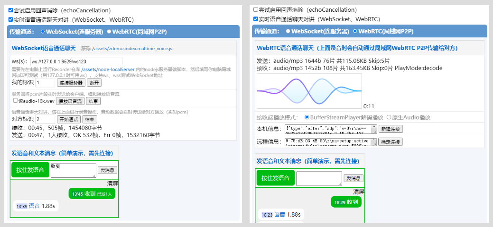
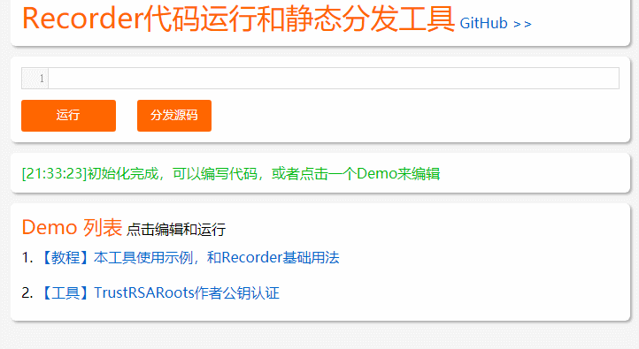
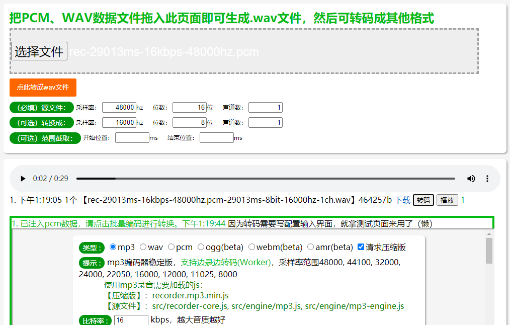

# :open_book:Recorder用于html5录音

[在线测试](https://xiangyuecn.github.io/Recorder/)，支持大部分已实现`getUserMedia`的移动端、PC端浏览器；主要包括：Chrome、Firefox、Safari、Android WebView、腾讯Android X5内核(QQ、微信)；不支持：UC系内核（典型的支付宝，大部分国产手机厂商的浏览器），IOS上除Safari外的其他任何形式的浏览器（含PWA、WebClip）。快捷方式: [【RecordApp测试】](https://jiebian.life/web/h5/github/recordapp.aspx)，[【Android、IOS App Demo】](https://github.com/xiangyuecn/Recorder/tree/master/app-support-sample)，[【工具】Recorder代码运行和静态分发](https://xiangyuecn.github.io/Recorder/assets/%E5%B7%A5%E5%85%B7-%E4%BB%A3%E7%A0%81%E8%BF%90%E8%A1%8C%E5%92%8C%E9%9D%99%E6%80%81%E5%88%86%E5%8F%91Runtime.html)，[【工具】裸(RAW、WAV)PCM转WAV播放测试和转码](https://xiangyuecn.github.io/Recorder/assets/%E5%B7%A5%E5%85%B7-%E8%A3%B8PCM%E8%BD%ACWAV%E6%92%AD%E6%94%BE%E6%B5%8B%E8%AF%95.html) ，[查看caniuse浏览器支持情况](https://caniuse.com/#search=getUserMedia)。

录音默认输出mp3格式，另外可选wav格式（raw pcm format此格式录音文件超大）；有限支持ogg(beta)、webm(beta)、amr(beta)格式；支持任意格式扩展（前提有相应编码器）。

mp3默认16kbps的比特率，2kb每秒的录音大小，音质还可以（如果使用8kbps可达到1kb每秒，不过音质太渣）。主要用于语音录制，双声道语音没有意义，特意仅对单声道进行支持。mp3和wav格式支持边录边转码，录音结束时转码速度极快，支持实时转码成小片段文件和实时传输，demo中已实现一个语音通话聊天，下面有介绍；其他格式录音结束时可能需要花费比较长的时间进行转码。

mp3使用lamejs编码，压缩后的recorder.mp3.min.js文件150kb左右（开启gzip后54kb）。如果对录音文件大小没有特别要求，可以仅仅使用录音核心+wav(raw pcm format)编码器，压缩后的recorder.wav.min.js不足5kb。

如需在Hybrid App内使用（支持IOS、Android），或提供IOS微信的支持，请参阅[app-support-sample](https://github.com/xiangyuecn/Recorder/tree/master/app-support-sample)目录。

*IOS、国产系统浏览器上的使用限制等问题和兼容请参阅下面的知识库部分。*


# :open_book:快速使用

## 【1】加载框架
在需要录音功能的页面引入压缩好的recorder.xxx.min.js文件即可 （**注意：[需要在https等安全环境下才能进行录音](https://developer.mozilla.org/en-US/docs/Web/API/MediaDevices/getUserMedia#Privacy_and_security)**）
``` html
<script src="recorder.mp3.min.js"></script> <!--已包含recorder-core和mp3格式支持-->
```
或者直接使用源码（src内的为源码、dist内的为压缩后的），可以引用src目录中的recorder-core.js+相应类型的实现文件，比如要mp3录音：
``` html
<script src="src/recorder-core.js"></script> <!--必须引入的录音核心-->
<script src="src/engine/mp3.js"></script> <!--相应格式支持文件-->
<script src="src/engine/mp3-engine.js"></script> <!--如果此格式有额外的编码引擎的话，也要加上-->
```
> 可自行用 `AMD/CommonJS` 写法把 `Recorder` 函数（把格式支持文件合并过来）进行导出；或者尝试直接 `import/require` `recorder.mp3.min.js`，应该可以通过全局`window.Recorder`访问，简单粗暴。vue?! angular?!可用??!!，[webpack使用](https://github.com/xiangyuecn/Recorder/issues/38)。

## 【2】调用录音
然后使用，假设立即运行，只录3秒，[运行此代码>>](https://xiangyuecn.github.io/Recorder/assets/%E5%B7%A5%E5%85%B7-%E4%BB%A3%E7%A0%81%E8%BF%90%E8%A1%8C%E5%92%8C%E9%9D%99%E6%80%81%E5%88%86%E5%8F%91Runtime.html?idf=self_base_demo)
``` javascript
var rec=Recorder({type:"mp3",sampleRate:16000});//mp3格式，指定采样率，其他参数使用默认配置；注意：是数字的参数必须提供数字，不要用字符串；需要使用的type类型，需提前把格式支持文件加载进来，比如使用wav格式需要提前加载wav.js编码引擎

//var dialog=createDelayDialog(); 开启可选的弹框伪代码，需先于open执行，因为回调不确定是同步还是异步的
rec.open(function(){//打开麦克风授权获得相关资源
    //dialog&&dialog.Cancel(); 如果开启了弹框，此处需要取消
    rec.start();//开始录音
    
    setTimeout(function(){
        rec.stop(function(blob,duration){//到达指定条件停止录音
            console.log((window.URL||webkitURL).createObjectURL(blob),"时长:"+duration+"ms");
            rec.close();//释放录音资源
            //已经拿到blob文件对象想干嘛就干嘛：立即播放、上传
            
            /*立即播放例子*/
            var audio=document.createElement("audio");
            audio.controls=true;
            document.body.appendChild(audio);
            //简单的一哔
            audio.src=(window.URL||webkitURL).createObjectURL(blob);
            audio.play();
            
        },function(msg){
            console.log("录音失败:"+msg);
        });
    },3000);
},function(msg,isUserNotAllow){//用户拒绝未授权或不支持
    //dialog&&dialog.Cancel(); 如果开启了弹框，此处需要取消
    console.log((isUserNotAllow?"UserNotAllow，":"")+"无法录音:"+msg);
});


//我们可以选择性的弹一个对话框：为了防止移动端浏览器存在第三种情况：用户忽略，并且（或者国产系统UC系）浏览器没有任何回调
/*伪代码：
function createDelayDialog(){
    if(Is Mobile){//只针对移动端
        return new Alert Dialog Component
            .Message("录音功能需要麦克风权限，请允许；如果未看到任何请求，请点击忽略~")
            .Button("忽略")
            .OnClick(function(){//明确是用户点击的按钮，此时代表浏览器没有发起任何权限请求
                //此处执行fail逻辑
                console.log("无法录音：权限请求被忽略");
            })
            .OnCancel(NOOP)//自动取消的对话框不需要任何处理
            .Delay(8000); //延迟8秒显示，这么久还没有操作基本可以判定浏览器有毛病
    };
};
*/
```

## 【附】录音上传示例
``` javascript
var TestApi="/test_request";//用来在控制台network中能看到请求数据，测试的请求结果无关紧要
var rec=Recorder();rec.open(function(){rec.start();setTimeout(function(){rec.stop(function(blob,duration){
//-----↓↓↓以下才是主要代码↓↓↓-------

//本例子假设使用jQuery封装的请求方式，实际使用中自行调整为自己的请求方式
//录音结束时拿到了blob文件对象，可以用FileReader读取出内容，或者用FormData上传
var api=TestApi;

/***方式一：将blob文件转成base64纯文本编码，使用普通application/x-www-form-urlencoded表单上传***/
var reader=new FileReader();
reader.onloadend=function(){
    $.ajax({
        url:api //上传接口地址
        ,type:"POST"
        ,data:{
            mime:blob.type //告诉后端，这个录音是什么格式的，可能前后端都固定的mp3可以不用写
            ,upfile_b64:(/.+;\s*base64\s*,\s*(.+)$/i.exec(reader.result)||[])[1] //录音文件内容，后端进行base64解码成二进制
            //...其他表单参数
        }
        ,success:function(v){
            console.log("上传成功",v);
        }
        ,error:function(s){
            console.error("上传失败",s);
        }
    });
};
reader.readAsDataURL(blob);

/***方式二：使用FormData用multipart/form-data表单上传文件***/
var form=new FormData();
form.append("upfile",blob,"recorder.mp3"); //和普通form表单并无二致，后端接收到upfile参数的文件，文件名为recorder.mp3
//...其他表单参数
$.ajax({
    url:api //上传接口地址
    ,type:"POST"
    ,contentType:false //让xhr自动处理Content-Type header，multipart/form-data需要生成随机的boundary
    ,processData:false //不要处理data，让xhr自动处理
    ,data:form
    ,success:function(v){
        console.log("上传成功",v);
    }
    ,error:function(s){
        console.error("上传失败",s);
    }
});

//-----↑↑↑以上才是主要代码↑↑↑-------
},function(msg){console.log("录音失败:"+msg);});},3000);},function(msg){console.log("无法录音:"+msg);});
```

## 【附】问题排查
- 打开[Demo页面](https://xiangyuecn.github.io/Recorder/)试试看，是不是也有同样的问题。
- 检查是不是在https之类的安全环境下调用的。
- 检查是不是IOS系统，确认[caniuse](https://caniuse.com/#search=getUserMedia)IOS对`getUserMedia`的支持情况。
- 检查上面第1步是否把框架加载到位，在[Demo页面](https://xiangyuecn.github.io/Recorder/)有应该加载哪些js的提示。
- 提交Issue，热心网友帮你解答。


## 【QQ群】交流与支持

欢迎加QQ群：781036591，纯小写口令：`recorder`


## 案例演示

### 【Demo】
[](https://xiangyuecn.github.io/Recorder/) https://xiangyuecn.github.io/Recorder/

> `2019-3-27` 在QQ和微信打开时，发现这个网址被屏蔽了，尝试申诉了一下。`2019-4-7`晚上又发现被屏蔽了，小米浏览器也一样报危险网站，尝试打开一下别人的`github.io`发现全是这样，看来是`github.io`的问题，被波及了，不过第二天又自己好了。

#### 【祝福贺卡助手】
使用到这个库用于祝福语音的录制，已开通网页版和微信小程序版。专门针对IOS的微信中进行了兼容处理，IOS上微信环境中调用的微信的api（小程序、公众号api）。小程序地址：[](https://jiebian.life/t/a)；网页地址：[](https://jiebian.life/t/a)

#### 【注】
如果你的项目用到了这个库也想展示到这里，可以发个isuse，注明使用介绍和访问方式，我们收录在这里。


# :open_book:知识库

本库期待的使用场景是语音录制，因此音质只要不比高品质的感觉差太多就行；1分钟的语音进行编码是很快的，但如果录制超长的录音，比如10分钟以上，不同类型的编码可能会花费比较长的时间，因为只有边录边转码(Worker)支持的类型才能进行极速转码。另外未找到双声道语音录制存在的意义（翻倍录音数据大小，并且拉低音质），因此特意仅对单声道进行支持。


浏览器Audio Media[兼容性](https://developer.mozilla.org/en-US/docs/Web/HTML/Supported_media_formats#Browser_compatibility)mp3最好，wav还行，其他要么不支持播放，要么不支持编码。

**特别注**：`IOS(11.X、12.X)`上只有`Safari`支持`getUserMedia`，IOS上其他浏览器均不支持，参考下面的已知问题。

**特别注**：大部分国产手机厂商的浏览器（系统浏览器，都用的UC内核？）虽然支持`getUserMedia`方法，但并不能使用，表现为直接返回拒绝或者干脆没有任何回调；UC系列目测全部阵亡（含支付宝）。

**特别注**：如果在`iframe`里面调用的录音功能，并且和上层的网页是不同的域（跨域了），如果未设置相应策略，权限永远是被拒绝的，[参考此处](https://developer.mozilla.org/en-US/docs/Web/API/MediaDevices/getUserMedia#Privacy_and_security)。另外如果要在`非跨域的iframe`里面使用，最佳实践应该是让window.top去加载Recorder（异步加载js），iframe里面使用top.Recorder，免得各种莫名其妙（比如微信里面的各种渣渣功能，搞多了就习惯了）。

> 如果需要最大限度的兼容IOS（仅增加微信支持），可以使用`RecordApp`，它已包含`Recorder`，源码在`src/app-support`、`app-support-sample`中，但此兼容库需要服务器端提供微信JsSDK的签名、下载素材接口，涉及微信公众（订阅）号的开发。

支持|Recorder|[RecordApp](https://github.com/xiangyuecn/Recorder/tree/master/app-support-sample)
-:|:-:|:-:
PC浏览器|√|√
Android Chrome Firefox|√|√
Android微信(含小程序)|√|√
Android Hybrid App|√|√
Android其他浏览器|未知|未知
IOS Safari|√|√
IOS微信(含小程序)||√
IOS Hybrid App||√
IOS其他浏览器||
开发难度|简单|复杂
第三方依赖|无|依赖微信公众号


## 已知问题
*2018-09-19* [caniuse](https://caniuse.com/#search=getUserMedia) 注明`IOS` `11.X - 12.X` 上 只有`Safari`支持调用`getUserMedia`，其他App下WKWebView(UIWebView?)([相关资料](https://forums.developer.apple.com/thread/88052))均不支持。经用户测试验证IOS 12上chrome、UC都无法录音，部分IOS 12 Safari可以获取到并且能正常录音，但部分不行，原因未知，参考[ios 12 支不支持录音了](https://www.v2ex.com/t/490695)。在IOS上不支持录音的环境下应该采用其他解决方案，参考`案例演示`、`关于微信JsSDK`部分。

*2019-02-28* [issues#14](https://github.com/xiangyuecn/Recorder/issues/14) 如果`getUserMedia`返回的[`MediaStreamTrack.readyState == "ended"`，`"ended" which indicates that the input is not giving any more data and will never provide new data.`](https://developer.mozilla.org/en-US/docs/Web/API/MediaStreamTrack) ，导致无法录音。如果产生这种情况，目前在`rec.open`方法调用时会正确检测到，并执行`fail`回调。造成`issues#14` `ended`原因是App源码中`AndroidManifest.xml`中没有声明`android.permission.MODIFY_AUDIO_SETTINGS`权限，导致腾讯X5不能正常录音。

*2019-03-09* 在Android上QQ、微信里，请求授权使用麦克风的提示，经过长时间观察发现，他们的表现很随机、很奇特。可能每次在调用`getUserMedia`时候都会弹选择，也可能选择一次就不会再弹提示，也可能重启App后又会弹。如果用户拒绝了，可能第二天又会弹，或者永远都不弹了，要么重置(装)App。使用腾讯X5内核的App测试也是一样奇特表现，拒绝权限后可能必须要重置(装)。这个问题貌似跟X5内核自动升级的版本有关。QQ浏览器更加惨不忍睹，2019-08-16测试发现卸载重装、拒绝权限后永远无法弹出授权，通过浏览器设置-清理-清理地理位置授权才能恢复，重启、重装、清理系统垃圾、删除根目录文件夹（腾讯那个大文件不敢删，毒瘤）垃圾均无效，奇葩。

*2019-06-14* 经[#29](https://github.com/xiangyuecn/Recorder/issues/29)反馈，稍微远程真机测试了部分厂商的比较新的Android手机系统浏览器的录音支持情况；华为：直接返回拒绝，小米：没有回调，OPPO：好像是没有回调，vivo：好像是没有回调；另外专门测试了一下UC最新版（支付宝）：直接返回拒绝。另[参考](https://www.jianshu.com/p/6cd5a7fa562c)。也许他们都商量好了或者本身都是用的UC？至于没有任何回调的，此种浏览器没有良心。

*2019-07-22* 对[#34](https://github.com/xiangyuecn/Recorder/issues/34)反馈研究后发现，问题一：macOS、IOS的Safari对连续调用录音（中途未调用close）是有问题的，但只要调用close后再重复录音就没有问题。问题二：IOS上如果录音之前先播放了任何Audio，录音过程可能会变得很诡异，但如果先录音，就不存在此问题（19-09-18 Evan:QQ1346751357反馈发现本问题并非必现，[功能页面](https://hft.bigdatahefei.com/LocateSearchService/sfc/index)，但本库的Demo内却必现，原因不明）。chrome、firefox正常的很。目测这两个问题是非我等屌丝能够解决的，于是报告给苹果家程序员看看，因此发了个[帖子](https://forums.developer.apple.com/message/373108)，顺手在`Feedback Assistant`提交了`bug report`，但好几天过去了没有任何回应（顺带给微软一个好评）。


# :open_book:方法文档

### 【构造】rec=Recorder(set)

构造函数，拿到`Recorder`的实例，然后可以进行请求获取麦克风权限和录音。

`set`参数为配置对象，默认配置值如下：
``` javascript
set={
    type:"mp3" //输出类型：mp3,wav等，使用一个类型前需要先引入对应的编码引擎
    ,bitRate:16 //比特率，必须是数字 wav(位):16、8，MP3(单位kbps)：8kbps时文件大小1k/s，16kbps 2k/s，录音文件很小
    
    ,sampleRate:16000 //采样率，必须是数字，wav格式（8位）文件大小=sampleRate*时间；mp3此项对低比特率文件大小有影响，高比特率几乎无影响。
                //wav任意值，mp3取值范围：48000, 44100, 32000, 24000, 22050, 16000, 12000, 11025, 8000
    
    ,bufferSize:4096 //AudioContext缓冲大小。会影响onProcess调用速度，相对于AudioContext.sampleRate=48000时，4096接近12帧/s，调节此参数可生成比较流畅的回调动画。
                //取值256, 512, 1024, 2048, 4096, 8192, or 16384
                //注意，取值不能过低，2048开始不同浏览器可能回调速率跟不上造成音质问题（低端浏览器→说的就是腾讯X5）
    
    ,onProcess:NOOP //接收到录音数据时的回调函数：fn(buffers,powerLevel,bufferDuration,bufferSampleRate) 
                //buffers=[[Int16,...],...]：缓冲的PCM数据，为从开始录音到现在的所有pcm片段；powerLevel：当前缓冲的音量级别0-100，bufferDuration：已缓冲时长，bufferSampleRate：缓冲使用的采样率（当type支持边录边转码(Worker)时，此采样率和设置的采样率相同，否则不一定相同）
                //如果需要绘制波形之类功能，需要实现此方法即可，使用以计算好的powerLevel可以实现音量大小的直观展示，使用buffers可以达到更高级效果
                //注意，buffers数据的采样率和set.sampleRate不一定相同，可能为浏览器提供的原始采样率，也可能为已转换好的采样率set.sampleRate；如需浏览器原始采样率的数据，请使用rec.buffers数据，而不是本回调的参数；如需明确和set.sampleRate完全相同采样率的数据，请在onProcess中自行连续调用采样率转换函数Recorder.SampleData()，配合mock方法可实现实时转码和压缩语音传输
}
```

**注意：set内是数字的明确传数字**，不要传字符串之类的导致不可预测的异常，其他有配置的地方也是一样（感谢`214282049@qq.com`19-01-10发的反馈邮件）。

### 【方法】rec.open(success,fail)
请求打开录音资源，如果浏览器不支持录音、用户拒绝麦克风权限、或者非安全环境（非https、file等）将会调用`fail`；打开后需要调用`close`来关闭，因为浏览器或设备的系统可能会显示正在录音。

注意：此方法回调是可能是同步的（异常、或者已持有资源时）也可能是异步的（浏览器弹出权限请求时）；一般使用时打开，用完立即关闭；可重复调用，可用来测试是否能录音。

另外：因为此方法会调起用户授权请求，如果仅仅想知道浏览器是否支持录音（比如：如果浏览器不支持就走另外一套录音方案），应使用`Recorder.Support()`方法。

> **特别注**: 鉴于UC系浏览器（大部分国产手机厂商系统浏览器）大概率表面支持录音但永远不会有任何回调、或者此浏览器支持第三种情况（用户忽略 并且 此浏览器认为此种情况不需要回调 并且程序员完美实现了）；如果当前环境是移动端，可以在调用此方法`8秒`后如果未收到任何回调，弹出一个自定义提示框（只需要一个按钮），提示内容范本：`录音功能需要麦克风权限，请允许；如果未看到任何请求，请点击忽略~`，按钮文本：`忽略`；当用户点击了按钮，直接手动执行`fail`逻辑，因为此时浏览器压根就没有弹移动端特有的模态话权限请求对话框；但如果收到了回调（可能是同步的，因此弹框必须在`rec.open`调用前准备好随时取消），需要把我们弹出的提示框自动关掉，不需要用户做任何处理。pc端的由于不是模态化的请求对话框，可能会被用户误点，所以尽量要判断一下是否是移动端。

`success`=fn();

`fail`=fn(errMsg,isUserNotAllow); 如果是用户主动拒绝的录音权限，除了有错误消息外，isUserNotAllow=true，方便程序中做不同的提示，提升用户主动授权概率


### 【方法】rec.close(success)
关闭释放录音资源，释放完成后会调用`success()`回调

注意：如果创建了多个Recorder对象并且调用了open（应避免同时有多个对象进行了open），只有最后一个新建的才有权限进行实际的资源释放（和多个对象close调用顺序无关），浏览器或设备的系统才会不再显示正在录音的提示。

### 【方法】rec.start()
开始录音，需先调用`open`；最佳实践为：每次调用`start`前都调用一次`open`以达到最佳的兼容性，录音`stop`后调用`close`进行关闭。

只要open成功时，调用此方法是安全的，如果未open强行调用导致的内部错误将不会有任何提示，stop时自然能得到错误；另外open操作可能需要花费比较长时间，如果中途调用了stop，open完成时（同步）的任何start调用将会被自动阻止，也是不会有提示的。

### 【方法】rec.stop(success,fail,autoClose)
结束录音并返回录音数据`blob对象`，拿到blob对象就可以为所欲为了，不限于立即播放、上传

`success(blob,duration)`：`blob`：录音数据audio/mp3|wav...格式，`duration`：录音时长，单位毫秒

`fail(errMsg)`：录音出错回调

`autoClose`：`false` 可选，是否自动调用`close`，默认为`false`不调用

提示：stop时会进行音频编码，根据类型的不同音频编码花费的时间也不相同。对于支持边录边转码(Worker)的类型，将极速完成编码并回调；对于不支持的10几秒录音花费2秒左右算是正常，但内部采用了分段编码+setTimeout来处理，界面卡顿不明显。


### 【方法】rec.pause()
暂停录音。

### 【方法】rec.resume()
恢复继续录音。

### 【属性】rec.buffers
此数据为从开始录音到现在为止的所有已缓冲的PCM片段，`buffers` `=` `[[Int16,...],...]`，录音stop时会使用此完整数据进行转码成指定的格式。

buffers中的PCM数据为浏览器采集的原始音频数据，采样率为浏览器提供的原始采样率；在`rec.set.onProcess`回调中`buffers`参数就是此数据或者此数据重新采样后的新数据。

如果你需要长时间实时录音（如长时间语音通话），并且不需要得到最终完整编码的音频文件，Recorder初始化时应当使用一个未知的类型进行初始化（如: type:"unknown"，仅仅用于初始化而已，实时转码可以手动转成有效格式，因为有效格式可能内部还有其他类型的缓冲），并且实时在`onProcess`中修改`rec.buffers`数组，只保留最后两个元素，其他元素设为null（代码：`rec.buffers[rec.buffers.length-3]=null`），以释放占用的内存，并且录音结束时不要调用`stop`（因为已录音的时间非常长时，stop操作会导致占用大量的内存，甚至不足），直接调用`close`丢弃所有数据即可。


### 【方法】rec.mock(pcmData,pcmSampleRate)
模拟一段录音数据，后面可以调用stop进行编码。需提供pcm数据[Int16,...]，和pcm数据的采样率。

可用于将一个音频解码出来的pcm数据方便的转换成另外一个格式：
``` javascript
var amrBlob=...;//amr音频blob对象
var amrSampleRate=8000;//amr音频采样率

//解码amr得到pcm数据
var reader=new FileReader();
reader.onload=function(){
    Recorder.AMR.decode(new Uint8Array(reader.result),function(pcm){
        transformOgg(pcm);
    });
};
reader.readAsArrayBuffer(amrBlob);

//将pcm转成ogg
function transformOgg(pcmData){
    Recorder({type:"ogg",bitRate:64,sampleRate:32000})
        .mock(pcmData,amrSampleRate)
        .stop(function(blob,duration){
            //我们就得到了新采样率和比特率的ogg文件
            console.log(blob,duration);
        });
};
```

提示：在录音实时回调中配合`Recorder.SampleData()`方法使用效果更佳，可实时生成小片段语音文件。


### 【静态方法】Recorder.Support()
判断浏览器是否支持录音，随时可以调用。注意：仅仅是检测浏览器支持情况，不会判断和调起用户授权（rec.open()会判断用户授权），不会判断是否支持特定格式录音。

### 【静态方法】Recorder.IsOpen()
由于Recorder持有的录音资源是全局唯一的，可通过此方法检测是否有Recorder已调用过open打开了录音功能。

### 【静态方法】Recorder.SampleData(pcmDatas,pcmSampleRate,newSampleRate,prevChunkInfo)
对pcm数据的采样率进行转换，配合mock方法使用效果更佳，比如实时转换成小片段语音文件。

`pcmDatas`: [[Int16,...]] pcm片段列表

`pcmSampleRate`:48000 pcm数据的采样率

`newSampleRate`:16000 需要转换成的采样率，newSampleRate>=pcmSampleRate时不会进行任何处理，小于时会进行重新采样

`prevChunkInfo`:{} 可选，上次调用时的返回值，用于连续转换，本次调用将从上次结束位置开始进行处理。或可自行定义一个ChunkInfo从pcmDatas指定的位置开始进行转换

返回值ChunkInfo
``` javascript
{
    //可定义，从指定位置开始转换到结尾
    index:0 pcmDatas已处理到的索引
    offset:0.0 已处理到的index对应的pcm中的偏移的下一个位置
    
    //仅作为返回值
    sampleRate:16000 结果的采样率，<=newSampleRate
    data:[Int16,...] 结果
}
```


# :open_book:压缩合并一个自己需要的js文件
可参考/src/package-build.js中如何合并的一个文件，比如mp3是由`recorder-core.js`,`engine/mp3.js`,`engine/mp3-engine.js`组成的。

除了`recorder-core.js`其他引擎文件都是可选的，可以把全部编码格式合到一起也，也可以只合并几种，然后就可以支持相应格式的录音了。

可以修改/src/package-build.js后，在src目录内执行压缩：
``` javascript
cnpm install
npm start
```

# :open_book:关于现有编码器
如果你有其他格式的编码器并且想贡献出来，可以提交新增格式文件的PR（文件放到/src/engine中），我们升级它。

## wav (raw pcm format)
wav格式编码器时参考网上资料写的，会发现代码和别人家的差不多。源码2kb大小。

### wav转pcm
生成的wav文件内音频数据的编码为未压缩的pcm数据（raw pcm），只是在pcm数据前面加了一个44字节的wav头；因此直接去掉前面44字节就能得到原始的pcm数据，如：`blob.slice(44,blob.size,"audio/pcm")`;

## mp3
采用的是[lamejs](https://github.com/zhuker/lamejs)(LGPL License)这个库的代码，`https://github.com/zhuker/lamejs/blob/bfb7f6c6d7877e0fe1ad9e72697a871676119a0e/lame.all.js`这个版本的文件代码；已对lamejs源码进行了部分改动，用于修复发现的问题。LGPL协议涉及到的文件：`mp3-engine.js`；这些文件也采用LGPL授权，不适用MIT协议。源码518kb大小，压缩后150kb左右，开启gzip后50来k。

## beta-ogg
采用的是[ogg-vorbis-encoder-js](https://github.com/higuma/ogg-vorbis-encoder-js)(MIT License)，`https://github.com/higuma/ogg-vorbis-encoder-js/blob/7a872423f416e330e925f5266d2eb66cff63c1b6/lib/OggVorbisEncoder.js`这个版本的文件代码。此编码器源码2.2M，超级大，压缩后1.6M，开启gzip后327K左右。对录音的压缩率比lamejs高出一倍, 但Vorbis in Ogg好像Safari不支持（[真的假的](https://developer.mozilla.org/en-US/docs/Web/HTML/Supported_media_formats#Browser_compatibility)）。

## beta-webm
这个编码器时通过查阅MDN编写的一个玩意，没多大使用价值：录几秒就至少要几秒来编码。。。原因是：未找到对已有pcm数据进行快速编码的方法。数据导入到MediaRecorder，音频有几秒就要等几秒，类似边播放边收听形。(想接原始录音Stream？我不可能给的!)输出音频虽然可以通过比特率来控制文件大小，但音频文件中的比特率并非设定比特率，采样率由于是我们自己采样的，到这个编码器随他怎么搞。只有比较新的浏览器支持（需实现浏览器MediaRecorder），压缩率和mp3差不多。源码2kb大小。

## beta-amr
采用的是[benz-amr-recorder](https://github.com/BenzLeung/benz-amr-recorder)(MIT License)优化后的[amr.js](https://github.com/jpemartins/amr.js)(Unknown License)，`https://github.com/BenzLeung/benz-amr-recorder/blob/462c6b91a67f7d9f42d0579fb5906fad9edb2c9d/src/amrnb.js`这个版本的文件代码，已对此代码进行过调整更方便使用。支持编码和解码操作。由于最高只有12.8kbps的码率，音质和同比配置的mp3、ogg差一个档次。由于支持解码操作，理论上所有支持Audio的浏览器都可以播放（需要自己写代码实现）。源码1M多，蛮大，压缩后445K，开启gzip后136K。优点：录音文件小。

### Recorder.amr2wav(amrBlob,True,False)
已实现的一个把amr转成wav格式来播放的方法，`True=fn(wavBlob,duration)`。要使用此方法需要带上上面的`wav`格式编码器。仿照此方法可轻松转成别的格式，参考`mock`方法介绍那节。


# :open_book:其他音频格式支持办法
``` javascript
//比如增加aac格式支持 (可参考/src/engine/wav.js实现)

//新增一个aac.js，编写以下格式代码即可实现这个类型
Recorder.prototype.aac=function(pcmData,successCall,failCall){
    //通过aac编码器把pcm[Int16,...]数据转成aac格式数据，通过this.set拿到传入的配置数据
    ... pcmData->aacData
    
    //返回数据
    successCall(new Blob([aacData.buffer],{type:"audio/aac"}));
}

//调用
Recorder({type:"aac"})
```


# :open_book:扩展
在`src/extensions`目录内为扩展支持库，这些扩展库默认都没有合并到生成代码中，需单独引用(`dist`或`src`中的)才能使用。

## `WaveView`扩展
`waveview.js`，4kb大小源码，录音时动态显示波形，具体样子参考演示地址页面。此扩展参考[MCVoiceWave](https://github.com/HaloMartin/MCVoiceWave)库编写的，具体代码在`https://github.com/HaloMartin/MCVoiceWave/blob/f6dc28975fbe0f7fc6cc4dbc2e61b0aa5574e9bc/MCVoiceWave/MCVoiceWaveView.m`中。

此扩展是在录音时`onProcess`回调中使用；`bufferSize`会影响绘制帧率，越小越流畅（但越消耗cpu），默认配置的大概12帧/s。基础使用方法：
``` javascript
var wave;
var rec=Recorder({
    onProcess:function(buffers,powerLevel,bufferDuration,bufferSampleRate){
        wave.input(buffers[buffers.length-1],powerLevel,bufferSampleRate);//输入音频数据，更新显示波形
    }
});
rec.open(function(){
    wave=Recorder.WaveView({elem:".elem"}); //创建wave对象，写这里面浏览器妥妥的
    
    rec.start();
});
```


### 【构造】wave=Recorder.WaveView(set)
构造函数，`set`参数为配置对象，默认配置值如下：
``` javascript
set={
    elem:"css selector" //自动显示到dom，并以此dom大小为显示大小
        //或者配置显示大小，手动把waveviewObj.elem显示到别的地方
    ,width:0 //显示宽度
    ,height:0 //显示高度
    
    //以上配置二选一
    
    scale:2 //缩放系数，因为正整数，使用2(3? no!)倍宽高进行绘制，避免移动端绘制模糊
    ,speed:8 //移动速度系数，越大越快
    
    ,lineWidth:2 //线条基础粗细
            
    //渐变色配置：[位置，css颜色，...] 位置: 取值0.0-1.0之间
    ,linear1:[0,"rgba(150,97,236,1)",1,"rgba(54,197,252,1)"] //线条渐变色1，从左到右
    ,linear2:[0,"rgba(209,130,253,0.6)",1,"rgba(54,197,252,0.6)"] //线条渐变色2，从左到右
    ,linearBg:[0,"rgba(255,255,255,0.2)",1,"rgba(54,197,252,0.2)"] //背景渐变色，从上到下
}
```

### 【方法】wave.input(pcmData,powerLevel,sampleRate)
输入音频数据，更新波形显示，这个方法调用的越快，波形越流畅。pcmData [Int16,...]为当前的录音数据片段，其他参数和`onProcess`回调相同。


# :open_book:兼容性
对于支持录音的浏览器能够正常录音并返回录音数据；对于不支持的浏览器，引入js和执行相关方法都不会产生异常，并且进入相关的fail回调。一般在open的时候就能检测到是否支持或者被用户拒绝，可在用户开始录音之前提示浏览器不支持录音或授权。


# :open_book:Android Hybrid App中录音示例
在Android Hybrid App中使用本库来录音，需要在App源码中实现以下两步分：

1. 在`AndroidManifest.xml`声明需要用到的两个权限
``` xml
<uses-permission android:name="android.permission.RECORD_AUDIO"/>
<uses-permission android:name="android.permission.MODIFY_AUDIO_SETTINGS"/>
```

2. `WebChromeClient`中实现`onPermissionRequest`网页授权请求
``` java
@Override
public void onPermissionRequest(PermissionRequest request) {
    ...此处应包裹一层系统权限请求
    if (Build.VERSION.SDK_INT >= Build.VERSION_CODES.LOLLIPOP) {
        request.grant(request.getResources());
    }
}
```

> 注：如果应用的`腾讯X5内核`，除了上面两个权限外，还必须提供`android.permission.CAMERA`权限。另外无法重写此`onPermissionRequest`方法，他会自己弹框询问，如果被拒绝了就看X5脸色了（随着X5不停更新什么时候恢复弹框天知地知就是你不知），参考已知问题部分。

如果不出意外，App内显示的网页就能正常录音了。

### 备忘小插曲
排查 [#46](https://github.com/xiangyuecn/Recorder/issues/46) `Android WebView`内长按录音不能收到`touchend`问题时，发现touch事件会被打断，反复折腾，最终发现是每次检测权限都会调用`Activity.requestPermissions`，而`requestPermissions`会造成WebView打断touch事件，进而产生H5、AppNative原生录都会产生此问题；最后老实把精简掉的`checkSelfPermission`加上检测一下是否已授权，就没有此问题了，囧。

### 附带测试项目
[app-support-sample/demo_android](https://github.com/xiangyuecn/Recorder/tree/master/app-support-sample/demo_android)目录中提供了Android测试源码（如果不想自己打包可以用打包好的apk来测试，文件名为`app-debug.apk.zip`，自行去掉.zip后缀）。


# :open_book:IOS Hybrid App中录音示例
纯粹的H5录音在IOS WebView中是不支持的，需要有Native层的支持，具体参考RecordApp中的[app-support-sample/demo_ios](https://github.com/xiangyuecn/Recorder/tree/master/app-support-sample/demo_ios)，含IOS App源码。


# :open_book:语音通话聊天demo：实时编码、传输与播放验证
在[线测试Demo](https://xiangyuecn.github.io/Recorder/)中包含了一个语音通话聊天的测试功能，没有服务器支持所以仅支持局域网内一对一语音。用两个设备（浏览器打开两个标签也可以）打开demo，勾选H5版语音通话聊天，按提示交换两个设备的信息即可成功进行P2P连接，然后进行语音。实际使用时数据传输可以用WebSocket，会简单好多。

编写本语音测试的目的在于验证H5录音实时转码、传输的可行性，并验证实时转码mp3格式小片段文件接收后的可播放性。经测试发现：除了移动端可能存在设备性能低下的问题以外，录音后实时转码mp3并传输给对方是可行的，对方接收后播放也能连贯的播放（效果还是要看播放代码写的怎么样，目前没有比较完美的播放代码）。另外（16kbps,16khz）MP3开语音15分钟大概3M的流量，wav 15分钟要37M多流量。

另外除wav外MP3等格式编码出来的音频的播放时间比PCM原始数据要长一些或短一些，如果涉及到解码或拼接时，这个地方需要注意。




# :open_book:工具：代码运行和静态分发Runtime
[在线访问](https://xiangyuecn.github.io/Recorder/assets/%E5%B7%A5%E5%85%B7-%E4%BB%A3%E7%A0%81%E8%BF%90%E8%A1%8C%E5%92%8C%E9%9D%99%E6%80%81%E5%88%86%E5%8F%91Runtime.html)，本工具提供在线运行和测试代码的能力，本库的大部分小demo将由此工具来进行开发和承载。本工具提供代码片段的分发功能，代码存储在url中，因此简单可靠；额外提供了一套源码作者的身份认证机制。

我们不传输、不存储数据，我们只是代码的可靠搬运工。看图：




# :open_book:工具：裸(RAW、WAV)PCM转WAV播放测试和转码
[在线访问](https://xiangyuecn.github.io/Recorder/assets/%E5%B7%A5%E5%85%B7-%E8%A3%B8PCM%E8%BD%ACWAV%E6%92%AD%E6%94%BE%E6%B5%8B%E8%AF%95.html)，本工具用来对原始的PCM音频数据进行封装、播放、转码，操作极其简单，免去了动用二进制编辑工具操作的麻烦。比如加工一下Android AudioRecord(44100)采集的音频。源码在`assets/工具-裸PCM转WAV播放测试.html`;




# :open_book:关于微信JsSDK和RecordApp
微信内浏览器他家的[JsSDK](https://mp.weixin.qq.com/wiki?t=resource/res_main&id=mp1421141115)也支持录音，涉及笨重难调的公众号开发（光sdk初始化就能阻碍很多新奇想法的产生，signature限制太多），只能满足最基本的使用（大部分情况足够了）。获取音频数据必须绕一个大圈：录好音了->上传到微信服务器->自家服务器请求微信服务器多进行媒体下载->保存录音（微信小程序以前也是二逼路子，现在稍微好点能实时拿到录音mp3数据）。

[2018]由于微信IOS上不支持原生JS录音，Android上又支持，为了兼容而去兼容的事情我是拒绝的（而且是仅仅为了兼容IOS上面的微信），其实也算不上去兼容，因为微信JsSDK中的接口完全算是另外一种东西，接入的话对整个录音流程都会产生完全不一样的变化，还不如没有进入录音流程之前就进行分支判断处理。

[2019]大动干戈，仅为兼容IOS而生，不得不向大厂低头，我还是为兼容而去兼容了IOS微信，对不支持录音的IOS微信`浏览器`、`小程序web-view`进行了兼容，使用微信JsSDK来录音，并以前未开源的兼容代码基础上重写了`RecordApp`，源码在`app-support-sample`、`src/app-support`内。

最后：如果要兼容IOS，可以自行接入JsSDK或使用`RecordApp`（没有公众号开个订阅号又不要钱），基本上可以忽略兼容性问题，就是麻烦点。


# :star:捐赠
如果这个库有帮助到您，请 Star 一下。

你也可以选择使用支付宝或微信给我捐赠：

  