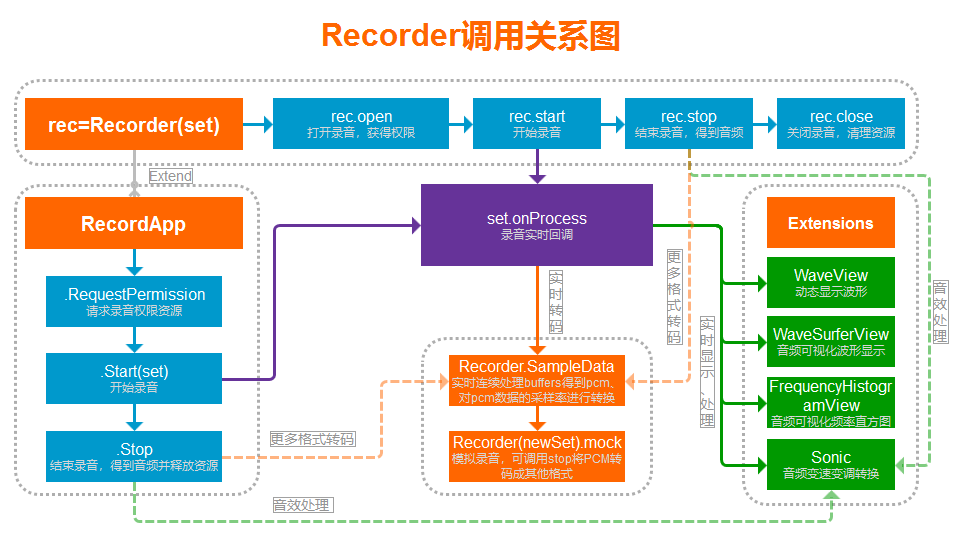

**【[源GitHub仓库](https://github.com/xiangyuecn/Recorder/tree/master/app-support-sample)】 | 【[Gitee镜像库](https://gitee.com/xiangyuecn/Recorder/tree/master/app-support-sample)】本文档中默认使用[github.io部署的链接](https://xiangyuecn.github.io/Recorder/app-support-sample/)，如果无法访问，请直接下载仓库源码到本地然后双击打开html文件访问。**


# :open_book:RecordApp：基于Recorder的跨平台录音解决方案

RecordApp是在[Recorder](../)基础上为不同平台环境提供底层适配，支持在：浏览器WebView（H5）、各种使用js来构建的程序（App、小程序、UniApp、Electron、NodeJs）中录音。

使用场景|平台环境|参考Demo
:-:|-|-
**App+H5页面**|浏览器、WebView（App、软件内置浏览器）|[ [H5在线测试](https://xiangyuecn.github.io/Recorder/app-support-sample/) ] [ [QuickStart](https://xiangyuecn.github.io/Recorder/app-support-sample/QuickStart.html) ] [ [App vue](https://xiangyuecn.github.io/Recorder/assets/demo-vue/recordapp.html) ] <br> [ [Android App](demo_android) ] [ [iOS App](demo_ios) ]
**微信小程序**|微信小程序（支持可视化插件）|使用文档和Demo: [ [miniProgram-wx](./miniProgram-wx) ]
**uni-app**|可编译成：H5、Android iOS App、小程序|使用文档和Demo: [ [demo_UniApp](./demo_UniApp) ]
**NodeJs**|无录音功能，可对PCM数据实时处理、编码|测试代码: [ [node-codes](../assets/node-codes) ]
其他环境|可通过`RecordApp.RegisterPlatform`自行适配|自行对接


[​](?)

[​](?)

[​](?)

[​](?)


<p align="center"><a href="https://github.com/xiangyuecn/Recorder"></a></p>

<p align="center">
  <a title="Stars" href="https://github.com/xiangyuecn/Recorder"></a>
  <a title="Forks" href="https://github.com/xiangyuecn/Recorder"></a>
  <a title="npm Downloads" href="https://www.npmjs.com/package/recorder-core"></a>
  <a title="npm Version" href="https://www.npmjs.com/package/recorder-core"></a>
  <a title="License" href="https://github.com/xiangyuecn/Recorder/blob/master/LICENSE"></a>
  <a title="JsDelivr CDN" href="https://www.jsdelivr.com/package/gh/xiangyuecn/Recorder"></a>
  <a title="unpkg CDN" href="https://unpkg.com/recorder-core/"></a>
  <a title="51LA" href="https://web.51.la/report/main?comId=20469973"></a>
</p>


[​](?)

# :open_book:快速使用

## 一、引入js文件
可以通过 npm 进行安装 `npm install recorder-core --registry=https://registry.npmmirror.com/` ，或者直接git clone得到源码直接引用。所有js文件均为手动引入（内部不会自动引用），因此未被你引入的文件均可删除来精简源码大小。

[​](?Ref=ImportCode&Start)可以使用`import`、`require`、`html script`等你适合的方式来引入js文件，下面的以import为主要参考，其他引入方式根据文件路径自行调整一下就可以了。
``` javascript
//必须引入的Recorder核心（文件路径是 /src/recorder-core.js 下同），使用import、require都行；recorder-core会自动往window（浏览器环境）或Object（非浏览器环境）下挂载名称为Recorder对象，全局可调用Recorder
import Recorder from 'recorder-core' //注意如果未引用Recorder变量，可能编译时会被优化删除（如vue3 tree-shaking），请改成 import 'recorder-core'，或随便调用一下 Recorder.a=1 保证强引用
//import './你clone的目录/src/recorder-core.js' //clone源码可以按这个方式引入，下同
//require('./你clone的目录/src/recorder-core.js') //clone源码可以按这个方式引入，下同
//<script src="你clone的目录/src/recorder-core.js"> //这是html中script方式引入，下同

//按需引入你需要的录音格式支持文件，如果需要多个格式支持，把这些格式的编码引擎js文件统统引入进来即可
import 'recorder-core/src/engine/mp3'
import 'recorder-core/src/engine/mp3-engine' //如果此格式有额外的编码引擎（*-engine.js）的话，必须要加上

//以上三个也可以合并使用压缩好的recorder.xxx.min.js
//比如 import 'recorder-core/recorder.mp3.min' //已包含recorder-core和mp3格式支持
//比如 <script src="你clone的目录/recorder.mp3.min.js">

//可选的插件支持项，把需要的插件按需引入进来即可
import 'recorder-core/src/extensions/waveview'

/****以上均为Recorder的相关文件，下面是RecordApp需要的支持文件****/

//必须引入的RecordApp核心文件（文件路径是 /src/app-support/app.js）。注意：app.js会自动往window（浏览器环境）或Object（非浏览器环境）下挂载名称为RecordApp对象，全局可调用RecordApp
import RecordApp from 'recorder-core/src/app-support/app'

//引入特定平台环境下的支持文件（也可以统统引入进来，非对应的环境下运行时会忽略掉）
//import 'recorder-core/src/app-support/app-native-support.js' //App下的原生录音支持文件（App中未提供原生支持时可以不提供，统统走H5录音）
//import 'recorder-core/src/app-support/app-miniProgram-wx-support.js' //微信小程序下的录音支持文件
//import '@/uni_modules/Recorder-UniCore/app-uni-support.js' //uni-app下的支持文件，请参考本文档目录下的demo_UniApp测试项目

//ts import 提示：npm包内已自带了.d.ts声明文件（不过是any类型）
```
[​](?RefEnd)

### 在App WebView、H5页面中使用
可以通过阅读和运行本目录下的[QuickStart.html](https://xiangyuecn.github.io/Recorder/app-support-sample/QuickStart.html)文件来快速入门学习，你可以直接将此html文件copy 到你的(https)网站中，无需其他文件，就能正常开始测试了，H5、Android App、iOS App内均适用。

RecordApp默认未开启App内原生录音支持，App内默认也使用H5录音（简单通用），可选开启支持后在App环境中将走Native原生录音（需要App配合）。

如何开启可选的原生录音支持：在Android、iOS App内使用`demo_android`、`demo_ios`目录内的`RecordAppJsBridge.java`或`RecordAppJsBridge.swift` 即可开启支持，本目录下的`native-config.js`文件内实现了对App的JsBridge调用（copy过去使用）。

关于App的系统录音权限：使用原生录音时，JsBridge会自动处理App的录音权限；使用H5录音时，需要先自行处理好App的系统录音权限；更多请参考下面的App权限部分。

``` javascript
//可选 开启App原生录音需要引入的文件，不引入时App中也统统使用默认的H5录音
import 'recorder-core/src/app-support/app-native-support.js' //App下的原生录音支持文件

//引入配置文件
import './你copy的目录/native-config.js' //你需要将 /app-support-sample/native-config.js copy到你自己项目中，再引入
```

### 在微信小程序中使用
请直接参考本目录下的 [miniProgram-wx](./miniProgram-wx) 小程序demo项目；如果是在小程序`web-view`中录音请直接使用`Recorder H5`就行，不需要额外支持。

``` javascript
//微信开发者工具对npm支持太差，因此最好直接git clone源码使用

//引入RecordApp的微信小程序支持文件
require("./你clone的目录/src/app-support/app-miniProgram-wx-support.js");
```

### 在uni-app中使用
请直接参考本目录下的 [demo_UniApp](./demo_UniApp) demo项目，可编译成：H5、Android App、iOS App、微信小程序，**[AD]编译成App时仅供测试，正式发布需商用授权**。

在uni-app中使用，需要先导入Recorder-UniCore组件，在demo_UniApp项目中可以找到此组件，或者到[DCloud 插件市场下载此组件](https://ext.dcloud.net.cn/plugin?name=Recorder-UniCore)。
``` javascript
//所有平台必须引入的uni-app支持文件
import '@/uni_modules/Recorder-UniCore/app-uni-support.js'

//需要编译成微信小程序时，引入微信小程序支持文件
import 'recorder-core/src/app-support/app-miniProgram-wx-support.js'

//需要编译成app时，需要在页面内提供一个renderjs模块，同样的进行一遍import
//具体使用请参考demo_UniApp项目
```


[​](?)

[​](?)

## 二、调用录音
[​](?Ref=Codes&Start)RecordApp的基础调用方式在所有平台环境下是通用的；但不同环境下可能会提供更多的方法、或配置参数以供使用，多出来的请参考对应的平台环境支持说明。

``` javascript
/**请求录音权限，Start调用前至少要调用一次RequestPermission**/
var recReq=function(success){
    //RecordApp.RequestPermission_H5OpenSet={ audioTrackSet:{ noiseSuppression:true,echoCancellation:true,autoGainControl:true } }; //这个是Start中的audioTrackSet配置，在h5中必须提前配置，因为h5中RequestPermission会直接打开录音
    
    RecordApp.RequestPermission(function(){
        //注意：有使用到H5录音时，为了获得最佳兼容性，建议RequestPermission、Start至少有一个应当在用户操作（触摸、点击等）下进行调用
        success&&success();
    },function(msg,isUserNotAllow){//用户拒绝未授权或不支持
        console.log((isUserNotAllow?"UserNotAllow，":"")+"无法录音:"+msg);
    });
};

/**开始录音**/
var recStart=function(success){
    var processTime=0;
    
    //开始录音的参数和Recorder的初始化参数大部分相同
    RecordApp.Start({
        type:"mp3",sampleRate:16000,bitRate:16 //mp3格式，指定采样率hz、比特率kbps，其他参数使用默认配置；注意：是数字的参数必须提供数字，不要用字符串；需要使用的type类型，需提前把格式支持文件加载进来，比如使用wav格式需要提前加载wav.js编码引擎
        /*,audioTrackSet:{ //可选，如果需要同时播放声音（比如语音通话），需要打开回声消除（打开后声音可能会从听筒播放，部分环境下（如小程序、uni-app原生接口）可调用接口切换成扬声器外放）
            //注意：H5中需要在请求录音权限前进行相同配置RecordApp.RequestPermission_H5OpenSet后此配置才会生效
            echoCancellation:true,noiseSuppression:true,autoGainControl:true} */
        ,onProcess:function(buffers,powerLevel,bufferDuration,bufferSampleRate,newBufferIdx,asyncEnd){
            //录音实时回调，大约1秒调用12次本回调，buffers为开始到现在的所有录音pcm数据块(16位小端LE)
            //可实时上传（发送）数据，可实时绘制波形，ASR语音识别，使用可参考Recorder
            processTime=Date.now();
        }
        
        //...  不同环境的专有配置，根据文档按需配置
    },function(){
        //开始录音成功
        success&&success();
        
        //【稳如老狗WDT】可选的，监控是否在正常录音有onProcess回调，如果长时间没有回调就代表录音不正常
        var this_=   RecordApp; //有this就用this，没有就用一个全局对象
        if(RecordApp.Current.CanProcess()){
            var wdt=this_.watchDogTimer=setInterval(function(){
                if(wdt!=this_.watchDogTimer){ clearInterval(wdt); return } //sync
                if(Date.now()<this_.wdtPauseT) return; //如果暂停录音了就不检测：puase时赋值this_.wdtPauseT=Date.now()*2（永不监控），resume时赋值this_.wdtPauseT=Date.now()+1000（1秒后再监控）
                if(Date.now()-(processTime||startTime)>1500){ clearInterval(wdt);
                    console.error(processTime?"录音被中断":"录音未能正常开始");
                    // ... 错误处理，关闭录音，提醒用户
                }
            },1000);
        }else{
            console.warn("当前环境不支持onProcess回调，不启用watchDogTimer"); //目前都支持回调
        }
        var startTime=Date.now(); this_.wdtPauseT=0;
    },function(msg){
        console.log("开始录音失败："+msg);
    });
};


//暂停录音
var recPause=function(){
    if(RecordApp.GetCurrentRecOrNull()){
        RecordApp.Pause();
        var this_=RecordApp;this_.wdtPauseT=Date.now()*2; //永不监控onProcess超时
        console.log("已暂停");
    }
};
//继续录音
var recResume=function(){
    if(RecordApp.GetCurrentRecOrNull()){
        RecordApp.Resume();
        var this_=RecordApp;this_.wdtPauseT=Date.now()+1000; //1秒后再监控onProcess超时
        console.log("继续录音中...");
    }
};


/**停止录音，清理资源**/
var recStop=function(){
    var this_=RecordApp;this_.watchDogTimer=0; //停止监控onProcess超时
    
    RecordApp.Stop(function(arrayBuffer,duration,mime){
        //arrayBuffer就是录音文件的二进制数据，不同平台环境下均可进行播放、上传
        console.log(arrayBuffer,mime,"时长:"+duration+"ms");
        
        //如果当前环境支持Blob，也可以直接构造成Blob文件对象，和Recorder使用一致
        if(typeof(Blob)!="undefined" && typeof(window)=="object"){
            var blob=new Blob([arrayBuffer],{type:mime});
            console.log(blob, (window.URL||webkitURL).createObjectURL(blob));
        }
    },function(msg){
        console.log("录音失败:"+msg);
    });
};


//这里假设立即运行，只录3秒
recReq(function(){
    recStart(function(){
        setTimeout(recStop,3000);
    });
});
```
[​](?RefEnd)


[​](?)

[​](?)

## 【附】需要进行的权限处理
App的WebView中打开网页进行录音时，如果未使用原生录音，将默认使用Recorder H5进行录音（和普通网页录音没有任何区别），此时必须在`RecordApp.RequestPermission`前先获取到App的系统录音权限，如果App没有系统录音权限，将无法录音。

### Android App录音权限
[demo_android](demo_android)目录中提供了Android测试项目源码（如果不想自己打包可以用打包好的apk来测试，demo_android目录下的`app-debug.apk.zip`，自行去掉.zip后缀）。

在Android App WebView中使用本库来H5录音，需要在App源码中实现以下几部分：

1. 在`AndroidManifest.xml`声明需要用到的两个权限，第二个也必须的
``` xml
<uses-permission android:name="android.permission.RECORD_AUDIO"/>
<uses-permission android:name="android.permission.MODIFY_AUDIO_SETTINGS"/>
```

2. WebView的WebChromeClient中实现`onPermissionRequest`网页授权请求

如果未实现此方法，WebView默认会拒绝H5录音权限；onPermissionRequest中需要先获取App的系统录音权限（Activity里面必须先用this.checkSelfPermission检测权限，否则直接this.requestPermissions会造成WebView触发touchcancel打断长按），然后再grant网页权限，可参考[MainActivity.java](demo_android/app/src/main/java/com/github/xianyuecn/recorder/MainActivity.java)中的实现代码。

注：如果应用的`腾讯X5内核`，可能还须提供`android.permission.CAMERA`权限，和调用`webView.setWebChromeClientExtension`来重写X5的`IX5WebChromeClientExtension.onPermissionRequest`方法来进行权限处理

3. 如需后台录音，还需要实现Android后台录音保活服务

自`Android 9`开始，为了保护用户隐私，锁屏或进入后台一段时间后App可能会被禁止访问麦克风、摄像头等功能，导致无法录音、或录音数据全部是静音，因此需要使用保活机制才能在后台录音，详细请参考[demo_android](demo_android)，里面专门有一个章节讲解保活。


### iOS App录音权限
[demo_ios](demo_ios)目录中提供了iOS测试项目源码（需自行用xcode编译运行）。

在iOS App WebView中使用本库来录音，需要在App源码 `Info.plist` 中声明使用麦克风 `NSMicrophoneUsageDescription`，无需其他处理，WebView会自己处理好录音权限；注意：iOS App需要在项目Background Modes中勾选Audio才能在后台保持录音，不然App切到后台后立马会停止录音。

iOS 14.3+以上版本才支持WebView中进行H5录音。

iOS 15+以上版本提供了静默授权支持，需要WKWebView的uiDelegate实现[WKUIDelegate requestMediaCapturePermissionFor接口](https://developer.apple.com/documentation/webkit/wkuidelegate)，可参考iOS Demo中的[MainView.swift](demo_ios/recorder/MainView.swift)中的代码；如果未实现，会导致H5录音每次打开页面后第一次录音时、或长时间无操作再打开录音时均会弹出录音权限对话框。

iOS 11.0-14.2：纯粹的H5录音在iOS WebView中是不支持的，需要有Native层的支持，具体参考[demo_ios](demo_ios)测试项目源码。


### 微信小程序录音权限
录音功能由微信小程序的`RecorderManager`提供，需要用户授予录音权限，调用`RecordApp.RequestPermission`的时候会检查是否能正常录音，如果用户拒绝了录音权限，会进入错误回调，回调里面你应当编写代码检查`wx.getSetting`中的`scope.record`录音权限，然后引导用户进行授权（可调用`wx.openSetting`打开设置页面，方便用户给权限）。


### Electron程序录音权限
在Electron BrowserWindow中使用本库来录音，需要程序本身先获得录音权限，调用`RecordApp.RequestPermission`前先到主进程使用 `systemPreferences.getMediaAccessStatus('microphone')` 判断程序是否有录音权限，如果是未申请权限，需要调用 `systemPreferences.askForMediaAccess('microphone')` 来请求权限；程序有权限后，即可和普通网页一样正常的录音。


### uni-app录音权限
uni-app项目当需要编译成Android、iOS App时，需要在 `manifest.json` 中配置好Android和iOS的录音权限声明，参考上面的Android iOS权限，是一样的，注意Android不要漏掉了`MODIFY_AUDIO_SETTINGS`权限；无需其他处理，因为`Recorder-UniCore`组件内已经全部处理好了。


[​](?)

[​](?)

## 【QQ群】交流与支持

欢迎加QQ群：①群 781036591、②群 748359095、③群 450721519，纯小写口令：`recorder`


[​](?)

[​](?)

[​](?)

[​](?)

# :open_book:方法文档



## 【静态方法】RecordApp.RequestPermission(success,fail)
请求录音权限，如果当前环境不支持录音或用户拒绝将调用错误回调；调用`RecordApp.Start`前需先至少调用一次此方法，用于获得权限和必要的环境初始化；请求权限后如果不使用了，不管有没有调用`Start`，至少要调用一次`Stop`来清理可能持有的资源。

`success`: `fn()` 有权限时回调

`fail`: `fn(errMsg,isUserNotAllow)` 没有权限或者不能录音时回调，如果是用户主动拒绝的录音权限，除了有错误消息外，`isUserNotAllow=true`，方便程序中做不同的提示，提升用户主动授权概率

注意：H5等环境中在请求权限时会调用Recorder的open方法打开录音，并保持打开直到Start时直接录音，会导致部分open会用到的配置参数在Start时不会生效，这些配置参数必须在请求录音权限前配置到`RecordApp.RequestPermission_H5OpenSet={...}`里面才会生效，主要为audioTrackSet、runningContext、sourceStream配置。

## 【静态方法】RecordApp.Start(set,success,fail)
开始录音，需先调用`RecordApp.RequestPermission`；成功开始录音后会回调`success()`，失败会回调`fail(errMsg)`。

``` javascript
set配置默认值（和Recorder的初始化参数大部分相同）：
{
    type:"mp3" //输出类型：mp3,wav等，使用一个类型前需要先引入对应的编码引擎
    ,bitRate:16 //比特率，必须是数字 wav(位):16、8，MP3(单位kbps)：8kbps时文件大小1k/s，16kbps 2k/s，录音文件很小
    
    ,sampleRate:16000 //采样率，必须是数字，wav格式（8位）文件大小=sampleRate*时间；mp3此项对低比特率文件大小有影响，高比特率几乎无影响。
                //wav任意值，mp3取值范围：48000, 44100, 32000, 24000, 22050, 16000, 12000, 11025, 8000
    
    ,onProcess:NOOP //接收到录音数据时的回调函数：fn(buffers,powerLevel,bufferDuration,bufferSampleRate,newBufferIdx,asyncEnd)
            //如果某平台环境下没有特殊说明，那么此环境下的回调和Recorder的onProcess回调行为完全一致
                //返回值：onProcess如果返回true代表开启异步模式，在某些大量运算的场合异步是必须的，必须在异步处理完成时调用asyncEnd(不能真异步时需用setTimeout包裹)；返回其他值或者不返回为同步模式（需避免在回调内执行耗时逻辑）；如果开启异步模式，在onProcess执行后新增的buffer会全部替换成空数组，因此本回调开头应立即将newBufferIdx到本次回调结尾位置的buffer全部保存到另外一个数组内，处理完成后写回buffers中本次回调的结尾位置。
                //buffers=[[Int16,...],...]：缓冲的PCM数据块(16位小端LE)，为从开始录音到现在的所有pcm片段，每次回调可能增加0-n个不定量的pcm片段。
                    //注意：buffers数据的采样率为bufferSampleRate，它和set.sampleRate不一定相同，可能为浏览器提供的原始采样率rec.srcSampleRate，也可能为已转换好的采样率set.sampleRate；如需浏览器原始采样率的数据，请使用rec.buffers原始数据，而不是本回调的参数；如需明确和set.sampleRate完全相同采样率的数据，请在onProcess中自行连续调用采样率转换函数Recorder.SampleData()，配合mock方法可实现实时转码和压缩语音传输；修改或替换buffers内的数据将会改变最终生成的音频内容（注意不能改变第一维数组长度），比如简单有限的实现实时静音、降噪、混音等处理，详细参考下面的rec.buffers
                //powerLevel：当前缓冲的音量级别0-100。
                //bufferDuration：已缓冲时长。
                //bufferSampleRate：buffers缓存数据的采样率（当type支持边录边转码(Worker)时，此采样率和设置的采样率相同，否则不一定相同）。
                //newBufferIdx:本次回调新增的buffer起始索引。
                //asyncEnd：fn() 如果onProcess是异步的(返回值为true时)，处理完成时需要调用此回调，如果不是异步的请忽略此参数，此方法回调时必须是真异步（不能真异步时需用setTimeout包裹）。
                //如果需要绘制波形之类功能，需要实现此方法即可，使用以计算好的powerLevel可以实现音量大小的直观展示，使用buffers可以达到更高级效果
                //如果需要实时上传（发送）之类的，可以配合Recorder.SampleData方法，将buffers中的新数据连续的转换成pcm，或使用mock方法将新数据连续的转码成其他格式，可以参考文档里面的：Demo片段列表 -> 实时转码并上传-通用版；基于本功能可以做到：实时转发数据、实时保存数据、实时语音识别（ASR）等
    
    //*******高级设置******
        //,disableEnvInFix:false 内部参数，禁用设备卡顿时音频输入丢失补偿功能，如果不清楚作用请勿随意使用
        //,takeoffEncodeChunk:NOOP //fn(chunkBytes) chunkBytes=[Uint8,...]：实时编码环境下接管编码器输出，当编码器实时编码出一块有效的二进制音频数据时实时回调此方法；参数为二进制的Uint8Array，就是编码出来的音频数据片段，所有的chunkBytes拼接在一起即为完整音频。本实现的想法最初由QQ2543775048提出。
                //当提供此回调方法时，将接管编码器的数据输出，编码器内部将放弃存储生成的音频数据；环境要求比较苛刻：如果当前环境不支持实时编码处理，将在Start时直接走fail逻辑
                //因此提供此回调后调用Stop方法将无法获得有效的音频数据，因为编码器内没有音频数据，因此Stop时返回的数据长度为0
    
    //*******H5录音专有配置，部分参数在别的环境下可能也会生效******
        //,sourceStream:MediaStream Object
                //可选直接提供一个媒体流，从这个流中录制、实时处理音频数据，请参考Recorder

        //,runningContext:AudioContext
                //可选提供一个state为running状态的AudioContext对象(ctx)，请参考Recorder

        /*,audioTrackSet:{ //请参考Recorder，echoCancellation在微信小程序、uni-app也可用；注意：H5等环境中需要在请求录音权限前进行相同配置RecordApp.RequestPermission_H5OpenSet后此配置才会生效
             deviceId:"",groupId:"" //指定设备的麦克风，通过navigator.mediaDevices.enumerateDevices拉取设备列表，其中kind为audioinput的是麦克风
            ,echoCancellation:true //回声消除（AEC）开关，不设置时由浏览器控制（一般为默认自动打开），设为true明确打开，设为false明确关闭
            ,noiseSuppression:true //降噪（ANS）开关，取值和回声消除开关一样
            ,autoGainControl:true //自动增益（AGC）开关，取值和回声消除开关一样
        }*/
    
    //*******uni-app编译成app时专有配置，详细请参考 demo_UniApp 目录******
        //,onProcess_renderjs:'function(...){ }' //renderjs中执行的onProcess函数字符串
        //,takeoffEncodeChunk_renderjs:'function(...){ }' //renderjs中执行的takeoffEncodeChunk函数字符串
        //,start_renderjs:'function(){ }' //Start成功时renderjs中会先调用这个函数字符串
        //,stop_renderjs:'function(...){ }' //Stop成功时renderjs中会先调用这个函数字符串
}
注意：此对象会被修改，因为平台实现时需要把实际使用的采样率、比特率存入此对象
```


## 【静态方法】RecordApp.Stop(success,fail)
结束录音和清理资源。

`success`: `fn(arrayBuffer,duration,mime)`    结束录音时回调，`arrayBuffer:ArrayBuffer` 录音二进制数据，`duration`: `123` 音频持续时间毫秒，`mime`: `audio/mp3` 录音格式类型。

`fail`: `fn(errMsg)` 录音出错时回调

如果不提供success参数=null时，将不会进行音频编码操作，只进行清理完可能持有的资源后走fail回调。

注意：当Start时提供了takeoffEncodeChunk后，你需要自行实时保存录音文件数据，因此Stop时返回的arrayBuffer的长度将为0字节。


## 【静态方法】RecordApp.Pause()
暂停录音。

## 【静态方法】RecordApp.Resume()
继续录音。


## 【静态方法】RecordApp.Install(success,fail)
对底层平台环境进行识别和初始化，`RecordApp.RequestPermission`只是对此方法进行了一次封装，并且多了一个权限请求而已。如果你只想先完成环境初始化，并不想调起权限请求，可手动调用此方法。此方法可以反复调用。

`success`: `fn()` 初始化成功回调

`fail`: `fn(errMsg)` 初始化失败回调


## 【静态属性】RecordApp.Current
为`RecordApp.Install`初始化后识别到的底层平台环境，取值为`RecordApp.Platforms`之一。

## 【静态方法】RecordApp.Current.CanProcess()
识别的底层平台环境是否支持实时返回PCM数据，如果返回值为true，`set.onProcess`将可以被实时回调，目前所有环境均为true。

## 【静态方法】RecordApp.GetCurrentRecOrNull()
获取底层平台录音过程中会使用用来处理实时数据的Recorder对象实例rec，如果底层录音过程中不使用Recorder进行数据的实时处理（目前没有），将返回null。Start调用前和Stop调用后均会返回null。

rec中的方法不一定都能使用，主要用来获取内部缓冲用的，比如实时清理缓冲。

## 【静态属性】RecordApp.Platforms
当前已注册支持的平台列表，引入相关平台支持文件后（`app-xxx-support.js`），会自动通过`RecordApp.RegisterPlatform`注册进这个列表。

## 【静态方法】RecordApp.RegisterPlatform(key,config)
注册一个平台的实现，对应的都会有一个`app-xxx-support.js`支持文件(Default-H5除外)，config中提供统一的实现接口，实现比较复杂，具体请阅读此方法源码注释，和参考已有的`app-xxx-support.js`文件。

**当你使用的平台环境没有相应的js支持文件时，你可以调用这个方法自行进行对接实现，然后就能正常使用RecordApp进行录音了。**


[​](?)

[​](?)

[​](?)

[​](?)

# :open_book:不同平台环境下的使用说明

## 内置：Default-H5
这个是RecordApp的内置支持，底层由Recorder H5提供录音支持；当在浏览器（WebView）环境中使用时，如果没有其他环境支持，就会默认由H5进行录音。

### 可使用的Recorder插件
因为是在浏览器中使用，因此所有的Recorder插件均可以使用。


[​](?)

[​](?)

## App原生录音：app-native-support.js
[app-native-support.js](../src/app-support/app-native-support.js) 是App Native原生录音支持文件，支持在浏览器环境中使用（Android iOS WebView）、各种适配后的js运行环境中使用（非浏览器环境）；使用本文件需要iOS、Android等App端提供的原生支持，如果你不能修改App的源码，将无法提供原生录音支持。

录音功能由原生App(Native)代码实现，通过JsBridge和js进行交互。Native层需要提供：请求权限、开始录音、结束录音、定时回调PCM[Int16]片段 等功能和接口。因为js层已加载Recorder和相应的js编码引擎，所以，Native层无需进行编码，可大大简化App的逻辑。

JsBridge可以是自己实现的交互方式 或 别人提供的框架。因为不知道具体使用的桥接方式，对应的请求已抽象成了4个方法在Native.Config中，需自行实现；你可以直接参考使用本文档目录下的 [native-config.js](./native-config.js) 配置文件，还有参考 [demo_android](./demo_android) 和 [demo_ios](./demo_ios) 两个demo项目，copy源码改改就能用。

### 可使用的Recorder插件
浏览器环境中使用时，所有的Recorder插件均可以使用；非浏览器环境中部分依赖浏览器的插件将不可用（如：可视化、播放器）。

### 【静态属性】RecordApp.AlwaysAppUseH5
默认为false，设为true时：App里面总是使用H5网页版录音，忽略原生录音。


[​](?)

[​](?)

## 微信小程序：app-miniProgram-wx-support.js
[app-miniProgram-wx-support.js](../src/app-support/app-miniProgram-wx-support.js) 是微信小程序支持文件，支持在微信小程序环境中使用；使用请参考本目录内的 [miniProgram-wx](./miniProgram-wx) 小程序demo项目；如果是在小程序`web-view`中录音请直接使用`Recorder H5`就行，不需要额外支持。

录音功能由微信小程序的RecorderManager录音接口提供（已屏蔽10分钟录音限制），因为js层已加载Recorder和相应的js编码引擎，所以，Recorder支持的录音格式，小程序内均可以做到支持。

### 可使用的Recorder插件
所有可视化、ASR插件均支持在小程序内使用，其他部分依赖浏览器环境的插件不可用（如：播放器）。

### 【静态方法】RecordApp.MiniProgramWx_onShow()
当使用到录音的页面onShow时进行一次调用，用于恢复被暂停的录音（比如按了home键会暂停录音）。

小程序自带的`RecorderManager`录音的时候，如果小程序退到了后台（或触发了`onInterruptionBegin`），录音将会被暂停，小程序显示的时候才允许继续录音，但`RecorderManager`无法感知这些事件或者存在bug，**因此你需要在要录音页面的`onShow`函数内加上`RecordApp.MiniProgramWx_onShow()`这行代码**，如果没有加这行代码，被暂停的录音可能会无法自动恢复。


[​](?)

[​](?)

## uni-app组件：app-uni-support.js
在本文档目录下的[demo_UniApp](./demo_UniApp)项目中可以找到Recorder-UniCore组件，或者到[DCloud 插件市场下载此组件](https://ext.dcloud.net.cn/plugin?name=Recorder-UniCore)，路径为 `@/uni_modules/Recorder-UniCore/app-uni-support.js` 。

此组件支持vue2、vue3、nvue，支持编译成：H5、Android App、iOS App、微信小程序，**[AD]编译成App时仅供测试，正式发布需商用授权**。

`app-uni-support.js` 在RecordApp下提供了大量的方法可供调用，详细文档请阅读[demo_UniApp](./demo_UniApp)的文档。

### 可使用的Recorder插件
编译成H5时，所有插件均可使用。

编译成App时，在renderjs支持使用所有插件（renderjs就是WebView浏览器环境）；在逻辑层中支持使用所有可视化、ASR插件，其他部分依赖浏览器环境的插件不可用（如：播放器）。

编译成小程序时，所有可视化插件均支持在小程序内使用，其他部分依赖浏览器环境的插件不可用（如：播放器）。


[​](?)

[​](?)

[​](?)

[​](?)

# :open_book:国际化多语言支持（i18n）
RecordApp共用`Recorder.i18n`实现，因此只需配置Recorder的语言即可；支持的语言文件在 [/src/i18n](../src/i18n) 目录内，详细使用请参考Recorder文档。

比如切换成英文：先`import "recorder-core/src/i18n/en-US.js"`，然后配置`Recorder.i18n.lang="en-US"`即可。

不同平台环境下可能还有专门的i18n文件夹，请参考对应的说明文档，import对应的语言文件进来即可。


[​](?)

[​](?)

[​](?)

[​](?)

# :star:捐赠
如果这个库有帮助到您，请 Star 一下。

您也可以使用支付宝或微信打赏作者：

  
