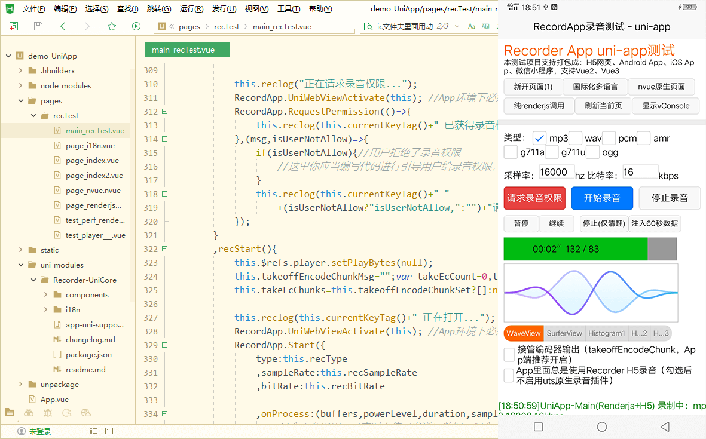

[Recorder](https://github.com/xiangyuecn/Recorder/) | [RecordApp](https://github.com/xiangyuecn/Recorder/tree/master/app-support-sample)

# :open_book:uni-app内使用RecordApp录音

本目录内包含uni-app的测试项目源码，主要文件请参考 [main_recTest.vue](pages/recTest/main_recTest.vue) ；本测试项目是使用[app-uni-support.js](uni_modules/Recorder-UniCore/app-uni-support.js)来给`RecordApp`提供uni-app支持的，此文件在 `uni_modules/Recorder-UniCore` 组件内，copy即可使用，或者到[DCloud 插件市场下载此组件](https://ext.dcloud.net.cn/plugin?name=Recorder-UniCore)。

- 支持vue2、vue3、nvue
- 支持编译成：H5、Android App、iOS App、微信小程序
- 支持已有的大部分录音格式：mp3、wav、pcm、amr、ogg、g711a、g711u等
- 支持实时处理，包括变速变调、实时上传、ASR语音转文字
- 支持可视化波形显示；可配置回声消除、降噪；**注意：不支持通话时录音**
- 支持PCM音频流式播放、完整播放，App端用原生插件边录音边播放更流畅
- 支持离线使用，本组件和配套原生插件均不依赖网络
- App端有配套的[原生录音插件](https://ext.dcloud.net.cn/plugin?name=Recorder-NativePlugin)可供搭配使用，兼容性和体验更好

**[AD]app-uni-support.js文件在uni-app中编译到App平台时仅供测试用（App平台包括：Android App、iOS App），不可用于正式发布或商用，正式发布或商用需先到DCloud插件市场购买[此带授权的插件](https://ext.dcloud.net.cn/plugin?name=Recorder-NativePlugin-Android)（费用为¥199元，赠送Android版原生插件）获得授权许可**；编译到其他平台时无此授权限制，比如：H5、小程序，均为免费授权；详情参考本文档下面的授权许可章节。


## 测试方法
**本测试项目如果在HBuilder中编译失败，请删掉node_modules目录重新手动执行npm install（偶尔出现HBuilder自动创建项目依赖包不完整，导致无法编译）**

1. 在本测试项目根目录执行 `npm install --registry=https://registry.npmmirror.com/` ，完成`recorder-core`依赖的安装
2. 在HBuilder中打开本测试项目文件夹
3. 在HBuilder中运行到浏览器、手机、微信小程序，即可在不同环境下测试
4. 测试中提供了：基础录音、播放、上传、WebSocket实时语音通话对讲、ASR语音识别等功能


## 截图



[​](?)

[​](?)

[​](?)

[​](?)

# 集成到自己项目中

## 一、引入js文件
1. 在你的项目根目录安装`recorder-core`：`npm install recorder-core --registry=https://registry.npmmirror.com/`
2. 导入Recorder-UniCore组件：直接复制本目录下的`uni_modules/Recorder-UniCore`组件到你项目中，或者到[DCloud 插件市场下载此组件](https://ext.dcloud.net.cn/plugin?name=Recorder-UniCore)
3. 项目配置好录音权限，参考下面的录音权限配置章节，**特别注意App后台录音配置、小程序权限声明**
4. 在需要录音的vue文件script内编写以下代码，按需引入需要的js

``` html
<template>
    <view>
        ... 建议template下只有一个根节点（最外面套一层view），如果不小心踩到了vue3的Fragments(multi-root 多个根节点)特性（vue2编译会报错，vue3不会），可能会出现奇奇怪怪的兼容性问题 
    </view>
</template>

<script> /**这里是逻辑层**/
//必须引入的Recorder核心（文件路径是 /src/recorder-core.js 下同），使用import、require都行
import Recorder from 'recorder-core' //注意如果未引用Recorder变量，可能编译时会被优化删除（如vue3 tree-shaking），请改成 import 'recorder-core'，或随便调用一下 Recorder.a=1 保证强引用

//必须引入的RecordApp核心文件（文件路径是 /src/app-support/app.js）
import RecordApp from 'recorder-core/src/app-support/app'

//所有平台必须引入的uni-app支持文件（如果编译出现路径错误，请把@换成 ../../ 这种）
import '@/uni_modules/Recorder-UniCore/app-uni-support.js'

/** 需要编译成微信小程序时，引入微信小程序支持文件 **/
// #ifdef MP-WEIXIN
    import 'recorder-core/src/app-support/app-miniProgram-wx-support.js'
// #endif


/** H5、小程序环境中：引入需要的格式编码器、可视化插件，App环境中在renderjs中引入 **/
// 注意：如果App中需要在逻辑层中调用Recorder的编码/转码功能，需要去掉此条件编译，否则会报未加载编码器的错误
// #ifdef H5 || MP-WEIXIN
    //按需引入你需要的录音格式支持文件，如果需要多个格式支持，把这些格式的编码引擎js文件统统引入进来即可
    import 'recorder-core/src/engine/mp3'
    import 'recorder-core/src/engine/mp3-engine' //如果此格式有额外的编码引擎（*-engine.js）的话，必须要加上
    
    //可选的插件支持项，把需要的插件按需引入进来即可
    import 'recorder-core/src/extensions/waveview'
// #endif

// ... 这后面写页面代码，用选项式API风格（vue2、vue3）、setup组合式API风格（仅vue3）都可以
</script>
```

5. 编译成app时，默认需要额外提供一个renderjs模块，请照抄下面这段代码放到vue文件末尾

``` html
<!-- #ifdef APP -->
<script module="yourModuleName" lang="renderjs"> //此模块内部只能用选项式API风格，vue2、vue3均可用，请照抄这段代码；不可改成setup组合式API风格，否则可能不能import vue导致编译失败
/**需要编译成App时，你需要添加一个renderjs模块，然后一模一样的import上面那些js（微信的js除外）
    ，因为App中默认是在renderjs（WebView）中进行录音和音频编码
    。如果配置了 RecordApp.UniWithoutAppRenderjs=true 且未调用依赖renderjs的功能时（如nvue、可视化、仅H5中可用的插件）
    ，可不提供此renderjs模块，同时逻辑层中需要将相关import的条件编译去掉**/
import 'recorder-core'
import RecordApp from 'recorder-core/src/app-support/app'
import '../../uni_modules/Recorder-UniCore/app-uni-support.js' //renderjs中似乎不支持"@/"打头的路径，如果编译路径错误请改正路径即可

//按需引入你需要的录音格式支持文件，和插件
import 'recorder-core/src/engine/mp3'
import 'recorder-core/src/engine/mp3-engine' 

import 'recorder-core/src/extensions/waveview'

export default {
    mounted(){
        //App的renderjs必须调用的函数，传入当前模块this
        RecordApp.UniRenderjsRegister(this);
    },
    methods: {
        //这里定义的方法，在逻辑层中可通过 RecordApp.UniWebViewVueCall(this,'this.xxxFunc()') 直接调用
        //调用逻辑层的方法，请直接用 this.$ownerInstance.callMethod("xxxFunc",{args}) 调用，二进制数据需转成base64来传递
    }
}
</script>
<!-- #endif -->
```


[​](?)

[​](?)

## 二、调用录音
``` javascript
/**在逻辑层中编写**/
//import ... 上面那些import代码

//var vue3This=getCurrentInstance().proxy; //当用vue3 setup组合式 API (Composition API) 编写时，直接在import后面取到当前实例this，在需要this的地方传vue3This变量即可，其他的和选项式 API (Options API) 没有任何区别；import {getCurrentInstance} from 'vue'；详细可以参考Demo项目中的 page_vue3____composition_api.vue

//RecordApp.UniNativeUtsPlugin={ nativePlugin:true };  //App中启用配套的原生录音插件支持，配置后会使用原生插件进行录音，没有原生插件时依旧使用renderjs H5录音
//App中提升后台录音的稳定性：配置了原生插件后，可配置 `RecordApp.UniWithoutAppRenderjs=true` 禁用renderjs层音频编码（WebWorker加速），变成逻辑层中直接编码（但会降低逻辑层性能），后台运行时可避免部分手机WebView运行受限的影响
//App中提升后台录音的稳定性：需要启用后台录音保活服务（iOS不需要，参考录音权限配置），Android 9开始，锁屏或进入后台一段时间后App可能会被禁止访问麦克风导致录音静音、无法录音（renderjs中H5录音也受影响），请调用配套原生插件的`androidNotifyService`接口，或使用第三方保活插件

export default {
data() { return {} } //视图没有引用到的变量无需放data里，直接this.xxx使用

,mounted() {
    this.isMounted=true;
    //页面onShow时【必须调用】的函数，传入当前组件this
    RecordApp.UniPageOnShow(this);
}
,onShow(){ //onShow可能比mounted先执行，页面可能还未准备好
    if(this.isMounted) RecordApp.UniPageOnShow(this);
}

,methods:{
    //请求录音权限
    recReq(){
        //编译成App时提供的授权许可（编译成H5、小程序为免费授权可不填写）；如果未填写授权许可，将会在App打开后第一次调用请求录音权限时，弹出“未获得商用授权时，App上仅供测试”提示框
        //RecordApp.UniAppUseLicense='我已获得UniAppID=*****的商用授权';
        
        //RecordApp.RequestPermission_H5OpenSet={ audioTrackSet:{ noiseSuppression:true,echoCancellation:true,autoGainControl:true } }; //这个是Start中的audioTrackSet配置，在h5（H5、App+renderjs）中必须提前配置，因为h5中RequestPermission会直接打开录音
        
        RecordApp.UniWebViewActivate(this); //App环境下必须先切换成当前页面WebView
        RecordApp.RequestPermission(()=>{
            console.log("已获得录音权限，可以开始录音了");
        },(msg,isUserNotAllow)=>{
            if(isUserNotAllow){//用户拒绝了录音权限
                //这里你应当编写代码进行引导用户给录音权限，不同平台分别进行编写
            }
            console.error("请求录音权限失败："+msg);
        });
    }
    
    //开始录音
    ,recStart(){
        //Android App如果要后台录音，需要启用后台录音保活服务（iOS不需要），需使用配套原生插件、或使用第三方保活插件
        //RecordApp.UniNativeUtsPluginCallAsync("androidNotifyService",{ title:"正在录音" ,content:"正在录音中，请勿关闭App运行" }).then(()=>{...}).catch((e)=>{...}) 注意必须RecordApp.RequestPermission得到权限后调用
        
        //录音配置信息
        var set={
            type:"mp3",sampleRate:16000,bitRate:16 //mp3格式，指定采样率hz、比特率kbps，其他参数使用默认配置；注意：是数字的参数必须提供数字，不要用字符串；需要使用的type类型，需提前把格式支持文件加载进来，比如使用wav格式需要提前加载wav.js编码引擎
            /*,audioTrackSet:{ //可选，如果需要同时播放声音（比如语音通话），需要打开回声消除（并不一定会生效；打开后声音可能会从听筒播放，部分环境下（如小程序、App原生插件）可调用接口切换成扬声器外放）
                //注意：H5、App+renderjs中需要在请求录音权限前进行相同配置RecordApp.RequestPermission_H5OpenSet后此配置才会生效
                echoCancellation:true,noiseSuppression:true,autoGainControl:true} */
            ,onProcess:(buffers,powerLevel,duration,sampleRate,newBufferIdx,asyncEnd)=>{
                //全平台通用：可实时上传（发送）数据，配合Recorder.SampleData方法，将buffers中的新数据连续的转换成pcm上传，或使用mock方法将新数据连续的转码成其他格式上传，可以参考Recorder文档里面的：Demo片段列表 -> 实时转码并上传-通用版；基于本功能可以做到：实时转发数据、实时保存数据、实时语音识别（ASR）等
                
                //注意：App里面是在renderjs中进行实际的音频格式编码操作，此处的buffers数据是renderjs实时转发过来的，修改此处的buffers数据不会改变renderjs中buffers，所以不会改变生成的音频文件，可在onProcess_renderjs中进行修改操作就没有此问题了；如需清理buffers内存，此处和onProcess_renderjs中均需要进行清理，H5、小程序中无此限制
                //注意：如果你要用只支持在浏览器中使用的Recorder扩展插件，App里面请在renderjs中引入此扩展插件，然后在onProcess_renderjs中调用这个插件；H5可直接在这里进行调用，小程序不支持这类插件；如果调用插件的逻辑比较复杂，建议封装成js文件，这样逻辑层、renderjs中直接import，不需要重复编写
                
                //H5、小程序等可视化图形绘制，直接运行在逻辑层；App里面需要在onProcess_renderjs中进行这些操作
                // #ifdef H5 || MP-WEIXIN
                if(this.waveView) this.waveView.input(buffers[buffers.length-1],powerLevel,sampleRate);
                // #endif
                
                /*实时释放清理内存，用于支持长时间录音；在指定了有效的type时，编码器内部可能还会有其他缓冲，必须同时提供takeoffEncodeChunk才能清理内存，否则type需要提供unknown格式来阻止编码器内部缓冲，App的onProcess_renderjs中需要进行相同操作
                if(this.clearBufferIdx>newBufferIdx){ this.clearBufferIdx=0 } //重新录音了就重置
                for(var i=this.clearBufferIdx||0;i<newBufferIdx;i++) buffers[i]=null;
                this.clearBufferIdx=newBufferIdx; */
            }
            ,onProcess_renderjs:`function(buffers,powerLevel,duration,sampleRate,newBufferIdx,asyncEnd){
                //App中在这里修改buffers会改变生成的音频文件，但注意：buffers会先转发到逻辑层onProcess后才会调用本方法，因此在逻辑层的onProcess中需要重新修改一遍
                //本方法可以返回true，renderjs中的onProcess将开启异步模式，处理完后调用asyncEnd结束异步，注意：这里异步修改的buffers一样的不会在逻辑层的onProcess中生效
                //App中是在renderjs中进行的可视化图形绘制，因此需要写在这里，this是renderjs模块的this（也可以用This变量）；如果代码比较复杂，请直接在renderjs的methods里面放个方法xxxFunc，这里直接使用this.xxxFunc(args)进行调用
                if(this.waveView) this.waveView.input(buffers[buffers.length-1],powerLevel,sampleRate);
                
                /*和onProcess中一样进行释放清理内存，用于支持长时间录音
                if(this.clearBufferIdx>newBufferIdx){ this.clearBufferIdx=0 } //重新录音了就重置
                for(var i=this.clearBufferIdx||0;i<newBufferIdx;i++) buffers[i]=null;
                this.clearBufferIdx=newBufferIdx; */
            }`
            ,onProcessBefore_renderjs:`function(buffers,powerLevel,duration,sampleRate,newBufferIdx){
                //App中本方法会在逻辑层onProcess之前调用，因此修改的buffers会转发给逻辑层onProcess，本方法没有asyncEnd参数不支持异步处理
                //一般无需提供本方法只用onProcess_renderjs就行，renderjs的onProcess内部调用过程：onProcessBefore_renderjs -> 转发给逻辑层onProcess -> onProcess_renderjs
            }`

            ,takeoffEncodeChunk:true?null:(chunkBytes)=>{
                //全平台通用：实时接收到编码器编码出来的音频片段数据，chunkBytes是Uint8Array二进制数据，可以实时上传（发送）出去
                //App中如果未配置RecordApp.UniWithoutAppRenderjs时，建议提供此回调，因为录音结束后会将整个录音文件从renderjs传回逻辑层，由于uni-app的逻辑层和renderjs层数据交互性能实在太拉跨了，大点的文件传输会比较慢，提供此回调后可避免Stop时产生超大数据回传
                
                //App中使用原生插件时，可方便的将数据实时保存到同一文件，第一帧时append:false新建文件，后面的append:true追加到文件
                //RecordApp.UniNativeUtsPluginCallAsync("writeFile",{path:"xxx.mp3",append:回调次数!=1, dataBase64:RecordApp.UniBtoa(chunkBytes.buffer)}).then(...).catch(...)
            }
            ,takeoffEncodeChunk_renderjs:true?null:`function(chunkBytes){
                //App中这里可以做一些仅在renderjs中才生效的事情，不提供也行，this是renderjs模块的this（也可以用This变量）
            }`
            
            ,start_renderjs:`function(){
                //App中可以放一个函数，在Start成功时renderjs中会先调用这里的代码，this是renderjs模块的this（也可以用This变量）
                //放一些仅在renderjs中才生效的事情，比如初始化，不提供也行
            }`
            ,stop_renderjs:`function(arrayBuffer,duration,mime){
                //App中可以放一个函数，在Stop成功时renderjs中会先调用这里的代码，this是renderjs模块的this（也可以用This变量）
                //放一些仅在renderjs中才生效的事情，不提供也行
            }`
        };
        
        RecordApp.UniWebViewActivate(this); //App环境下必须先切换成当前页面WebView
        RecordApp.Start(set,()=>{
            console.log("已开始录音");
            //【稳如老狗WDT】可选的，监控是否在正常录音有onProcess回调，如果长时间没有回调就代表录音不正常
            //var wdt=this.watchDogTimer=setInterval ... 请参考示例Demo的main_recTest.vue中的watchDogTimer实现
            
            //创建音频可视化图形绘制，App环境下是在renderjs中绘制，H5、小程序等是在逻辑层中绘制，因此需要提供两段相同的代码
            //view里面放一个canvas，canvas需要指定宽高（下面style里指定了300*100）
            //<canvas type="2d" class="recwave-WaveView" style="width:300px;height:100px"></canvas>
            RecordApp.UniFindCanvas(this,[".recwave-WaveView"],`
                this.waveView=Recorder.WaveView({compatibleCanvas:canvas1, width:300, height:100});
            `,(canvas1)=>{
                this.waveView=Recorder.WaveView({compatibleCanvas:canvas1, width:300, height:100});
            });
        },(msg)=>{
            console.error("开始录音失败："+msg);
        });
    }
    
    //暂停录音
    ,recPause(){
        if(RecordApp.GetCurrentRecOrNull()){
            RecordApp.Pause();
            console.log("已暂停");
        }
    }
    //继续录音
    ,recResume(){
        if(RecordApp.GetCurrentRecOrNull()){
            RecordApp.Resume();
            console.log("继续录音中...");
        }
    }
    
    //停止录音
    ,recStop(){
        //RecordApp.UniNativeUtsPluginCallAsync("androidNotifyService",{ close:true }) //关闭Android App后台录音保活服务
        
        RecordApp.Stop((arrayBuffer,duration,mime)=>{
            //全平台通用：arrayBuffer是音频文件二进制数据，可以保存成文件或者发送给服务器
            //App中如果在Start参数中提供了stop_renderjs，renderjs中的函数会比这个函数先执行
            
            //注意：当Start时提供了takeoffEncodeChunk后，你需要自行实时保存录音文件数据，因此Stop时返回的arrayBuffer的长度将为0字节
            
            //如果是H5环境，也可以直接构造成Blob/File文件对象，和Recorder使用一致
            // #ifdef H5
                var blob=new Blob([arrayBuffer],{type:mime});
                console.log(blob, (window.URL||webkitURL).createObjectURL(blob));
                var file=new File([arrayBuffer],"recorder.mp3");
                //uni.uploadFile({file:file, ...}) //参考demo中的test_upload_saveFile.vue
            // #endif
            
            //如果是App、小程序环境，可以直接保存到本地文件，然后调用相关网络接口上传
            // #ifdef APP || MP-WEIXIN
                RecordApp.UniSaveLocalFile("recorder.mp3",arrayBuffer,(savePath)=>{
                    console.log(savePath); //app保存的文件夹为`plus.io.PUBLIC_DOWNLOADS`，小程序为 `wx.env.USER_DATA_PATH` 路径
                    //uni.uploadFile({filePath:savePath, ...}) //参考demo中的test_upload_saveFile.vue
                },(errMsg)=>{ console.error(errMsg) });
            // #endif
        },(msg)=>{
            console.error("结束录音失败："+msg);
        });
    }
    
}
}
```


[​](?)

[​](?)

[​](?)

[​](?)

# 录音权限配置、需要注意的细节
## 编译成H5时录音和权限
编译成H5时，录音功能由Recorder H5提供，无需额外处理录音权限。


[​](?)

## 编译成微信小程序时录音和权限
编译成微信小程序时，录音功能由小程序的`RecorderManager`提供，屏蔽了微信原有的底层细节（无录音时长限制）。

小程序录音需要用户授予录音权限，调用`RecordApp.RequestPermission`的时候会检查是否能正常录音，如果用户拒绝了录音权限，会进入错误回调，回调里面你应当编写代码检查`wx.getSetting`中的`scope.record`录音权限，然后引导用户进行授权（可调用`wx.openSetting`打开设置页面，方便用户给权限）。

**注意：上架小程序需要到小程序管理后台《[用户隐私保护指引](https://developers.weixin.qq.com/miniprogram/dev/framework/user-privacy/miniprogram-intro.html)》中声明录音权限，否则正式版将无法调用录音功能（请求权限时会直接走错误回调）。**

更多细节请参考 [miniProgram-wx](../miniProgram-wx) 测试项目文档。


[​](?)

## 编译成App时录音和权限
编译成App录音时，分两种情况：
1. 默认未配置`RecordApp.UniNativeUtsPlugin`（未使用原生录音插件和uts插件）时，会在renderjs中使用Recorder H5进行录音，录音数据会实时回传到逻辑层。
2. 配置了`RecordApp.UniNativeUtsPlugin`使用原生录音插件或uts插件时，会直接调用原生插件进行录音；录音数据默认会传递到renderjs中进行音频编码处理（WebWorker加速），然后再实时回传到逻辑层，如果配置了`RecordApp.UniWithoutAppRenderjs=true`时，音频编码处理将会在逻辑层中直接处理。

当App是在renderjs中使用H5进行录音时（未使用原生录音插件和uts插件），iOS上只支持14.3以上版本，**且iOS上每次进入页面后第一次请求录音权限时、或长时间无操作再请求录音权限时WebView均会弹出录音权限对话框**，不同旧iOS版本（低于iOS17）下H5录音可能存在的问题在App中同样会存在；使用配套的[原生录音插件](https://ext.dcloud.net.cn/plugin?name=Recorder-NativePlugin)或uts插件时无以上问题和版本限制（uts插件开发中暂不可用），Android也无以上问题。

当音频编码是在renderjs中进行处理时，录音结束后会将整个录音文件传回逻辑层，由于uni-app的逻辑层和renderjs层大点的文件传输会比较慢，**建议Start时使用takeoffEncodeChunk实时获取音频文件数据可避免Stop时产生超大数据回传**；配置了`RecordApp.UniWithoutAppRenderjs=true`后，因为音频编码直接是在逻辑层中进行，将不存在传输性能损耗，但会影响逻辑层的性能（正常情况轻微不明显），需要配套使用原生录音插件才可以进行此项配置。

在调用`RecordApp.RequestPermission`的时候，`Recorder-UniCore`组件会自动处理好App的系统录音权限，只需要在uni-app项目的 `manifest.json` 中配置好Android和iOS的录音权限声明。
```
//Android需要勾选的权限，第二个也必须勾选
<uses-permission android:name="android.permission.RECORD_AUDIO"/>
<uses-permission android:name="android.permission.MODIFY_AUDIO_SETTINGS"/>
【注意】Android如果需要在后台录音，需要启用后台录音保活服务，否则锁屏或进入后台一段时间后App可能会被禁止访问麦克风导致录音静音、无法录音（renderjs中H5录音、原生插件录音均受影响），请参考下面的`androidNotifyService`

//iOS需要声明的权限
NSMicrophoneUsageDescription
【注意】iOS需要在 `App常用其它设置`->`后台运行能力`中提供`audio`配置，不然App切到后台后立马会停止录音
```


[​](?)

## PCM音频流式播放、语音通话、回声消除、声音外放
在App、H5中，均可使用H5版的[BufferStreamPlayer](../../src/extensions/buffer_stream.player.js)来实时流式播放语音；其中App中需要在renderjs中加载BufferStreamPlayer，在逻辑层中调用`RecordApp.UniWebViewVueCall`等方法将逻辑层中接收到的实时语音数据发送到renderjs中播放；播放声音的同时进行录音，声音可能会被录进去产生回声，因此一般需要打开回声消除；调用代码参考demo中的[test_realtime_voice.vue](pages/recTest/test_realtime_voice.vue)。

App中如果搭配使用了配套的[原生录音插件](https://ext.dcloud.net.cn/plugin?name=Recorder-NativePlugin)，可以调用原生实现的PcmPlayer播放器实时流式播放PCM音频，边录音边播放更流畅；同时也支持完整播放，比如AI语音合成的播放；调用代码参考demo中的[test_player_nativePlugin_pcmPlayer.vue](pages/recTest/test_player_nativePlugin_pcmPlayer.vue)。

微信小程序请参考 [miniProgram-wx](../miniProgram-wx) 文档里面的同名章节，使用WebAudioContext播放。

配置audioTrackSet可尝试打开回声消除，或者切换听筒播放或外放，打开回声消除时，一般会转为听筒播放显著降低回声。
``` js
//打开回声消除
RecordApp.Start({
    ... 更多配置参数请参考RecordApp文档
    //此配置App、H5、小程序均可打开回声消除；注意：H5、App+renderjs中需要在请求录音权限前进行相同配置RecordApp.RequestPermission_H5OpenSet后此配置才会生效
    ,audioTrackSet:{echoCancellation:true,noiseSuppression:true,autoGainControl:true}
    
    //Android指定麦克风源（App搭配原生插件、小程序可用），0 DEFAULT 默认音频源，1 MIC 主麦克风，5 CAMCORDER 相机方向的麦，6 VOICE_RECOGNITION 语音识别，7 VOICE_COMMUNICATION 语音通信(带回声消除)
    ,android_audioSource:7 //提供此配置时优先级比audioTrackSet更高，默认值为0
    
    //iOS的AVAudioSession setCategory的withOptions参数值（App搭配原生插件可用），取值请参考本文档下面的iosSetDefault_categoryOptions
    //,ios_categoryOptions:0x1|0x4 //默认值为5(0x1|0x4)
});

//App搭配原生插件时尝试切换听筒播放或外放
await RecordApp.UniNativeUtsPluginCallAsync("setSpeakerOff",{off:true或false});
//小程序尝试切换
wx.setInnerAudioOption({ speakerOn:false或true })
//H5不支持切换
```


[​](?)

[​](?)

[​](?)

# :open_book:国际化多语言支持（i18n）
RecordApp共用`Recorder.i18n`实现，因此只需配置Recorder的语言即可；支持的语言文件在 [/src/i18n](../../src/i18n) 目录内，详细使用请参考Recorder文档。

比如切换成英文：先`import "recorder-core/src/i18n/en-US.js"`，Recorder-UniCore组件内也有一个`i18n`目录 `import "@/uni_modules/Recorder-UniCore/i18n/en-US.js"`，然后配置`Recorder.i18n.lang="en-US"`即可。


[​](?)

[​](?)

[​](?)

[​](?)

# RecordApp增加的属性和方法文档
RecordApp基础的属性和方法请阅读[RecordApp文档](../)，比如`RequestPermission`、`Start`、`Stop`这些方法。下面的属性和方法是uni-app支持文件给RecordApp增加的，引入`app-uni-support.js`文件后才可以使用。

**下面方法中用到的componentThis参数**，一般直接使用this即可，如果你使用的vue3 setup组合式 API (Composition API) 编写时，请在import后面取到当前实例this（参考上面调用录音的代码中的vue3This变量定义），在需要componentThis的地方传vue3This变量即可。

**下面的方法中，如果写了`App 逻辑层中调用`，就只能在App环境下，并且只能在逻辑层中调用，在H5、renderjs等环境下调用将返回错误或显示错误日志，但不会抛异常；写了`renderjs层中调用`只能在App环境下的renderjs中进行调用；未写类似字样的，一般没有调用限制，在哪调用都行。**

## 【静态方法】RecordApp.UniIsApp()
判断当前环境是否是app，非app返回0，Android返回1，iOS返回2

## 【静态方法】RecordApp.UniPageOnShow(componentThis)
所有平台逻辑层中调用，当使用到录音的页面onShow时反复进行调用，传入当前页面或组件的this对象；如果是微信小程序环境，还会自动调用`RecordApp.MiniProgramWx_onShow`

## 【静态方法】RecordApp.UniWebViewActivate(componentThis)
App 逻辑层中调用，切换使用当前页面或组件的WebView，传入当前页面或组件的this对象，App环境中在调用本方法后才可以进行RecordApp.RequestPermission、RecordApp.Start操作

## 【静态方法】RecordApp.UniRenderjsRegister(moduleThis)
App renderjs中的mounted内调用，传入当前模块的this，一个renderjs模块只需调用一次即可

## 【静态方法】RecordApp.UniSaveLocalFile(fileName,buffer,True,False)
App 逻辑层、小程序环境下保存文件到本地，提供文件名和arrayBuffer，True(savePath)成功保存后回调完整保存路径，False(errMsg)；app保存的文件夹为`plus.io.PUBLIC_DOWNLOADS`，小程序为 `wx.env.USER_DATA_PATH` 路径

## 【静态方法】RecordApp.UniFindCanvas(componentThis,selectorList,renderjsFunc,mainFunc)
所有平台逻辑层中均可调用，查找用于可视化绘制的canvas实例

> App、H5会在原位置添加新的html canvas节点，并且隐藏老的canvas，原因是uni创建的canvas不可以使用：如果是隐藏的uni-canvas没法初始化，到显示的时候会篡改canvas已设置的宽高，App中uni-canvas显示有问题 似乎设置了缩放 导致显示不全，重新建一个省心还高效
> 小细节：如果你的canvas所在的view存在v-if之类的会重新创建了对应的view，必须将可视化波形重新进行初始化才能使用；如果使用的是同一个view，重新初始化后如果上次的动画没有完成时，小程序中开头部分新的波形会和老的波形相互干扰，老动画完成后恢复正常，App、H5无此问题（因为会创建新的canvas节点）

``` javascript
// componentThis:this 当前页面或当前组件this
// selectorList:[".class"] 要查找的canvas列表，提供css选择器，查找得到canvas1 canvas2...
// renderjsFunc:"eval js" App环境下在renderjs中进行绘制时执行的js代码，可以使用结果变量canvas1 canvas2...，代码中的this为renderjs模块的this
// mainFunc:fn(canvas1,canvas2...) 逻辑层中进行绘制时调用函数（H5、小程序等），参数为查找到的canvas

/**调用示例代码，App、H5、小程序通用
假设有以下2个canvas的view，可以一次性查找到这两个canvas，canvas需要指定宽高（下面style里指定了300*100）
<view>
    <canvas type="2d" class="recwave-SurferView" style="width:300px;height:100px"></canvas>
    <canvas type="2d" class="recwave-SurferView-2x" style="width:600px;height:100px;display:none"></canvas>
</view>**/

//App环境下是在renderjs中绘制，H5、小程序等是在逻辑层中绘制，因此需要提供两段相同的代码（宽高值需要和canvas style的宽高一致）
RecordApp.UniFindCanvas(this,[".recwave-SurferView",".recwave-SurferView-2x"],`
    this.surferView=Recorder.WaveSurferView({compatibleCanvas:canvas1,compatibleCanvas_2x:canvas2, width:300, height:100});
`,(canvas1,canvas2)=>{
    this.surferView=Recorder.WaveSurferView({compatibleCanvas:canvas1,compatibleCanvas_2x:canvas2, width:300, height:100});
});
```

## 【静态属性】RecordApp.UniJsSource.IsSource
当前`app-uni-support.js`文件是否是源码版，true为源码版，false为压缩版

## 【静态属性】RecordApp.UniWithoutAppRenderjs
App 逻辑层中可设置，在不要使用或没有renderjs时，应当设为true，此时App中RecordApp完全运行在逻辑层，比如nvue页面，此时音频编码之类的操作全部在逻辑层，但会影响逻辑层的性能（正常情况轻微不明显），需要提供UniNativeUtsPlugin配置由原生插件进行录音，可视化绘制依旧可以在renderjs中进行。默认为false，RecordApp将在renderjs中进行实际的工作（音频编码会利用WebWorker加速），然后将处理好的数据传回逻辑层，数据比较大时传输会比较慢（可通过Start时使用takeoffEncodeChunk实时获取音频文件数据可避免Stop时产生超大数据回传）。

搭配了原生插件，且需要在后台录音时，建议设为true，可避免受renderjs的WebView在后台运行受限的影响，录音会更稳定。

## 【静态属性】RecordApp.UniAppUseLicense
App 逻辑层中可设置，`app-uni-support.js`文件在App中使用的授权许可，默认为空字符串，获得授权后请赋值为"我已获得UniAppID=***的商用授权"（星号为你项目的uni-app应用标识），设置了UniNativeUtsPlugin时默认为已授权；如果未授权，将会在App打开后第一次调用`RecordApp.RequestPermission`请求录音权限时，弹出“未获得商用授权时，App上仅供测试”提示框。


[​](?)

## 二进制和Base64相关
更多转换请参考：[【Demo库】js二进制转换-Base64/Hex/Int16Array/ArrayBuffer/Blob](https://xiangyuecn.github.io/Recorder/assets/工具-代码运行和静态分发Runtime.html?jsname=lib.js-binary-bytes)

### 【静态方法】RecordApp.UniBtoa(arrayBuffer)
base64编码，将arrayBuffer二进制数据转为base64字符串

### 【静态方法】RecordApp.UniAtob(b64)
base64解码，将base64字符串转为arrayBuffer二进制数据

### 【静态方法】RecordApp.UniB64Enc(str)
base64编码，将字符串转为base64字符串

### 【静态方法】RecordApp.UniB64Dec(b64)
base64解码，将base64字符串转为字符串

### 【静态方法】RecordApp.UniStr2Buf(str)
将文本转成arrayBuffer

### 【静态方法】RecordApp.UniBuf2Str(arrayBuffer)
将arrayBuffer转成文本


[​](?)

## App逻辑层与renderjs层交互

### 【静态方法】RecordApp.UniWebViewCallAsync(componentThis,set,jsCode,bigBytes)
简化 App 逻辑层中对此页面或组件的WebView renderjs层的调用，并异步返回调用结果，出错会抛异常（componentThis为null时使用UniWebViewActivate切换的页面或组件）；方法内部对 UniWebViewEval、UniWebViewVueCall、UniMainCallBack、UniWebViewSendToMain 等方法的调用进行了封装，使用更简单

``` javascript
//调用示例代码（在async函数内调用）
var dataMB=new Uint8Array(1*1024*1024); //可选的，假设同时需要传递1MB的数据到renderjs中
var set={ //可选配置
    tag:"格式转码" //可选调用标记，抛异常时会添加到错误消息开头，默认为空字符串
    ,timeout:5000 //可选调用超时，默认5秒超时，-1不超时
    ,useEval:false //可选是否要通过UniWebViewEval来执行jsCode，默认false使用UniWebViewVueCall来执行jsCode（此时jsCode中的this为renderjs模块的this）
};
try{
    var result=await RecordApp.UniWebViewCallAsync(this,set,`
        var buffer=BigBytes; //接收到了逻辑层的二进制数据
        console.log("renderjs已执行 "+buffer.byteLength+" "+typeof(this.$ownerInstance));
        //调用逻辑层vue的方法，如果配置了useEval=true将没有this
        //this.$ownerInstance.callMethod("test",{data:{}});
        
        //处理完后，需调用CallSuccess(value,bigBytes)、CallFail(errMsg)返回结果给逻辑层，不然会抛处理超时异常
        //CallFail("转码错误xxxx"); //处理失败就调用CallFail，逻辑层会抛出此错误异常

        //CallSuccess(any); //处理成功回调，可传入任意值，逻辑层将接收到这个值 result=any
        CallSuccess({abc:123}, new Uint8Array(9).buffer); //可以额外返回一个ArrayBuffer，逻辑层将接收到一个对象 result={ value:{abc:123}, bigBytes:ArrayBuffer }
    `, dataMB.buffer);
}catch(e){
    result={timeout:!!e.isTimeout, errMsg:e.message};
}
uni.showModal({title:"renderjs调用结果", content:JSON.stringify(result)});
```

### 【静态方法】RecordApp.UniWebViewEval(componentThis,jsCode,bigBytes)
App 逻辑层中直接调用此页面或组件的WebView renderjs中的eval（componentThis为null时使用UniWebViewActivate切换的页面或组件）；要调用renderjs模块vue组件内的方法请用UniWebViewVueCall；如果需要传递大的数据请用bigBytes参数传入一个ArrayBuffer，jsCode中使用BigBytes变量得到这个数据

``` javascript
//调用示例代码，非频繁调用时建议使用UniWebViewCallAsync简化这些调用
var cb=RecordApp.UniMainCallBack((data)=>{ //可选的，renderjs执行完成后回调
    uni.showModal({title:"收到了renderjs回调", content:JSON.stringify(data)});
});
var dataMB=new Uint8Array(1*1024*1024); //可选的，假设同时需要传递1MB的数据到renderjs中

RecordApp.UniWebViewEval(this,`
    var buffer=BigBytes; //接收到了逻辑层的二进制数据
    console.log("renderjs已执行 "+buffer.byteLength); //这里是WebView浏览器环境，随便调用
    
    //处理完后，可以回调结果给逻辑层
    RecordApp.UniWebViewSendToMain({action:"${cb}", abc:buffer.byteLength});
`, dataMB.buffer);
```

### 【静态方法】RecordApp.UniWebViewVueCall(componentThis,jsCode,bigBytes)
App 逻辑层中直接调用此页面或组件的renderjs模块vue组件内的方法（componentThis为null时使用UniWebViewActivate切换的页面或组件），jsCode中的this为renderjs模块的this（也可以用This变量）（如需renderjs中调用逻辑层vue实例方法，请直接用$ownerInstance.callMethod即可）；如果需要传递大的数据请用bigBytes参数传入一个ArrayBuffer，jsCode中使用BigBytes变量得到这个数据

``` javascript
//调用示例代码，非频繁调用时建议使用UniWebViewCallAsync简化这些调用
//jsCode可以传个对象{preCode:"",jsCode:""}，preCode相当于UniWebViewEval调用，会在获取到vue上下文前执行，获取失败时jsCode无法执行，preCode中可重新赋值CallErr函数来绑定失败回调
var cb=RecordApp.UniMainCallBack((data)=>{ //可选的，renderjs执行完成后回调
    uni.showModal({title:"收到了renderjs回调", content:JSON.stringify(data)});
});
var dataMB=new Uint8Array(1*1024*1024); //可选的，假设同时需要传递1MB的数据到renderjs中

RecordApp.UniWebViewVueCall(this,`
    var buffer=BigBytes; //接收到了逻辑层的二进制数据
    console.log("renderjs已执行 "+buffer.byteLength+" "+typeof(this.$ownerInstance));
    //调用逻辑层vue的方法
    //this.$ownerInstance.callMethod("test",{data:{}});
    
    //处理完后，可以回调结果给逻辑层
    RecordApp.UniWebViewSendToMain({action:"${cb}", abc:typeof(this.$ownerInstance)});
`, dataMB.buffer);
```

### 【静态方法】RecordApp.UniMainCallBack(callback)
App 逻辑层中生成一个一次性的回调，renderjs层通过这个回调返回数据给逻辑层，函数参数为renderjs层返回的数据，数据应当是个对象，错误消息统一用errMsg属性，主要和UniWebViewSendToMain一块搭配使用，请参考上面的UniWebViewEval；由于这个回调只能回调一次，如果需要多次回调请用UniMainCallBack_Register

### 【静态方法】RecordApp.UniMainCallBack_Register(key,callback)
App 逻辑层注册或取消注册key对应的一个回调，此回调可以反复被调用，使用上和UniMainCallBack相同；`key="abc"`提供一个唯一的字符串，同一个key后注册的会覆盖以前的，callback为null时会清除此key对应的回调

### 【静态方法】RecordApp.UniWebViewSendToMain(data)
renderjs层中调用本方法，将数据传回给逻辑层回调，`data={action:"UniMainCallBack等",...需要返回的数据, errMsg:"错误消息"}`，使用请参考上面的UniWebViewEval

### 【静态方法】RecordApp.UniWebViewSendBigBytesToMain(arrayBuffer,True,False)
renderjs层调用本方法，将超过512KB的二进制数据传回逻辑层，一次性发送1MB以上的数据UniApp太卡，传入arrayBuffer，True(dataID), False(errMsg)，成功后可在逻辑层中通过UniMainTakeBigBytes(dataID)来取到数据

### 【静态方法】RecordApp.UniMainTakeBigBytes(dataID)
App 逻辑层取走接收到的二进制数据，返回arrayBuffer，不可重复提取否则返回null


[​](?)

## 原生录音插件配置
### 【静态属性】RecordApp.UniNativeUtsPlugin
App 逻辑层中可设置，App中启用原生录音插件或uts插件，由App提供原生录音，将原生插件或uts插件赋值给这个变量即可开启支持；使用原生录音插件只需赋值为`{nativePlugin:true}`即可（提供`nativePluginName`可指定插件名字，默认为`Recorder-NativePlugin`），使用uts插件只需import插件后赋值即可（uts插件还未开发，目前不可集成）；如果未提供任何插件，App中将使用H5录音（在renderjs中提供H5录音）。

**在App中引入原生录音插件来进行录音，兼容性和体验更好，在iOS上的体现更为明显（请参考上面的录音权限描述）。**

### 集成原生录音插件
原生录音插件已上架DCloud插件市场，请到市场购买或试用；测试时无需购买插件，试用是免费的，并且原生插件试用是无限制的。

1. 到DCloud插件市场试用或购买[这个原生录音插件](https://ext.dcloud.net.cn/plugin?name=Recorder-NativePlugin)
2. 在项目manifest.json的App原生插件配置中勾选上这个原生录音插件
3. 调试需要先打一个自定义基座，然后使用自定义基座进行调试；正式打包需要使用云打包


### 使用原生插件
``` javascript
//在调用RecordApp.RequestPermission之前进行配置，建议放到import后面直接配置（全局生效）
//也可以判断一下只在iOS上或Android上启用，不判断就都启用，比如判断iOS：RecordApp.UniIsApp()==2
RecordApp.UniNativeUtsPlugin={ //目前仅支持原生插件，uts插件不可用
    nativePlugin:true
    //,nativePluginName:"xxx" //可指定插件名字，默认为Recorder-NativePlugin
};

//配置好后可调用RecordApp.UniCheckNativeUtsPluginConfig()来检查配置是否能生效，返回空字符串代表正常，如果无法加载原生录音插件会返回错误消息
//配置好后在调用录音功能时，会使用原生插件来录音
```

### 【静态方法】RecordApp.UniNativeUtsPluginCallAsync(action,args)
App 逻辑层中可调用，在集成了原生插件时，在App中可以通过本方法调用原生插件的部分扩展能力，主要为文件流读写。本方法异步返回调用结果，出错会抛异常。

### 【静态属性】RecordApp.UniNativeUtsPlugin_JsCall=(data)=>{ }
App逻辑层中可绑定一个全局的函数回调，来接收原生插件的`jsCall`事件回调，通过`data.action`来区分不同事件；可以从这个函数里面自己写代码分发事件，比如用uni.$emit触发由uni.$on绑定的回调；不推荐使用，请直接用下面这个OnJsCall方法绑定事件。

### 【静态方法】RecordApp.UniNativeUtsPlugin_OnJsCall(key,action,callback)
App逻辑层中绑定原生插件某个事件的回调，相同的页面和处理功能请使用相同的key，相同key+action只会绑定最后的一次（建议页面创建时用一个随机字符串做key并绑定、销毁时解除），call为空时解除绑定，当绑定的原生层jsCall发来数据时，action相同就会触发回调；事件请参考下面的【事件回调】，调用代码参考demo中的[test_player_nativePlugin_pcmPlayer.vue](pages/recTest/test_player_nativePlugin_pcmPlayer.vue)。

### 可用的接口
``` javascript
【文档说明】
下面的action中，开头的名字为UniNativeUtsPluginCallAsync的action参数，“参数”为args，“返回”为接口的异步返回值，调用例子：
/**App中集成了原生插件后按下面代码进行调用，注意需要先配置RecordApp.UniNativeUtsPlugin
    参数：action 字符串，要调用的功能；args 对象，调用参数
    返回：any 根据功能定义返回对应的结果，出错会抛异常
比如将任意数据保存到文件：**/
try{
    var result=await RecordApp.UniNativeUtsPluginCallAsync("writeFile",{path:"test.txt", dataBase64:"dGVzdDEyMw=="});
}catch(e){
    console.error(e)
}


【录音相关action】 注意：在使用Recorder-UniCore组件时会自动调用这些接口，请勿自行调用
jsCall 【这是一个特殊方法】绑定原生层js回调，当原生层需要给js发送消息时，会进行回调（RecNP.request的回调方法会被反复调用）
    参数：{}
    返回：{ action:"", ... } //原生层会反复调用回调方法，通过其中的action来判断返回的是什么内容
        {action:"noop"} //无需处理，多次调用jsCall时原生层释放老的回调
        {action:"onLog",isError:false,tag:"xx",message:"xxx"} //原生层日志输出
        {action:"onRecord",sampleRate:44100,pcmDataBase64:"base64"} //录音数据回调，pcm为16位单声道，sampleRate是pcm的采样率
        {action:"onPcmPlayerEvent", ... } //PCM播放器事件回调，详细参考PcmPlayer
            更多其他事件回调，请参考下面的【事件回调】

recordPermission 请求录音权限
    参数：{}
    返回：1 //权限状态code数值：1有权限，3用户拒绝。（2未用到；此接口早期移植的时候忘记改成对象，保留数值格式）

recordStart 开始录音，录音pcm数据会通过jsCall回调给js，事件的action为onRecord，开始后必须每5秒调用一次recordAlive；本方法会获取录音权限，但建议先调用recordPermission提前获取录音权限
    参数：{
        appNativePlugin_sampleRate:44100 //可选录制的采样率(24/09/05新增)，默认返回44100采样率的pcm数据，可取值48000（在js中使用Recorder.SampleData函数来转换成需要的任意采样率）；其他采样率值不一定可用，可能导致无法打开录音，请测试好后再提供
        ,appNativePlugin_AEC_Enable:false //可选是否启用回声消除，默认不启用
        
        ,setSpeakerOff:{off:true,headset:true} //可选切换扬声器外放和听筒播放 (25/03/30新增)，参数和setSpeakerOff接口一致；不提供时固定off:false+headset:true，有耳机走耳机，没有耳机走扬声器；录音结束时会保留当前切换了的状态
        
        ,android_audioSource:0 //可选Android指定麦克风源 MediaRecorder.AudioSource，默认值为0，0 DEFAULT 默认音频源，1 MIC 主麦克风，5 CAMCORDER 相机方向的麦，6 VOICE_RECOGNITION 语音识别，7 VOICE_COMMUNICATION 语音通信(带回声消除)。配置值除7外，会禁用回声消除
        
        ,ios_categoryOptions:0x1|0x4 //可选iOS的AVAudioSession setCategory的withOptions参数值，取值参考下面的iosSetDefault_categoryOptions；默认值为5(0x1|0x4)
        ,ios_categoryResetPlayback_AEC:false //(25/03/30已移除，原因： 新版本AVAudioSession Category调整，录音或听筒播放时使用PlayAndRecord，其他时候使用Playback（蓝牙播放音质更好），不需要此参数重置了) 老版本可选iOS打开录音时重置录音环境，用于提高部分音频设备的兼容性(24/09/05新增)；iOS录音开启回声消除时，本原生插件可能无法感知到新插入的USB音频输入设备（如Lightning口/USB领夹麦克风），首次录音前插入的无此影响；可在录音时提供本true启用音频环境重置（默认false不重置），将能感知到所有音频输入设备，但会导致Start变慢；注意：录音中途新插入的USB设备可能任何配置下均无法感知到，需下次Start时才可以
    }
    返回：{} //空对象

recordStop 停止录音
    参数：{}
    返回：{} //空对象

recordAlive 定时心跳（开始录音后5秒发一次），如果超过30秒未发心跳（25/03/30以前为10秒），将会停止录音，防止未stop导致泄露
    参数：{}
    返回：{} //空对象


【其他可用action】
getInfo 获取插件信息
    参数：{}
    返回：{
        info:"" //插件信息字符串
        ,bundleId:"xx.xx.xx" //当前App包名，Android为Package值、iOS为Bundle ID值
        ,bundleIds:["allow all"] //插件打包包名列表，默认匹配任何包名
        ,distInfo:"standard" //插件打包信息，默认standard
    }

debugInfo 获取调试信息 (24/09/05新增)
    参数：{}
    返回：{ appMemoryUsage:123 } //app内存占用大小（不一定准），单位字节；数据来源：Android Debug.getMemoryInfo.TotalPss，iOS task_info.TASK_VM_INFO.phys

setSpeakerOff 切换扬声器外放和听筒播放，随时都可以调用；但需注意打开录音时可能会自动切换播放方式：
    24/09/05起，打开录音固定off:false+headset:true，并且结束录音时会恢复成这个固定状态，可在打开录音后调用一次切换成你需要的播放方式
    25/03/30起，打开录音默认off:false+headset:true，结束录音时会保留当前切换了的状态，并且打开录音时可提供同名同功能的setSpeakerOff参数指定切换方式
    iOS Bug：25/03/30前的版本，部分iOS系统版本首次切换或首次打开录音时，可能会导致已有的音频播放暂停但有播放进度变成假的无声，建议切换后或开始录音后再打开播放；25/03/30之后的新版本由于不会自动停用AVAudioSession，此问题大幅减轻，使用uni自带的InnerAudioContext播放不会有播放暂停问题，但renderjs中使用audio标签播放100%会被暂停（用AudioContext播放不受影响）
    参数：{
        off:true //必填，true听筒播放，false扬声器播放，连接耳机时此配置无效
        headset:true //选填，默认true耳机播放，false扬声器播放（同时使用手机上的麦克风），连接耳机时此配置生效
        //配置场景：当由代码进行主动调用，比如开启回声消除录音时想播放的声音大点，就只提供off:false，这时没连接耳机会从扬声器播放，有耳机就从耳机播放
        //配置场景：当类似由用户点击外放按钮时调用，同时提供off:false+headset:false，这时不管有没有耳机，都会从扬声器播放
    }
    返回：{  } //空对象

iosSetDefault_categoryOptions iOS设置默认值，Android不可调用，为iOS的AVAudioSession setCategory的withOptions参数值；recordStart开始录音时、pcmPlayer_create创建播放器时，如果未提供ios_categoryOptions参数，将会使用此默认值，提供了时将赋值给此默认值；setSpeakerOff调用时也会使用到此默认值
    参数：{
        value:0x1|0x4 //必填，取值（多选，默认值5=0x1|0x4）：0 什么也不设置，0x1 MixWithOthers，0x2 DuckOthers，0x4 AllowBluetooth，0x8 DefaultToSpeaker（不可用，通过setSpeakerOff来切换），0x11 InterruptSpokenAudioAndMixWithOthers，0x20 AllowBluetoothA2DP，0x40 AllowAirPlay，0x80 OverrideMutedMicrophoneInterruption
    }
    返回：{  } //空对象

ios_deactivationAVAudioSession iOS手动调用停用音频会话 (25/03/30新增)，Android不可调用；此版本开始AVAudioSession激活后不会自动停用，保持音频会话的连续性，减少对App内其他音频组件的干扰；iOS音频会话编程指南不建议停用，除非明确知道作用时需要停用会话
    参数：{  }
    返回：{  } //空对象


pcmPlayer_create 创建一个PCM播放器 (25/03/30新增)，创建后会立即开始播放，通过pcmPlayer_input接口传入pcm数据，有数据就有声音，没数据就静音；播放器事件会通过jsCall回调传给js，事件的action为onPcmPlayerEvent，不同事件通过type区分，详细事件请参考下面的【事件回调】
    参数：{
        sampleRate:16000 //必填的待播放PCM采样率
        ,realtime:true|{maxDelay:300} //是否开启实时模式，默认开启；设为true或提供配置对象时将开启实时模式，比如用于即时通话，如果未播放数据量超过maxDelay(默认值300ms)将会触发type=maxDelayDiscard事件，并丢弃部分老数据来保持播放的实时性；设为false时input的数据会按顺序排队完整播放（注意：会导致实时音频的延迟持续增大），比如用于语音合成播放
        ,timeUpdateInterval:0 //是否要回调播放时间信息，默认0不提供回调，提供一个毫秒值到了指定间隔时间就会触发一次type=time事件，比如100ms触发一次
        
        ,setSpeakerOff:{off:true,headset:true} //可选切换扬声器外放和听筒播放，参数和setSpeakerOff接口一致
        ,debug_writeToFile:"" //可选提供一个文件路径，将已真正播放了的数据写入到文件方便调试，如果input有停顿，文件中会存在静默，文件路径参考writeFile的path参数
        ,ios_categoryOptions:0x1|0x4 //可选iOS的AVAudioSession setCategory的withOptions参数值，取值参考iosSetDefault_categoryOptions；默认值为5(0x1|0x4)
    }
    返回：{
        player:"xxx" //播放器唯一标识，后续调用接口需要传这个值
        ,debug_writeToFile:"完整路径" //如果提供了debug_writeToFile参数，就会返回对应的完整路径
    }
    
pcmPlayer_destroy 关闭销毁一个PCM播放器
    参数：{
        player:"xxx" //创建播放器时的唯一标识
        ,all:false //设为true时，关闭所有播放器，可不传player参数
    }
    返回：{ notDestroyCount:123 } //剩余未关闭的播放器数量

pcmPlayer_input 往PCM播放器输入数据；如果配置的realtime=false(非实时模式)时，建议单次调用传入的数据量不超过512KB，并且根据time事件中实时传回的bufferSize余量来控制下次数据输入，缓冲未播放的字节数尽量不要超过10MB，来避免无限制的占用内存，过大的可以通过writeFile追加写入临时文件后续用readFile分段取出
    参数：{
        player:"xxx" //创建播放器时的唯一标识
        ,pcmDataBase64:"base64" //传入PCM数据，必须是16位PCM，采样率为创建播放器时提供的采样率
    }
    返回：{
        bufferSize:123 //缓冲未播放的字节数
        ,bufferMs:123 //缓冲未播放的毫秒数
    }

pcmPlayer_clearInput 清除PCM播放器内还未播放的缓冲数据
    参数：{
        player:"xxx" //创建播放器时的唯一标识
        ,keepDuration:false //false时总时长duration会减去清除了的时长，true时不减去
    }
    返回：{  } //空对象

pcmPlayer_pause 暂停PCM播放
    参数：{ player:"xxx" } //创建播放器时的唯一标识
    返回：{  } //空对象

pcmPlayer_resume 恢复PCM播放
    参数：{ player:"xxx" } //创建播放器时的唯一标识
    返回：{  } //空对象

pcmPlayer_setVolume 设置播放音量，注意：此接口不是修改手机系统音量，是播放时pcm数据直接*volume
    参数：{
        player:"xxx" //创建播放器时的唯一标识
        ,volume:1.0 //音量大小，取值0.0-5.0（超过5也行，但削峰严重音质明显变差），0.0没有声音，1.0不改变音量，0.5降低一倍音量，2.0放大一倍音量
    }
    返回：{
        volume:1.0 //已设置的音量值
    }


writeFile 数据写入文件，可新建文件、追加写入（文件流写入）
    参数：{
        path:"文件路径" //必填，支持的路径请参考下面
        ,dataBase64:"base64" //必填，写入的任意内容base64编码，可以为空字符串（如仅新建文件）
        ,append:false //可选，是否追加写入到文件结尾，默认false会新建文件并写入数据
        ,seekOffset:-1 //可选，从现有文件指定位置写入并覆盖对应内容(24/09/05新增)，取值：-1不指定（默认），0 到 文件长度（0为文件开头位置，append配置无效）
    }
    返回：{
        fullPath:"/文件绝对路径"
    }
    > 参考demo项目中 pages/recTest/test_native_plugin.vue 中的 realtimeWritePcm2Wav 方法
    > ，有用到实时写入pcm数据，并在结束时在文件开头写入wav头，即可生成wav文件

readFile 读取文件，可流式读取
    参数：{
        path:"文件路径" //必填，支持的路径请参考下面
        ,type:"base64" //可选，返回结果类型，默认base64，设为text时将读取成utf-8文本，提供了chunkSize时只支持base64
        ,chunkSize:0 //可选，本次读取的最大长度，单位字节，默认0读取全部
        ,chunkOffset:0 //可选，提供了chunkSize时，指定读取的开始位置
    }
    返回：{
        data:"文本或base64" //文件内容，类型取决于提供的type
        ,isExists:true //文件是否存在；文件不存在时不会返回错误，此时的data为空字符串
        ,totalSize:0 //文件大小
        ,fullPath:"/文件绝对路径"
    }

deleteFile 删除文件或文件夹
    参数：{
        path:"文件路径" //必填，支持的路径请参考下面（文件不存在时不会报错）
        ,isDir:false //可选，true时此路径是文件夹，删除此文件夹，默认false
    }
    返回：{ fullPath:"/文件绝对路径" }

moveFile 移动或重命名文件
    参数：{
        fromPath:"源文件路径" //必填，支持的路径请参考下面
        ,path:"新文件路径" //必填，如果存在会覆盖
    }
    返回：{ fullPath:"/移动后的文件绝对路径" }

copyFile 复制文件
    参数：{
        fromPath:"源文件路径" //必填，支持的路径请参考下面
        ,path:"新文件路径" //必填，如果存在会覆盖
    }
    返回：{ fullPath:"/复制后的文件绝对路径" }

resolvePath 解析路径成绝对路径
    参数：{
        path:"文件或文件夹路径" //必填（空字符串时为store目录），支持的路径请参考下面
        ,pathInfo:false //可选，是否返回路径信息，默认false不返回
    }
    返回：{
        fullPath:"/文件绝对路径"
        ,pathInfo:{ //可选返回路径信息
            isExists:true //文件或文件夹是否存在
            ,isFile:true //true时path为文件，false时为文件夹
            ,size:123 //isFile时文件大小，文件夹为0
            ,date:123456 //isFile时文件更新时间，毫秒，文件夹为0
        }
    }

listPath 读取文件夹内的文件
    参数：{ path:"文件夹路径" } //必填（空字符串时为store目录），支持的路径请参考下面
    返回：{
        files:[ { //此文件夹下的文件
                name:"文件名"
                ,size:123 //文件大小
                ,date:123456 //文件更新时间，毫秒
            } ]
        ,dirs:[ "文件夹名" ] //此文件夹下的文件夹
        ,fullPath:"/文件夹绝对路径" //结尾不带/
    }


androidNotifyService 搭配常驻通知的Android后台录音保活服务(24/09/05新增)，iOS不可调用。注意：需要在项目根目录提供AndroidManifest.xml配置才可调用本接口，调用时App必须在前台（适配Android 12+），需要先调用请求录音权限后才能开启服务（适配Android 14+），详细请参考下面的“Android后台录音保活”
    参数：{
        title:"录音通知标题" //打开服务时必填，close为true时无需提供
        ,content:"录音通知内容" //可选，close为true时无需提供
        ,close:false //设为true时关闭服务和通知，不管打开服务是否成功，都需要调用close关闭
    }
    返回：{ } //close时返回空对象
    返回：{ //非close时只要成功返回结果，就代表服务已在运行，但通知可能不显示或会延迟显示，并不影响服务运行
        notifyPermissionCode:1 //仅供参考，通知的显示权限状态，取值：1有通知权限，3不确定，当App的targetSdkVersion>=33(Android 13+)时代表无通知权限，小于33时可能系统设置中未打开App的通知或正在弹框询问是否允许通知
        ,notifyPermissionMsg:"" //仅供参考，权限code对应的消息，当App的targetSdkVersion>=33时为：`(已|未)获得App的通知权限`，小于33时为：`系统设置中App的通知(已|未)打开`
    }

androidStoragePermission__limited 简易获取Android的外部存储权限，iOS不可调用，当你需要读写当前应用数据以外的文件时（如手机的Download目录文件），需要先获取外部存储权限；注意这个只会请求WRITE_EXTERNAL_STORAGE权限，因此TargetSDK需小于33（Android 13），否则此权限永远是拒绝的（请自行用别的途径获取权限）
    参数：{}
    返回：{ code:1 } //权限状态：1有权限，3用户拒绝。（2未用到）


【事件回调】
> 搭配Recorder-UniCore前端组件使用时，可以参考上面的RecordApp.UniNativeUtsPlugin_OnJsCall绑定事件回调
> 直接调用的原生插件时，也一样的参考上面这样绑定事件：RecNP.request({action:"jsCall",args:{}},function(data){ 这里面需要自己写代码分发事件，比如用uni.$emit触发由uni.$on绑定的回调 })
下面的action为事件参数对象data.action，不同action的data中有不同的字段，下面是详细定义

{action:"onLog" //原生层日志输出
    ,isError:false //是否是错误消息
    ,tag:"日志标签"
    ,message:"日志消息内容"
}

{action:"onRecord" //录音时的录音数据回调
    ,sampleRate:44100 //pcm数据的采样率
    ,pcmDataBase64:"base64" //pcm数据base64字符串，为16位pcm
}

{action:"onRecError" //录音出现错误，录音已自动停止，收到此消息时应当处理录音错误，建议弹个框用户点击后重新打开录音，否则打开录音可能会出错
    message:"错误消息"
}

{action:"onInterruptionBegin" //录音中断回调（目前只iOS上会触发）
 action:"onInterruptionEnd" //录音中断结束回调（目前只iOS上会触发）
        说明：当收到Begin事件时，录音会自动停止，如果js未停止录音，收到End时会自动恢复录音；如果收到End时js调用了停止录音，就不会自动恢复
    fromSystem:true //是否是系统触发的事件，false时为自己的代码触发的事件
    ,ios_userInfo:null||{} //系统触发时iOS上会提供一个对象，为AVAudioSessionInterruptionNotification的userInfo
}

{action:"onPcmPlayerEvent" //PCM播放器的事件回调，根据type区分不同事件
    player:"xxx" //哪个播放器的事件，为创建播放器时的唯一标识
    
    ,type:"time" //播放时间回调，创建播放器时提供了timeUpdateInterval才会有这个回调
        ,current:123 //当前播放时间ms
        ,duration:123 //总时长ms，为input已输入的数据总时长（clearInput会减掉清除的）
        ,volume:1.0 //播放音量
        ,bufferSize:123 //缓冲未播放的字节数
        ,bufferMs:123 //缓冲未播放的毫秒数
    
    ,type:"playEnd" //没有可播放的数据时回调（destroy一定会回调），已输入的数据已全部播放完了，可代表正在缓冲中或播放结束；之后如果继续input输入了新数据，播放完后会再次回调，因此会多次回调；非实时模式一次性输入了数据时，此回调相当于播放完成，可以destroy掉，重新创建播放器来input数据可达到循环播放效果
        //没有更多字段
    
    ,type:"playSuspend" //播放被错误中断，不会自动恢复，可调用resume恢复播放，建议弹个框用户点击后resume，否则可能resume会出错
        ,message:"错误消息"
        ,bufferSize,bufferMs
    
    ,type:"playInterruptionBegin" //播放中断回调（目前只iOS上会触发）
    ,type:"playInterruptionEnd" //播放中断结束回调（目前只iOS上会触发）
            说明：当收到Begin事件时，播放会自动停止，如果js未暂停播放，收到End时会自动恢复播放；如果收到End时js调用了暂停播放，就不会自动恢复
        ,fromSystem:true //是否是系统触发的事件，false时为自己的代码触发的事件
        ,bufferSize,bufferMs
    
    ,type:"maxDelayDiscard" //实时模式时，如果未播放数据量超过maxDelay将会触发本事件，并丢弃部分老数据来保持播放的实时性
        ,discardLen:123 //丢弃的pcm数据长度，值为二进制数据长度/2（按Int16算）
        ,discardMs:123 //丢弃的pcm数据时长毫秒数
        ,delayMs:123 //延迟多少ms导致的丢弃
        ,inputOffset:123 //在所有input pcm的哪个Int16索引位置开始丢弃的
        ,bufferSize,bufferMs
}


【支持的路径】
"store://文件夹/文件.png" 或 "文件夹/文件.png" （开头不带/）
    app内部保存文件，文件夹是可选的
        Android为app的file目录 + 文件夹/文件.png
        iOS为app的Library/Files目录 + 文件夹/文件.png

"__doc://文件夹/文件.png"
    app内部保存文件，文件夹是可选的；兼容iOS Documents目录专用的，正常用"store://"就够了
        Android为app的file/__doc目录 + 文件夹/文件.png
        iOS为app的Documents目录 + 文件夹/文件.png

"cache://文件夹/文件.png"
    app内部缓存文件，文件夹是可选的，存储的文件可能会被用户或系统删除
        Android为app的cache目录 + 文件夹/文件.png
        iOS为app的Library/Caches目录 + 文件夹/文件.png

"file:///绝对路径/文件.png" 或 "/绝对路径/文件.png" （开头有/）
    绝对路径，一般只允许读写app自己目录内的文件；Android获取到了外部存储权限时（调用androidStoragePermission__limited），可能可以可读写外部存储中的文件；iOS不支持读写非app自己目录文件
```


### Android后台录音保活
自`Android 9`开始，为了保护用户隐私，锁屏或进入后台一段时间后App可能会被**禁止访问麦克风**、摄像头等功能，导致无法录音、或录音数据全部是静音，因此需要使用保活机制才能在后台录音；**H5录音、原生接口录音均受影响**。iOS不存在此类问题，iOS只要在manifest.json的`后台运行能力`中提供`audio`配置，即可在后台录音。

本插件已提供androidNotifyService接口，来控制搭配常驻通知的Android后台录音保活服务，打开服务后可提升App在后台或锁屏后录音的稳定性，注意：不同机型的录音**保活效果不一定100%有效**；此服务为前台服务（Foreground services），在启动的时候会在状态栏显示一个常驻的通知（通知可能不显示或会延迟显示，并不影响服务运行）。

【注意】targetSdkVersion>=31(`Android 12+`)时，App必须在前台才能调用此服务接口，在后台时不允许调用；targetSdkVersion>=34(`Android 14+`)时，`microphone`类型的服务依赖录音权限，因此建议先请求录音权限（调用RecordApp.RequestPermission、或recordPermission接口），成功后再来调用androidNotifyService接口。

【注意】使用前台服务后，在上架时可能需要声明需要使用的任何前台服务类型、提供使用说明和具体用例，否则可能导致部分应用市场**无法上架**；为了不影响不使用此服务的App，要使用本服务前要在AndroidManifest.xml中进行**配置后才能使用**。

``` xml
//请在项目根目录新建AndroidManifest.xml文件，填入以下内容（修改后需要重新打包才会生效）
//文档篇幅有限，下面内容的原文在demo项目的同名文件中，可在demo中找到此文件，或到github查看：https://github.com/xiangyuecn/Recorder/blob/master/app-support-sample/demo_UniApp/AndroidManifest.xml

<?xml version="1.0" encoding="utf-8"?>
<manifest xmlns:android="http://schemas.android.com/apk/res/android" xmlns:tools="http://schemas.android.com/tools" 
    package="io.dcloud.nativeresouce">
    
    <uses-permission android:name="android.permission.POST_NOTIFICATIONS"/>
    <uses-permission android:name="android.permission.FOREGROUND_SERVICE"/>
    <uses-permission android:name="android.permission.FOREGROUND_SERVICE_MICROPHONE"/>

    <application>
        <service
            android:name="uni.plugin.recorder.RecorderNativePlugin$RecNotifyService"
            android:foregroundServiceType="microphone"
            android:exported="false">
        </service>
    </application>
</manifest>

//上面这段代码仅用于Android后台录音保活服务，如果项目不需要后台录音保活，可以不复制
//iOS只要在manifest.json的`后台运行能力`中提供`audio`配置，即可在后台录音
```


[​](?)

[​](?)

[​](?)

[​](?)

# 使用Recorder-UniCore组件的授权许可
**app-uni-support.js文件在uni-app中编译到App平台时仅供测试用（App平台包括：Android App、iOS App），不可用于正式发布或商用，正式发布或商用需先到DCloud插件市场购买[此带授权的插件](https://ext.dcloud.net.cn/plugin?name=Recorder-NativePlugin-Android)（费用为¥199元，赠送Android版原生插件）获得授权许可**；编译到其他平台时无此授权限制，比如：H5、小程序，均为免费授权。

购买后可联系客服，同时提供订单信息，客服拉你进入VIP支持QQ群，在群文件中可下载Recorder-UniCore前端组件的`app-uni-support.js`文件最新源码；客服联系方式：QQ 1251654593 ，或者直接联系作者QQ 753610399 （回复可能没有客服及时）。

> 注：VIP支持群的主要作用是代表你已获得授权许可，可以随时获得`app-uni-support.js`文件最新版源码；不作为问答或售后群使用，当然如果你有问题也可以直接群里问，花费时间不多的，作者免费顺带就解答了，如果复杂花费比较久时间的，可能要适当收点人工费用，或者选择进行付费指导。
> 
> `Recorder-UniCore`组件中自带的`app-uni-support.js`文件是压缩版，功能和源码版一致，在VIP支持群中下载得到此文件源码后，可以直接替换组件中的这个文件，也可以不替换。


[​](?)

## 解除组件限制
如果未获得授权许可，将会在App打开后第一次调用`RecordApp.RequestPermission`请求录音权限时，弹出“未获得商用授权时，App上仅供测试”提示框。

获得作者的授权许可后，请在调用`RecordApp.RequestPermission`请求录音权限前，赋值`RecordApp.UniAppUseLicense="我已获得UniAppID=***的商用授权"`（星号为你项目的uni-app应用标识），就不会弹提示框了；或者购买了配套的[原生录音插件](https://ext.dcloud.net.cn/plugin?name=Recorder-NativePlugin)或uts插件，直接设置`RecordApp.UniNativeUtsPlugin`参数，也不会弹提示框。

插件开发维护不易，感谢支持~


[​](?)

## 许可及服务协议

**您（以下称“用户”）下载、使用我（以下称“作者”）提供的Recorder-UniCore组件（含原生录音插件、uts插件，以下统称“本组件”），应当阅读并遵守本许可协议。请用户务必审慎阅读、充分理解各条款内容，特别是免除或者限制责任的条款，并选择接受或不接受。除非用户已阅读并接受本协议所有条款，否则用户无权下载、使用本组件及相关服务，用户的下载、使用等行为即视为用户已阅读并同意本许可协议的约束。**

1. 用户应当直接从作者许可的途径，如作者的GitHub、Gitee仓库、已上架的DCloud插件市场、QQ群等途径中获取本组件；其他途径获取到的组件代码是未经过作者授权的，存在安全隐患，可能会导致你的程序、资产受到侵害，作者对因此给用户造成的损失不予负责。

2. 作者将积极并采取措施保护用户的信息和隐私；组件本身不会搜集存储任何用户信息。

3. 除法律法规有明确规定外，作者将尽最大努力确保本组件及其所涉及的技术及信息安全、有效、准确、可靠，但受限于现有技术，用户理解作者不能对此进行担保。

4. 用户理解，对于不可抗力及第三方原因导致的您的直接或间接损失，作者无法承担责任。

5. 用户因使用本组件进行生成、处理数据，由此引起或与有关的包括但不限于利润损失、资料损失、业务中断的损害赔偿或其它商业损害赔偿或损失，需由用户自行承担。

6. 如若发生赔偿、退款等行为，赔偿、退款等累计金额不得超过用户实际支付给作者的总金额。

7. 已授予的授权许可，包括免费授权，和已购买的原生录音插件、uts插件，均仅限在授权指定的uni-app的应用标识（AppID）对应的项目上使用，不可在其他项目上使用；用户不得对本组件及其中的相关信息擅自出租、出借、销售、逆向工程、破解，不得在未取得作者授权的情况下借助本组件发展与本组件有关联的衍生软件产品、服务、插件、外挂等。

8. 用户不得使用本组件从事违反法律法规政策、破坏公序良俗、损害公共利益的行为。


