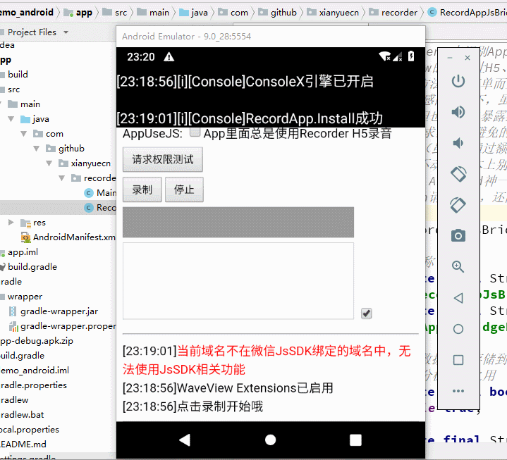

[Recorder](https://github.com/xiangyuecn/Recorder/) | [RecordApp](https://github.com/xiangyuecn/Recorder/tree/master/app-support-sample)

# :open_book:Android Hybrid App

目录内包含Android App测试源码，和核心文件 [RecordAppJsBridge.java](app/src/main/java/com/github/xianyuecn/recorder/RecordAppJsBridge.java) ；目录内 [app-debug.apk.zip](app-debug.apk.zip) 为打包好的debug包（40kb，删掉.zip后缀），或者clone后自行用`Android Studio`编译打包。本demo为java代码，兼容API Level 15+，已测试API Level 35（Android 15）。

本Demo是对[/app-support-sample/native-config.js](../native-config.js)配置示例中定义的JsBridge接口的实现，支持H5录音、和原生接口录音。

可以直接copy目录内`RecordAppJsBridge.java`使用，此文件为核心文件；支持新开发WebView界面，或对已有的WebView实例升级支持RecordApp。

## 【限制】

- 虽然兼容API Level 15+，但实际上17+才是好的选择，因为addJavascriptInterface
- 古董WebView(21-)虽然能正常接收PCM和进行MP3、WAV编码，但对Blob对象的播放不一定能良好支持
- 如需后台录音，H5录音、原生接口录音均需要提供保活机制，参考下面的录音保活

## 需要权限
1. `android.permission.RECORD_AUDIO`
2. `android.permission.MODIFY_AUDIO_SETTINGS` 这个权限也是必须的
3. 如需后台录音，后台录音保活服务会涉及到多个权限，H5录音、原生接口录音均需要

注意：仅使用H5录音时，需要WebView的WebChromeClient中实现onPermissionRequest网页授权请求，如果未实现此方法，WebView默认会拒绝H5录音权限；onPermissionRequest中需要先获取App的系统录音权限（Activity里面必须先用this.checkSelfPermission检测权限，否则直接this.requestPermissions会造成WebView触发touchcancel打断长按），然后再grant网页权限，可参考[MainActivity.java](app/src/main/java/com/github/xianyuecn/recorder/MainActivity.java)中的实现代码。

> 注：如果使用的`腾讯X5内核`，可能还须提供`android.permission.CAMERA`权限，和调用`webView.setWebChromeClientExtension`来重写X5的`IX5WebChromeClientExtension.onPermissionRequest`方法来进行权限处理

## Android后台录音保活
自`Android 9`开始，为了保护用户隐私，锁屏或进入后台一段时间后App可能会被禁止访问麦克风、摄像头等功能，导致无法录音、或录音数据全部是静音，因此需要使用保活机制才能在后台录音；H5录音、原生接口录音均受影响。iOS不存在此类问题，iOS只要在manifest.json的`后台运行能力`中提供`audio`配置，即可在后台录音。

如需后台录音就需要使用一个前台服务（[Foreground services](https://developer.android.google.cn/develop/background-work/services/fg-service-types?hl=zh-cn)）来作为搭配常驻通知的Android后台录音保活服务，打开服务后可提升App在后台或锁屏后录音的稳定性，服务会在状态栏显示一个常驻的通知（通知可能不显示或会延迟显示，并不影响服务运行）；不同机型的录音**保活效果不一定100%有效**，目前本Android Demo代码中未提供此服务实现，需要自行实现、或咨询作者有偿提供。

【注意】targetSdkVersion>=31(`Android 12+`)时，App必须在前台才能调用启动此前台服务，在后台时不允许调用；targetSdkVersion>=34(`Android 14+`)时，`microphone`类型的服务依赖录音权限，因此建议先请求录音权限（调用`RecordApp.RequestPermission`请求权限），成功后再来调用启动服务的接口。

## 原理

通过addJavascriptInterface往WebView注入一个全局对象`RecordAppJsBridge`，js中通过`window.RecordAppJsBridge`来访问，只有存在这个对象，就代表是在App中；js通过这个对象的`request`方法和java进行数据的交互。

## 数据交互
java收到js发起的`RecordAppJsBridge.request`请求，解析请求数据参数，并调用参数中接口对应的java方法，同步执行完后把数据返回给js，如果方法是异步的，将在异步操作完成后java将调用网页的js方法`AppJsBridgeRequest.Call`将数据异步返回（如果是跨域的iframe中发起的异步调用，数据将会使用postMessage来转发返回）。

## 录音接口
接口对应的方法使用的`AudioRecord`来录音，`AudioRecord`使用稳健的44100采样率进行音频采集，我们实时接收PCM数据并进行采样率的转换，然后调用`AppJsBridgeRequest.Record`把数据返回给js端即可完成完整的录音功能。

## 【截图】

