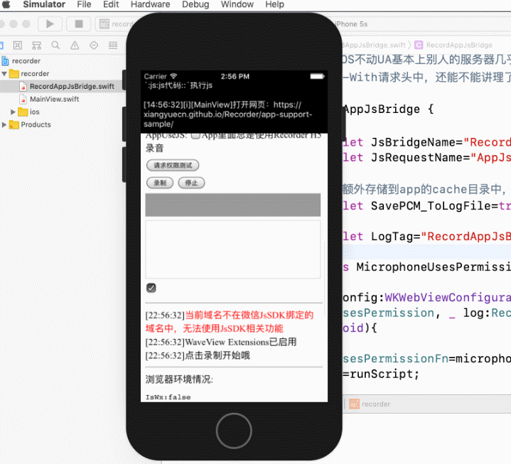

[Recorder](https://github.com/xiangyuecn/Recorder/) | [RecordApp](https://github.com/xiangyuecn/Recorder/tree/master/app-support-sample)

# :open_book:iOS Hybrid App

本目录内包含iOS App测试源码，和核心文件 [RecordAppJsBridge.swift](recorder/RecordAppJsBridge.swift) ；clone后用`xcode`打开后编译运行。本demo为swift代码，兼容iOS 9.0+，已测试iOS 17.1。

本Demo是对[/app-support-sample/native-config.js](../native-config.js)配置示例中定义的JsBridge接口的实现，支持H5录音、和原生接口录音。

可以直接copy目录内`RecordAppJsBridge.swift`使用，此文件为核心文件；支持新开发WKWebView界面，或对已有的WKWebView实例升级支持RecordApp。

## 【限制】

- **xcode测试项目clone后请修改`PRODUCT_BUNDLE_IDENTIFIER`，不然这个测试id被抢来抢去要闲置7天才能被使用，太难了**
- 仅H5录音需要iOS 14.3+以上的系统才支持，低于14.3必须使用原生接口
- 仅H5录音需要iOS 15+以上才支持录音静默授权，如果WebView未适配静默授权、或版本低于15，会导致WebView每次打开后第一次录音时、或长时间无操作再打开录音时均会弹出录音权限对话框，使用原生接口无此问题
- 未做古董版本UIWebView适配，理论上并不需要太大改动就能支持，并不打算进行支持、也没有必要进行支持
- 未测试在OC中调用此swift文件，可参考代码自行改写成OC代码

## 需要权限
需要在App源码 `Info.plist` 中声明使用麦克风 `NSMicrophoneUsageDescription`，无需其他处理，WebView会自己处理好录音权限；注意：iOS App需要在项目Background Modes中勾选Audio才能在后台保持录音，不然App切到后台后立马会停止录音。

注意：仅使用H5录音时（不使用原生录音接口），需要WKWebView的uiDelegate实现[WKUIDelegate requestMediaCapturePermissionFor接口](https://developer.apple.com/documentation/webkit/wkuidelegate)（iOS 15+支持）才能做到静默授权支持，可参考[MainView.swift](recorder/MainView.swift)中的代码；如果未实现，会导致H5录音每次打开页面后第一次录音时、或长时间无操作再打开录音时均会弹出录音权限对话框。

## 原理

通过userContentController往WKWebView注入一个全局对象`RecordAppJsBridgeIsSet`，js中通过`webkit.messageHandlers.RecordAppJsBridgeIsSet`来访问，只有存在这个对象，就代表是在App中；但并不通过这个对象来进行数据交互，因为它仅支持异步操作；数据交互需要一个同步方法来进行支持，因为同步可以实现异步，仅支持异步的只能异步到底，所以选择重写WebView的prompt弹框方法，进行数据的交互。

## 数据交互
swift收到js发起的prompt弹框请求，解析弹框携带的数据参数，并调用参数中接口对应的swift方法，同步执行完后把数据返回给prompt弹框，如果方法是异步的，将在异步操作完成后swift将调用网页的js方法`AppJsBridgeRequest.Call`将数据异步返回（如果是跨域的iframe中发起的异步调用，数据将会使用postMessage来转发返回）。

## 录音接口
接口对应的方法使用的`AudioUnit`来录音，`AudioUnit`会实时回调录音PCM数据，然后调用`AppJsBridgeRequest.Record`把数据返回给js端即可完成完整的录音功能。

> 早期版本（2020-11-17）接口对应的方法使用的`AVAudioRecorder`来录音，`AVAudioRecorder`会把录音PCM数据写入到文件，因此我们实时从这个文件中读取出数据，然后定时调用`AppJsBridgeRequest.Record`把数据返回给js端即可完成完整的录音功能；可能是因为`AVAudioRecorder`存在文件写入缓存的原因，数据并非实时的flush到文件的，因此实时发送给js的数据存在300ms左右的滞后，没有AudioUnit的好使。

## 运行截图

