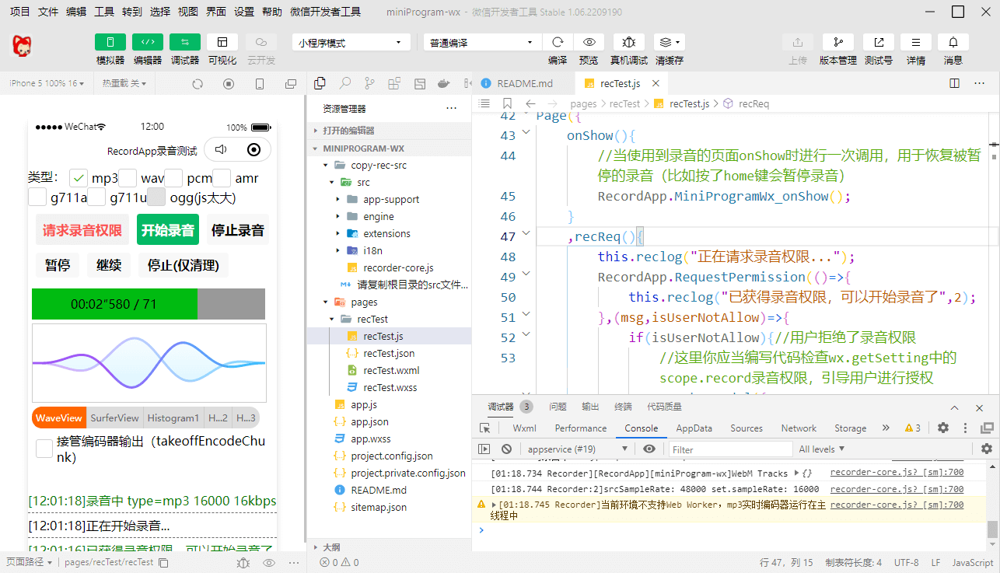

[Recorder](https://github.com/xiangyuecn/Recorder/) | [RecordApp](https://github.com/xiangyuecn/Recorder/tree/master/app-support-sample)

# :open_book:微信小程序内使用RecordApp录音

本目录内包含微信小程序的测试源码，主要文件**请直接参考 [recTest.js](pages/recTest/recTest.js) 代码**；使用[/src/app-support/app-miniProgram-wx-support.js](../../src/app-support/app-miniProgram-wx-support.js)来给`RecordApp`提供微信小程序支持，底层适配使用的微信的 `wx.getRecorderManager + PCM` ，屏蔽了微信原有的底层细节（无录音时长限制），统一使用`RecordApp`提供的方法进行录音，详细使用文档请直接参考[RecordApp文档](../)即可。

- 支持Android、iOS真机微信内测试，PC端微信支持情况未知（[见社区内2023-03-10回复说在修bug，后面又直接干脆说不支持](https://developers.weixin.qq.com/community/develop/doc/000ec4fb6a826883726fdf8605b000)）
- 支持微信开发者工具模拟器内测试（内置WebM解码，和真机无差异）
- 支持已有的大部分录音格式：mp3、wav、pcm、amr、ogg、g711a、g711u等（注意其中mp3、amr、ogg编码器会显著增加小程序包体积）
- 支持实时处理，包括变速变调、实时上传、ASR语音转文字
- 支持可视化波形显示

> 如果是在小程序`web-view`中录音请直接使用`Recorder H5`就行，和普通浏览器没有区别，不需要使用RecordApp进行额外的支持。


[​](?)

[​](?)

## 测试方法

1. 将Recorder根目录内的`src`文件夹复制到`copy-rec-src`文件夹内（比如可用路径：`/copy-rec-src/src/recorder-core.js`，自己实际项目按需copy仅你require引用到了的文件就行）
2. 修改`project.config.json`内的`appid`成你自己的测试号
3. 微信开发者工具中导入本项目，就能编译预览了


## 截图



[​](?)

[​](?)

# 部分原理和需要注意的细节

小程序自带的`RecorderManager`录音的时候，如果小程序退到了后台（或触发了`onInterruptionBegin`），录音将会被暂停，小程序显示的时候才允许继续录音，但`RecorderManager`无法感知这些事件或者存在bug，**因此你需要在要录音页面的`onShow`函数内加上`RecordApp.MiniProgramWx_onShow()`这行代码**，如果没有加这行代码，被暂停的录音可能会无法自动恢复。

小程序录音需要用户授予录音权限，调用`RecordApp.RequestPermission`的时候会检查是否能正常录音，如果用户拒绝了录音权限，会进入错误回调，回调里面你应当编写代码检查`wx.getSetting`中的`scope.record`录音权限，然后引导用户进行授权（可调用`wx.openSetting`打开设置页面，方便用户给权限）。

微信开发者工具对npm支持太差，“构建 npm”功能没什么卵用，npm包内没被main文件引用的js会被全部丢弃，导致文件缺失；似乎也不允许手动`require`含`node_modules`的路径；因此请直接copy根目录内的src文件夹到本小程序源码的`copy-rec-src`文件夹内，直接当做小程序源码调用，好使；或者按需copy仅你require引用到了的js文件到小程序项目中，免得小程序源码过大（一般编译时会忽略掉未引用到的js文件）。


[​](?)

## 语音通话、回声消除、声音外放

由于BufferStreamPlayer不支持在小程序中使用，如需实时播放语音，可使用`wx.createWebAudioContext().createBufferSource()`来进进行播放，请参考[/assets/runtime-codes/fragment.playbuffer.js](../../assets/runtime-codes/fragment.playbuffer.js)播放代码；播放声音的同时进行录音，声音可能会被录进去产生回声，因此一般需要打开回声消除。

配置audioTrackSet可尝试打开回声消除，或者切换成听筒播放，降低回声。
``` js
//打开回声消除，仅Android上会生效，实际为RecorderManager.start的audioSource参数
RecordApp.Start({
    ... 更多配置参数请参考RecordApp文档
    //配置echoCancellation后，相当于给android_audioSource配置为7
    ,audioTrackSet:{echoCancellation:true,noiseSuppression:true,autoGainControl:true}
    
    //Android指定麦克风源，0 DEFAULT 默认音频源，1 MIC 主麦克风，5 CAMCORDER 相机方向的麦，6 VOICE_RECOGNITION 语音识别，7 VOICE_COMMUNICATION 语音通信(带回声消除)
    ,android_audioSource:7 //提供此配置时优先级比audioTrackSet更高
});

//尝试切换成听筒播放，iOS不支持配置回声消除，可使用听筒播放，大幅减弱回声
wx.setInnerAudioOption({ speakerOn:false })
//尝试切换成扬声器外放
wx.setInnerAudioOption({ speakerOn:true })
```


[​](?)

## 已知问题

iOS上微信小程序基础库存在bug，canvas.drawImage(canvas)可能无法绘制，可能会导致可视化插件WaveSurferView在iOS小程序上不能正确显示，其他可视化插件、Android、开发工具均无此兼容性问题；相关链接：[issues#202](https://github.com/xiangyuecn/Recorder/issues/202)，[社区内2023-11-16说在修](https://developers.weixin.qq.com/community/develop/doc/000aaca2148dc8a235a0fb8c66b000)。


[​](?)

## 小程序包体积

必须引入的 Recorder + RecordApp (`src/recorder-core.js`、 `src/app-support/app.js + app-miniProgram-wx-support.js`)  本身并不大，编译出来的小程序包增量仅有35kb左右，可以放心引入。

其他文件全部是可选的，按需手动require引入：不同录音格式类型编码器、可视化插件等。

使用wav、pcm、g711录音格式编码器，这3个编码器加起来也增量仅有6kb左右，可以放心引入。

使用mp3录音格式编码器，编译出来的小程序包增量会有120kb左右，如果没有用到mp3格式，就不要require引入。

使用amr录音格式编码器，编译出来的小程序包增量会有250kb左右，比较大；使用ogg录音格式编码器，编译出来的小程序包增量会有700kb左右，太大了；不建议在小程序中使用这两种格式。
